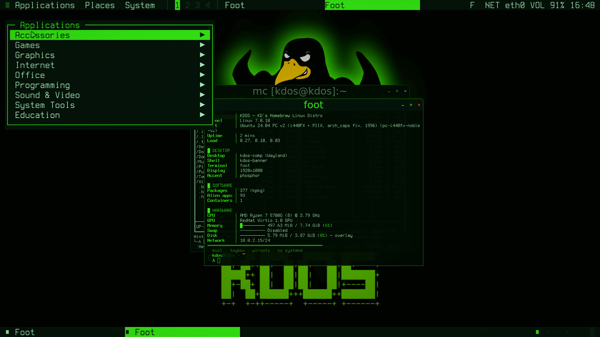
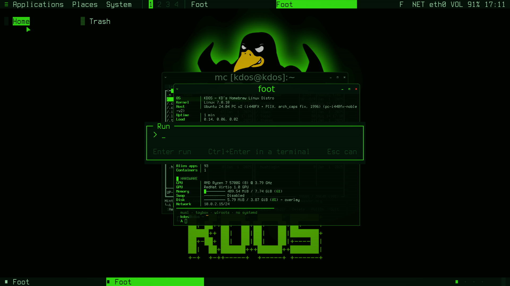
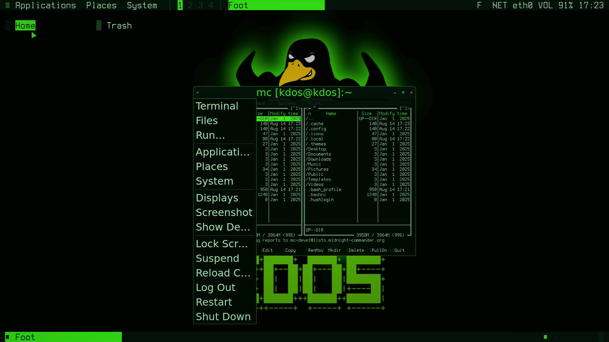
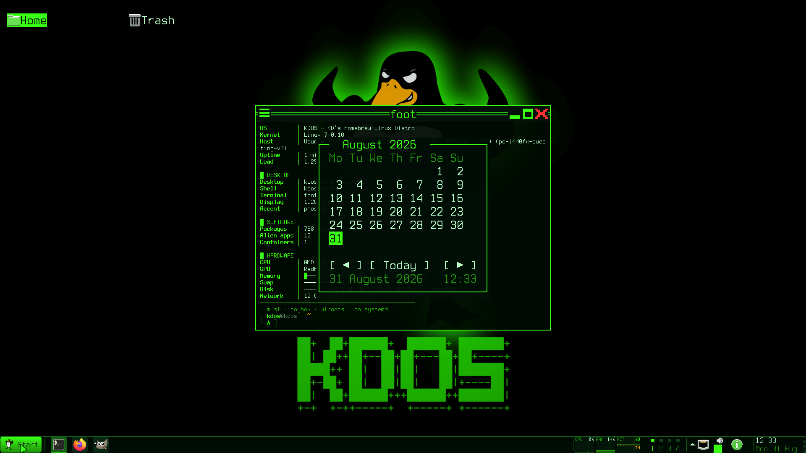
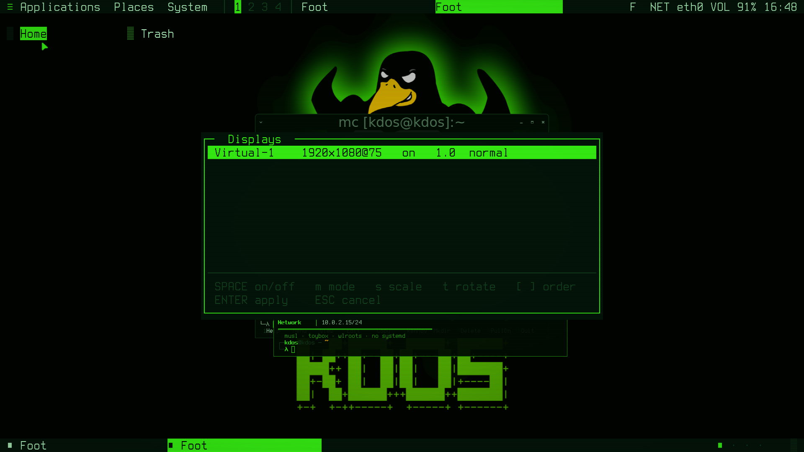

<p align="center">
  
</p>

<h1 align="center">KDOS</h1>

<p align="center"><b><i>I use KDOS btw.</i></b></p>

<p align="center">
A Linux distribution compiled from source, one <code>kpkgbuild</code> at a time —<br>
with a desktop that is a character grid all the way down.
</p>

<p align="center">
<b>musl</b> · <b>toybox</b> · <b>wlroots</b> · <b>no systemd</b> · <b>no Xorg</b> · <b>no GTK or Qt on the host</b>
</p>

<p align="center">
<sub>430 ports · Linux 7.0.10 · 377 packages on the ISO · ~90 containerised GUI apps baked in · builds offline from this repo</sub>
</p>

<p align="center">
  
</p>

<p align="center">
<sub>Every screenshot on this page was taken on the current ISO in a QEMU guest with virgl, with <code>grim</code> — so what you see is the composited output, CRT pass included.</sub>
</p>

---

## Who this is for

KDOS assumes a reader who is comfortable with a build log, a package recipe, and
the C that draws the panel. It ships one user account, no first-boot wizard, no
telemetry, and no configuration layer between you and the file that takes
effect. Almost every byte of the host is compiled here from an upstream
tarball, so anything that is wrong is wrong somewhere you can read — and the
handful of things that are *not* compiled here are named, counted and
explained in [What is not built from source](#what-is-not-built-from-source)
rather than glossed over.

That trade is deliberate. You get a system that is inspectable end to end and
rebuildable from the machine itself, offline, with reproducible packages. You
take on being the integrator: there is no vendor to escalate to, no third-party
archive, and no abstraction that quietly papers over a mistake.

It is worth your time if you want to

- change the desktop, the package manager or the installer rather than configure
  around them,
- run a workstation whose applications are containerised by default and whose
  host carries no systemd, no Xorg, no GTK and no Qt,
- keep an offline, reproducible source for the exact system you are running.

It is the wrong choice if you need broad hardware enablement, a large binary
archive, or a system that stays out of your way. Those are reasonable
requirements; this is not the distribution that meets them.

---

## What KDOS is

Four properties. Everything else in this repository follows from them.

**1 — Built from scratch.** The host is compiled here by a recipe in `ports/`:
430 ports, cross toolchain → musl userland → self-hosting bootstrap →
libraries → desktop → kernel. No base image, no binary package archive. Eight
ports are exceptions — vendor firmware that has no source, two bootstrap
compilers, and two prebuilt font sets — and they are listed in full below.

**2 — KDOS can build KDOS.** Phase 2 is a real self-hosting pass: the chroot
rebuilds tar, musl, zlib, binutils and gcc *with itself*. The shipped system
carries gcc 15, binutils, rust, cmake, meson, ninja, python 3.14, make and
`kpkg`, so a running KDOS can rebuild every port in the tree — including the
kernel, the compiler and the desktop. `kdos rebuild /mnt/work` does it from the
sources on the medium, with no network at any point.

**3 — The repo builds offline.** `make build` runs `--network none`. Every
upstream tarball, every `cargo vendor` bundle and the entire ~4 GB alien-app
container image live in this repository under Git LFS. Clone it, unplug the
network, get a bootable ISO. A build that reaches the internet is a build that
stops reproducing the day a URL rots.

**4 — Applications live in boxes.** KDOS builds the *desktop*; it does not
native-port Firefox, LibreOffice or Blender. The outer ring is a Debian image
baked into the ISO, and ~90 GUI apps out of it behave like ordinary system
apps: launcher entries, MIME handlers, terminal commands, one theme.

### What is not built from source

"Built from scratch" is a claim, so here is the complete list of things it does
not cover. Every one is a deliberate decision with a reason, and each was checked against
the tree rather than remembered.

**Vendor firmware and microcode — no source exists to build.** These are
processor and device code published only as binaries. There is no version of
this distribution, or of any other, that compiles them.

| Port | Size | What it is |
|---|---|---|
| `linux-firmware` | 619 MB source → **921 MB installed** | Upstream's complete tree, unpruned. Installed with upstream's own `copy-firmware.sh --zstd`, which creates the 2307 `WHENCE` alias symlinks a plain copy would omit |
| `intel-ucode` | 17 MB | 157 Intel CPU microcode files, upstream's whole set. Rides in front of the initramfs for the kernel's early loader |
| `sof-firmware` | 10 MB | Intel SOF audio DSP firmware and topologies. Not part of linux-firmware; Tiger Lake and newer are silent without it |
| `wireless-regdb` | 40 KB | The wireless regulatory database. **Must** be installed prebuilt: the kernel is built `CONFIG_CFG80211_REQUIRE_SIGNED_REGDB=y` and verifies upstream's signature, so a locally regenerated database is rejected in silence |

The firmware tree is shipped **whole rather than curated**. A pruned subset is a
bet on which hardware the machine will turn out to have, and losing that bet is
silent — `request_firmware()` fails and the device simply does not work. 921 MB
is what not making that bet costs.

**Two bootstrap compilers — the chicken and the egg.** Rust and Go are written
in themselves. Building either from source requires a working one first.

| Port | Prebuilt input | Why |
|---|---|---|
| `rust` | 146 MB — `rustc`, `cargo`, `rust-std` | Upstream's stage-0 binaries for the previous release. The alternative is `mrustc` and a chain of a dozen historical compilers |
| `go` | 57 MB — `go1.x.linux-amd64` | Go's own bootstrap toolchain, for the same reason |

Both are pinned by version and sha256 like every other source, and both are
downloaded once by `make fetch` and committed, so the offline build still holds.
Everything they then produce — the shipped `rustc`, `cargo` and `go`, and every
Rust program in the tree — is compiled here.

**Two prebuilt font sets.** `ttf-dejavu` (5 MB) and `terminus-ttf` (0.5 MB)
ship as `.ttf` because upstream publishes them that way. The console font
`terminus-font` is a counter-example and is genuinely built from source: BDF
through `configure` and `make` into the PSF that `kdos-getty` loads.

**Vendored artwork, remade rather than redrawn.** `kdos-icons` (45 MB of
pruned Papirus SVG), `kdos-cursors` (4.4 MB of Bibata Xcursor binaries) and
`kdos-gtk-theme` (adw-gtk3 stylesheets) are upstream assets committed to this
repository and recoloured at build time by generators in `src/packages/`. The
palette is ours; the shapes are not. Each carries a `LICENSE.notice` recording
exactly what was changed. `kdos-icons` also ships a 2.6 MB pre-rasterised icon
atlas, generated on a host by `genatlas.py` because rasterising SVG needs a
renderer the target does not have.

**One vendored third-party source file set.** Monocypher, in
`src/libs/libksig/monocypher/` — 4 files of public-domain C99 for Ed25519.
It is compiled here like everything else; it is listed because it is the only
code in `src/` that is not ours.

**The application container is Debian, and always was.** `ports/appbox/` is a
3.9 GB pre-baked Debian trixie image, and nothing in it is compiled by this
repository. That is the whole point of the outer ring — KDOS builds the
*desktop* and does not native-port Firefox — but it is by far the largest body
of binaries on the medium and deserves saying plainly rather than only being
implied by "applications live in boxes".

**Data files are data.** `ca-certificates`, `iana-etc`, `hwdata`,
`xkeyboard-config`, `iso-codes` and `docbook-xml`/`xsl` are text or tables
installed as they arrive. There is nothing to compile; they are noted for
completeness, not as exceptions. One of them is not purely text:
`alsa-ucm-conf` carries 18 small binary `.bin` files alongside its
configuration — precomputed EQ filter coefficients for SOF DSPs, which belong
with the firmware group above in kind if not in size.

Everything else on the host — every library, every daemon, the compiler, the
kernel and the desktop — is compiled here from a tarball whose URL and sha256
are in this repository.

### The Three Rings

| Ring | Lives in | What is there |
|---|---|---|
| **Core** | `ports/core/` | musl, toybox, the kernel, the toolchain, init — 430 recipes |
| **Desktop** | `src/desktop/` + `wlroots` | `kdos-comp`, `kdos-shell`, lock, power, energy, boxsock, the portal |
| **Outer** | `ports/appbox/` | The Debian app image: browsers, office, CAD, media, IDEs, games |

`src/packages/` is the fourth thing: ports that are **ours** rather than an
upstream tarball — `kpkg`, the installer, the boot splash, the appbox runtime,
the theme generators, and three vendored-and-recoloured art packages.

---

## The desktop

<p align="center">
  
</p>

The desktop is ours, and it is a **grid of character cells** — not as a
retro-aesthetic wrapper over a toolkit, but literally: the panel, the menus, the
launcher, the desktop icons, the file chooser, the lock screen and the installer
are all drawn by `libktui` into cells, and only application windows contain
pixels. That is why the host needs neither GTK nor Qt.

**`kdos-comp` is a frozen hard fork of labwc 0.20.0** — imported wholesale,
rebranded, and never merged again. It is ~39,700 lines of upstream C that the
wlroots ecosystem exercises daily, plus ~2,500 lines of KDOS in six graft files:

| Graft | What it adds |
|---|---|
| `kdos-crt.c` | the phosphor shader the whole session is rendered through |
| `kdos-wallpaper.c` | the wallpaper, as scene nodes rather than a client |
| `kdos-child.c` | supervised chrome — one set per output, with a crash-loop brake |
| `kdos-idle.c` | dim → lock → outputs off, each measured from the last activity |
| `kdos-frames.c` | a frame-timing socket, for `kdos stutter` |
| `kdos-config.c` | `~/.config/kdos/comp.conf`, parsed and never sourced |

Everything else — window management, session lock, capture, clipboard,
Xwayland, input methods, security contexts — is upstream code with one-line
hooks marked `/* KDOS */`. That choice closed a long list of gaps in one commit
and is why the desktop's own code is small enough to audit.

### The compositor renders the session through a CRT pass

wlroots has no shader API, so the pass uses the one documented seam it does
have: `wlr_scene_output_build_state()` takes a custom swapchain. The scene
composites into a buffer of ours; our GLES2 program blits that into the output's
real buffer with scanlines every third *physical* row, a three-tap horizontal
bleed, a vignette, optional barrel distortion, and a faint phosphor floor so
black is never quite black.

Three things it gets right, each of which was a bug first:

- **Direct scanout is disabled while it is on.** On the scanout path wlr_scene
  hands the commit a *client's* buffer plus a destination box — not a picture of
  the desktop — and the first version stretched a 13-pixel panel over the whole
  screen.
- **The texture is imported per frame and destroyed after.** Caching it per
  swapchain slot deadlocks the swapchain: a slot is only reused when its last
  lock goes, and four cached textures means `No free output buffer slot` and a
  scene that stops rendering.
- **Two fallbacks, neither of which can black the screen.** A non-GLES2
  renderer gets no pass at all (`make run`'s software path says so at startup);
  anything that fails at runtime marks that output broken and returns to the
  plain commit for good.

`crt = 0` in `comp.conf` is an honest off. `KDOS_CRT_DUMP=<prefix>` writes the
composite and the result as PPMs, which is how the pass gets looked at without a
screen.

### `kdos-shell` is one binary under many names

The panel, the Start menu, the launcher, the menus, the desktop icons, the file
chooser, the run box, the notification daemon and centre, the calendar, the
display, audio, network, bluetooth and device managers, the clipboard history,
the tooltips — all one basename-dispatched binary sharing one font cache, one
palette and one widget toolkit. `TOOLS[]` in `main.c` is the authoritative list;
a number in a heading is a number that goes stale. Everything it knows it learns from **standard protocols**:
wlr-foreign-toplevel for the window list, ext-workspace-v1 for the pager,
wlr-output-management for the screens, StatusNotifierItem for the tray. There is
no private channel to the compositor, which is what lets you run waybar here
instead if you want to.

<p align="center">
  
</p>

The menu bar is GNOME 2's three words. A menu opens **under the word that was
clicked** — layer-shell has no coordinates, so that is an anchor plus a pixel
margin — and it is a separate process, because libktui has one cell buffer and a
menu that wedges must not take the panel with it.

<p align="center">
  
</p>

`Super+D` searches everything on the machine that can be started — native and
containerised in one list, with the boxed ones marked, because an alien app
costs a container start on its first launch and you are entitled to know which
those are before you click.

<p align="center">
  
</p>

`Alt+F2` runs a command. `argv`, never `/bin/sh -c` — which is the rule
everywhere in this tree and is not redundant just because you typed the string
yourself: a shell would also expand `$(...)` out of a paste.

<p align="center">
  
</p>

Right-click the desktop (or `Super+Space`) for the compositor's own menu. It
deliberately lists no applications: Applications, Places and System are
`kdos-menu`, which reads the same desktop entries the launcher and the panel do.
A second application menu built at compositor startup would be the one that went
stale.

### The chrome answers the mouse, and the panel answers back

Four front ends once shipped with `grep -c KT_EVT_MOUSE == 0`, and one of them
is the file dialog every containerised application puts in front of you. They
share one contract now: motion selects, left press activates, the wheel scrolls,
right press backs out, and clicking away closes. The right of the panel is
**controls, not a readout** — volume mutes on a click and takes ±5% from the
wheel (straight to the ALSA mixer, so the same code works on a bare TTY), the
network applet opens `nmtui`, the clock opens a calendar, and the restart mark
opens `kdos restarts`.

<p align="center">
  
</p>

Three input defects found by reading the stack, each invisible to a compiler:

- **The event queue was one slot.** libwayland delivers a whole batch of
  callbacks from one read, so a button press followed by the motion that
  accompanies it was discarded before any consumer saw it. Every click under a
  moving hand was a coin toss. It is a ring now; motion still collapses onto
  motion, a button never overwrites anything.
- **Key repeat did not exist.** Wayland has none of its own — the compositor
  sends `repeat_info` and every client repeats for itself. Holding an arrow key
  anywhere in the chrome did exactly one thing.
- **The desktop ate the root menu.** `kdos-desk` covers the whole output and set
  no input region, so every click on bare wallpaper went to it and the
  compositor's root-menu binding never fired. It claims only the cells its icons
  occupy now.

And one that only 1920×1080 could show: the focused taskbar entry was drawn with
a reverse *attribute*, which inverts only the cells the text covers — so
`Foot` looked like a solid bar and `GNU Image Manipulation Program` came out as
one lit block per word.

### The file dialog is a character grid too

<p align="center">
  
</p>

Open and Save in a boxed GIMP or LibreOffice go through
`xdg-desktop-portal-kdos`, which is a bus adapter and nothing more: it spawns
`kdos-pick` and reads its stdout, so the chooser stays a normal program you can
run by hand, script, or replace. The same backend answers `Settings` (colour
scheme and accent) and `OpenURI` — "open this on the host for me", which is what
a containerised app asks when you click a link, and which had no backend at all
until it was implemented on top of `kdos-appbox open`.

Three rules it exists to keep: **every request is answered** (an unanswered one
leaves the application blocked forever), the bus loop **never blocks on a
dialog** (the fork happens in the handler, the message is reffed, the pipe joins
the poll set), and the chooser is exec'd with `argv`.

The catch nobody documents: a GTK app only routes through the portal when it
believes it is sandboxed. A distrobox is not, so all of this existed and nothing
ever called it until `kdos-appbox` started exporting `GTK_USE_PORTAL=1`.

### The screens

<p align="center">
  
</p>

labwc takes its output configuration over `wlr-output-management-v1` like every
wlroots compositor, and KDOS had no client for it — so a second monitor came up
at whatever mode the kernel picked. `kdos-display` (`Super+P`) is that client:
mode, scale, rotation, enable, and the left-to-right order, with `--list` for a
bug report.

**Positions are computed, not typed.** A protocol that takes pixel coordinates
invites a layout where two screens overlap or one sits in a gap; what people
want is an *order*. So the list order is the arrangement, `[` and `]` move a
screen along it, and applying lays them edge to edge using each head's *logical*
size — mode over scale, axes swapped when it is rotated. Nothing is applied
until Enter, and switching off the last enabled screen is refused, because the
mistake a display tool makes is a screen you can no longer read.

### One set of chrome per output

An unnamed layer surface is placed by the compositor on **one** output, so a
two-monitor machine had a panel, a window list and desktop icons on the first
screen and nothing on the second. libktui has a single cell buffer, so a second
screen cannot be a second surface of the same process — it has to be a second
*process*, which is exactly what the two panels already were. `libkwl` learned
`wl_output`'s `name` event, the shell learned `--output`, and the compositor
supervises one set per screen, spawned from its output-created hook and SIGTERMed
from output-destroyed.

### Lock, power, idle

`kdos-lock` is an `ext-session-lock-v1` client; the compositor owns the `locked`
state, so a lock screen that crashes stays locked and a new client may replace
it. **`kdos-checkpass` is the only setuid binary KDOS ships**, it takes *no
arguments* — the account checked is the caller's real uid, so there is nothing
to aim at root — and the password arrives on stdin, because `argv` is
world-readable through `/proc`. `kdos doctor` checks that setuid bit, because
losing it is silent and locks you out of your own session.

`kdos-powerd` is a root daemon on a unix socket gated by `SO_PEERCRED` — root
and `wheel`, checked on the socket rather than taken from the message. All three
idle stages are **0 by default in a VM**, because a blanked screen over VNC is
indistinguishable from a crashed compositor.

---

## Five things this desktop does that other Linux desktops do not

**1 — It names the process that made your desktop hiccup.**

```
7 frames dropped on eDP-1 (133 ms) — the busiest just then:
  calibre-idx (appbox kdos-apps)  waiting on the disk
  calibre     (appbox kdos-apps)  92% of a core
```

`kdos stutter` joins three sources that are each useless alone: the compositor's
own frame deadline (presentation events where the backend has them, the frame
clock where it does not — reported with a `source` field rather than averaged),
`/proc/pressure/*`, and `/proc/<pid>/stat`. The closest prior art states outright
that it *"cannot identify which specific process caused a frame miss"*. Two
details make the difference: **blocked before busy** (a process asleep in `D`
shows almost no CPU while it is the thing holding the disk) and container names
read from `conmon`'s argv rather than cgroups, because rootless podman with no
systemd frequently sits in `0::/`.

Over 60% of the frame budget spent in the compositor's own render is the one
causal claim it makes. Otherwise it reports what it measured and names who was
busy — attribution from a 500 ms window is circumstantial, and a tool that
claimed otherwise would be wrong the first time two things were busy at once.

**2 — The panel names the app using your microphone or camera.**

Every phone OS has done this for a decade. The reason no Linux desktop does is
not difficulty — PipeWire knows the capture node, the node knows the client, the
client knows its name, the panel knows how to draw — it is that there are four
owners and nobody owns all four. Two sources, because there are two ways to
record: a PipeWire node with `media.class = Stream/Input/Audio` counted only
while it is RUNNING (a node that *exists* is not a node that is *recording*),
and, for the camera, a process holding an fd on `/dev/video*`, because almost
nothing takes the camera through a portal.

**3 — Per-app Energy Impact.**

Windows, macOS and Android all ship it; no Linux desktop does, and the hard part
is not the measurement — RAPL and cycle-share are twenty years old — it is
*identity*: "Firefox" is forty processes in scattered cgroups. On KDOS every fat
application already runs in its own container whose supervisor knows its name.
`kdos-energy` reports **relative shares, never watt-hours**, because RAPL sees
the CPU package and not your panel; it drops nested RAPL domains (summing the
flat listing double-counts the cores — measured: 15 W becomes 26.25 W), handles
the counter wrap, and subtracts a measured idle floor before attributing
anything.

**4 — A boxed app cannot photograph your screen.**

`kdos-boxsock` gives every container its own tagged Wayland socket via
`security-context-v1`; labwc's filter then hands that client a static allowlist —
surfaces, seat, dmabuf, text-input, primary selection — and none of the capture,
data-control or input-method globals. Verified: a tagged `grim` cannot bind
screencopy while an untagged one shoots the screen. That is what makes the
portal the *sanctioned* route rather than a convenience.

**5 — The desktop's own tools are testable without a desktop.**

`kdos-shell --dump`, `kdos-menu --dump`, `kdos-pick --dump`, `kdosbuild
--preview`, `kinstall --dump plan --json`, `kdos stutter --fixture`,
`kdos-energyd --fixture`, `KDOS_PRIVACY_PROC` — every component that makes a
decision can be asked what it would draw or conclude, offscreen, with no
compositor and no hardware. Six geometry defects in this toolkit were invisible
to the compiler and to a test suite that could not draw; that is what these
exist for.

---

## PHOSPHOR

The look is a 1983 green-screen terminal that happens to be running a modern
Wayland desktop, and it goes all the way down: `setvtrgb` loads the palette in
`rcS`, so tty1 is phosphor before anything Wayland exists.

```sh
kdos theme phosphor | amber | ice | bone
```

<p align="center">
  
</p>

One command repaints the panel, the desktop icons, the notifications, the window
frames, the CRT shader's tint, the icon theme, the cursor theme, the GTK
stylesheets, `kdeglobals`, foot, btop, mc and the starship prompt — from a
single palette table compiled into every consumer as an X-macro, so nobody keeps
a second copy of the numbers.

**The desktop needs no theme file at all.** `kdos-comp` and `kdos-shell` link
`libkcolor` and read one word — the accent *name* — from
`$XDG_CACHE_HOME/kdos/theme`. A running session is retinted by a SIGHUP, not by
being handed a palette. Everything `kdos theme` writes exists for software that
is **not ours** and cannot be told: GTK and Qt apps in the box, foot, btop,
starship.

Alien apps are themed through `$HOME`, because a container shares your home
directory and nothing else — `/usr/share/themes` is invisible inside it:

| Path | Read by |
|---|---|
| `~/.themes/KDOS/` | GTK3 and non-libadwaita GTK4 |
| `~/.config/gtk-{3,4}.0/gtk.css` | libadwaita, which ignores themes entirely |
| `~/.config/kdeglobals` | every Qt app under `QT_QPA_PLATFORMTHEME=kde` |
| `~/.icons/KDOS/`, `~/.icons/KDOS-cursors/` | every toolkit, host and container |

The GTK theme is a recoloured **adw-gtk3** rather than hand-written CSS over
Adwaita, and that choice is the fix: stock GTK3 Adwaita is compiled from SASS
with literal hex in every rule, so redefining named colours reaches only the
widgets that happen to reference one. adw-gtk3 is written against named colours
end to end — rewrite ~125 `@define-color` declarations and every widget follows.

The icon theme is a pruned, hue-mapped **Papirus** (90 MB → 13.7 MB), mapped by
*family* rather than flattened: blue/green/purple to the accent,
yellow/orange/brown to the secondary, red to urgent. Papirus colour-codes
mimetypes, and collapsing every hue onto one accent turns a folder of files into
a wall of identical green lozenges. A PDF stays red, an audio file stays amber.
Cursors are a pruned, recoloured **Bibata** (27 MB → 4.4 MB) where `wait` and
`progress` ramp to amber — the same "working on it" colour the boot splash uses.

**`kdos theme --audit`** re-runs every generator against a scratch `$HOME` and
compares byte for byte, symlinks included. It repairs nothing — an audit that
fixed what it found would be a `kdos theme` with a misleading name. Exit 0 clean,
1 on drift.

---

## Alien apps

<p align="center">
  
</p>

That is GIMP — glibc, GTK3, running inside rootless Podman — with KDOS's accent
on every widget and its desktop-entry `Name` in the taskbar rather than
`gimp`. The ISO ships a pre-baked **Debian trixie** image with the best
open-source app per segment: LibreOffice, Firefox, GIMP, Krita, Inkscape,
Blender, FreeCAD, PrusaSlicer, OpenSCAD, KiCad, Octave, Stellarium, Ardour,
LMMS, Kdenlive, OBS, VSCodium, Wireshark, KeePassXC, RetroArch, emulators, wine,
and a shelf of games. Heavy is the point: **the image is the offline software
library**, a Knoppix-style fat stick that gives you a full workstation with no
network.

Nothing about them looks containerised in use:

```sh
gimp photo.png                  # every alien app is also a normal command
libreoffice-writer report.odt
wine setup.exe
```

They appear in the launcher, register their MIME types (so they show up in "Open
with" and can be default handlers), merge into the taskbar as running windows
with their own names, and share the session bus so single-instance handoff and
notifications work. **Cold start is ~18 s, warm start 0.3 s**, because login
backgrounds a `nice 10` warmup while the desktop is still settling.

<p align="center">
  
</p>

```sh
kdos-appbox apps                    # what is available
kdos-appbox install thunderbird     # apt into the box
kdos-appbox create dev image=fedora-toolbox:41
kdos-appbox security dev network=private processes=private
kdos-appbox open report.odt         # the MIME route: globs → mimeapps → exec
kdos-appbox tui                     # the manager above
```

The runtime is ~3,400 lines of C with **no `system()` and no shell anywhere in
it**, because app names, package names and file arguments all arrive from
`.desktop` files and `argv`. Every sandbox profile key maps 1:1 onto a container
namespace flag — `network`, `ipc`, `devices`, `processes`, `home` — and that
mapping is the design: **KDOS does not offer confinement it cannot enforce.**
Profiles apply at creation time, because namespaces cannot be re-flagged on a
live container, and the tool says so instead of silently doing nothing.

Four traps the launch path exists to keep, each a real debug cycle: the
stuck-in-`stopping` recovery; a readiness wait that only runs when *someone
else* started the box; a notification that is fire-and-forget because gdbus's
default reply timeout is 25 seconds and a notification must never gate a launch;
and a one-time storage-driver choice (fuse-overlayfs on the live ISO, because
the kernel refuses to stack an overlay upperdir on overlayfs; native overlay
once installed on ext4 — and never flipped afterwards, because the two write
incompatible whiteout formats).

---

## kpkg

```sh
kpkg install foo       # build from ports and install
kpkgadd  foo.tar.xz    # install a pre-built package
kpkgdel  foo           # remove
kpkgdepends foo        # resolved install order
```

**A port is two files.** `kpkgbuild` is declarative metadata that is *parsed,
never sourced*; `build.sh` beside it is the build and is ordinary bash.

```
name        = mesa
version     = 25.3.3
release     = 1
source      = https://mesa3d.org/archive/mesa-$version.tar.xz
sha256      = 9ba0…  mesa-25.3.3.tar.xz
description = OpenGL and Vulkan implementation
depends     = libdisplay-info libinput pixman seatd eudev libxkbcommon
vendoring   = rust
```

Splitting them is what lets `bash -n` syntax-check all 420 build scripts in
`testing/preflight.sh`, and what stopped kpkg exec'ing bash just to *read* a
recipe. The shell stayed in a file rather than moving into the format because
there is no embeddable shell worth vendoring — and because `ports/core/rust`
writes a `config.toml` heredoc containing a line that reads exactly `[build]`.

**Packages are reproducible.** Building a port twice yields a byte-identical
`.tar.xz`: sorted members, `uid/gid 0`, mtime from a pinned `SOURCE_DATE_EPOCH`,
GNU format, single-threaded xz, and a `umask(022)` before the build. Measured on
real ports, including a second build under `umask 077`, `XZ_OPT=-T0` and
`TZ=Asia/Kolkata` — the three things that used to change the bytes.

That is the precondition for everything below:

```sh
kpkg verify --repro zlib          # build it twice; the two must be identical
kpkg keygen builder               # Ed25519, via vendored Monocypher
kpkg index /repo --sign builder.key
kpkg binhost /repo zlib           # use the prebuilt package, or say why not
kpkg delta old.tar.xz new.tar.xz  # 3 KB instead of 85 KB on a point release
```

**Two hashes replace Gentoo's entire USE-flag matching problem**, because KDOS
has no USE flags: a prebuilt package is usable when the architecture, the
*build-config* hash (arch, libc, target, compiler version, C/C++/LD flags) and
the *recipe* hash (SHA-256 over kpkgbuild, build.sh, postinstall.sh and every
patch) all equal the client's own. Anything else builds from source, and the
exit code says which happened.

Signing is Ed25519 through vendored Monocypher — the one piece of third-party
source in `src/`, because libsodium is a shared library, BearSSL has no Ed25519
signing, and OpenSSL is the opposite of "links nothing but musl". **The index is
signed, not 377 packages**: it carries every package's hash, so one signature
covers them all transitively. A bad signature is refused; a missing one is
allowed (local builds are never signed) unless `KPKG_REQUIRE_SIG=1`. KDOS ships
**no key** in `/etc/kdos/keys`, because shipping one would be asking you to trust
whoever built the image — which is the question signing exists to let you answer
yourself.

Deltas are `zstd --patch-from` over the **uncompressed** tars (two `.tar.xz`
files built from nearly identical trees share almost no bytes — that is what a
compressor does), and a delta is never trusted: it is applied and the *result* is
hashed against the `C:` the signed index already carries.

### `kdos cve` — offline vulnerability tracking

```
KDOS cve  —  Alpine secdb of 2026-08-12 (0 days old), the ports tree

  curl        8.17.0    fixed in 8.21.0   CVE-2025-14017,CVE-2025-14524,… +29 more
  zlib        1.3.1     fixed in 1.3.2    CVE-2026-22184,CVE-2026-27171

  389 checked, 262 not in the database, 28 behind a recorded fix
```

A vendored 270 KB table merged from six Alpine branches, answered by version
comparison rather than a scan, on a machine that cannot reach a CVE feed. Four
details change the answer: Alpine's `-rN` is packaging and is cut off; `fixed in
0` means "never affected"; the newest fix a pin is behind is the one reported;
and **a package Alpine does not carry is UNKNOWN, never clean** — 262 of 389
are in that state and the summary says so.

---

## The C libraries

Nine static archives under `src/libs/`, 12,163 lines, **linking nothing but
musl** — with exactly one declared exception, which is why it is a separate
archive.

| Lib | Owns |
|---|---|
| `libkbase` | alloc + OOM hook, strings, files, paths, flock, the `KbArgv` builder and the process helpers |
| `libkcolor` | the palette table, HLS, the hue-family classifier, the recolour primitives |
| `libktui` | terminal ownership, cell buffer + diff flush, input decoding, widgets, modals, charts, offscreen rendering |
| `libkcell` | the fcft glyph cache and the cell → ARGB painter, plus the shape-vector ASCII engine |
| `libkwl` | libktui's **Wayland backend** — surface roles, shm buffers, input, `kwl_input_cells` |
| `libkxdg` | desktop entries |
| `libkpkg` | the package database, the ports tree, the solver, `kp_vercmp`, the recipe hashes |
| `libksig` | Ed25519 signing, key files, keyrings (vendored Monocypher) |
| `libkbuild` | phase discovery, the phase-env metadata block, build plans, the snapshot inventory |

The constraint is load-bearing: **`kinstall` links libktui in phase 1**, before
any library exists to link against. `libkwl` needs fcft, pixman, xkbcommon and
wayland-client, so splitting it out is what keeps the installer linking zero
libraries on the first bootable image.

Three rules the extraction exists to keep, each a bug that was already there:
symbols are prefixed (two of our own programs could not be linked together);
frame state is private (`ui.consumed = 1` appeared in two dozen places in the
installer alone); and chrome hit-ids belong to the library, not to whichever
application registered them first.

`libktui` draws at **three glyph tiers** — eighth blocks where UTF-8 is
available, `░▒█` on the Linux console, `.:#` otherwise — because the console
font is 512 glyphs and an eighth-block bar there is not ugly, it is *invisible*.

`libkcolor` reproduces Python's `colorsys` exactly, including the odd
`2.0 - maxc - minc` and `round()`'s half-to-even, verified over 8,476 colours ×
4 schemes against CPython. Not pedantry: the vendored Papirus and Bibata artwork
is committed, and a generator that rounds differently diffs against files
already in git.

---

## Boot

<p align="center">
  
</p>

Past the bootloader, KDOS starts the way its windows do: a flash, the picture
unfolding out of a hairline, scanline banding burning off as the tube warms up,
POST lines with `OK`/`FAIL` columns, and a collapse back into a line and a dot.

That is `kdos-splash` — ~700 lines of static C drawing straight to `/dev/fb0`,
with the wordmark rendered from the shipped Terminus console font scaled up, so
the logo is real bitmap type rather than an image. It starts in the initramfs and
**keeps running across `switch_root`**: its control FIFO lives on devtmpfs, which
is *moved* into the new root, so one process spans both halves of boot and the
screen never blinks.

Three facts, one debug cycle each:

- **Deferred takeover means nothing is being scanned out.** Writing to
  `/dev/fb0` before the DRM fbdev client does its modeset paints a buffer nobody
  is looking at. One byte to `/dev/tty0` ends the deferral — and only a *real
  glyph* does it: escape sequences are eaten by the VT state machine and spaces
  are skipped by the render path.
- **mmap writes need an explicit flush**, so each frame ends with a
  `FBIOPAN_DISPLAY` to the offset it is already at.
- **The process survives `switch_root` with a ghost root.** Open fds keep
  working — that is the whole trick — but every path it resolves *by name* after
  that points into the deleted initramfs, so the `quit` client detects the daemon
  by opening the FIFO and watching for `ENXIO`.

The progress bar is fed **additively**: each phase adds its own step count as it
learns it, so `done == total` happens at every phase boundary — which is why the
splash clamps at 99% until `quit` arrives. A boot that shows 100% and then sits
there is a bug report waiting to happen.

**CPU microcode rides in front of the initramfs**, because `CONFIG_MICROCODE`'s
early loader runs before any filesystem exists and scans the raw initrd for two
literal paths. Nothing in that cpio may be compressed, the Intel bundle is
upstream's whole `intel-ucode/` rather than a per-family prune, and it must
consume to *exactly* its last byte — `scan_microcode()` ends
`return size ? NULL : patch;`, so one stray file means the kernel loads nothing
at all. The build walks the records the same way and fails instead.

Also on the boot path: **A/B root slots** with the boot counting in the
initramfs (rEFInd has none, and a kernel that boots into a wedged userland must
still spend an attempt), a state file written with the fsync-fsync-rename dance
because the ESP is FAT and a torn write there bricks the machine, and **LUKS2**
with the passphrase prompted through the splash on `/dev/tty1` and fed to
`cryptsetup --key-file=-` on stdin.

<p align="center">
  
</p>

`tty1` autologins as `kdos`. The banner is composed by `kdos-banner`, which
paints it one raster line at a time with a bright beam leading the fill, then one
frame of reverse video for the CRT thump; any keypress skips the rest, and a
dumb `TERM`, a pipe or a short terminal all fall back to a plain print.
`fastfetch` is run with `--logo none` and the columns are pasted together here,
because asked to draw a logo fastfetch moves the *cursor* back up over it —
output that cannot be replayed one line at a time.

The penguin is decoded from the same quantised mascot the splash draws, so the
banner, the splash and `kdos.png` cannot drift apart. The console font is
`ter-kdos32n`: Terminus xos4-2 with six spacing diacritics swapped for the double
box-drawing glyphs the wordmark needs — loaded by a getty wrapper that first
forces fbcon's deferred takeover, because a `setfont` any earlier is silently
wiped.

---

## Installing to a disk

```sh
sudo kinstall                      # the ten-page wizard
sudo kinstall --dry-run            # rehearse: logs every command, runs none
sudo kinstall --dump plan --json   # what it would do, as data
sudo kinstall --config answers.conf --unattended
```

`kinstall` is a dependency-free C TUI drawn with `libktui` — no ncurses, no
libraries at all beyond musl — and it **writes nothing until the summary is
confirmed**. Every page fills a config struct and only the install step touches
the disk; `Next` on the summary page is deliberately refused, because the install
starts from the button and only from the button.

Two things it does that a terminal installer usually cannot:

- **The mouse works on a bare tty.** The Linux console has no mouse reporting
  and KDOS ships no gpm, so `input.c` opens `/dev/input/event*` itself, keeps its
  own pointer (relative devices scaled by the real cell size read from
  `/sys/class/graphics/fb0/virtual_size`, absolute ones mapped directly) and
  draws it as an inverted cell. Under `foot` it uses SGR-1006 instead.
- **It looks the same in both places.** The whole interface is eight colours,
  because a 512-glyph console font makes the VT steal the foreground intensity
  bit — so `A_BOLD` changes the *font page* rather than the weight. On a tty it
  installs its own palette through `PIO_CMAP` and restores what `kdos-getty`
  loaded; elsewhere the same eight slots go out as 24-bit SGR.

The filesystem is a **table, not a branch** (`ki_filesystems[]`): ext4, btrfs or
xfs, with every consumer reading the same row — the menu, the mkfs argv, the
fstab line and the swapfile step. `fs_passno` is 1 for ext4 and 0 for the others
because there is no `fsck.btrfs` worth running; the swapfile is `fallocate` on
ext4, `dd` on xfs (which refuses unwritten extents) and `btrfs filesystem
mkswapfile` on btrfs. A filesystem whose mkfs is missing is still listed and
refuses *before* anything is written, because a control that snaps back under the
cursor is worse than one that explains itself.

---

## Building it

```sh
make fetch        # every upstream tarball + vendor bundle (LFS)
make fetch-apps   # bake the Debian app image (needs network; only when it changes)
make build        # cross toolchain → userland → desktop → kernel → ISO
make run          # boot the ISO in QEMU
```

The build runs inside an Alpine container with `--network none`, so it cannot
contaminate — or depend on — your host.

| Phase | What it does |
|---|---|
| 0 | Cross toolchain — binutils + gcc for `x86_64-kdos-linux-musl` |
| 1 | Base userland — musl, toybox, bash, native gcc, kpkg, kinstall |
| 2 | Self-hosting bootstrap — the chroot rebuilds its own toolchain |
| 3 | Core libraries, build systems, interpreters |
| 4 | Userland and the Wayland base |
| 5 | The desktop — wlroots, kdos-comp, kdos-shell, lock, power, energy, portal |
| 5 | Kernel + modules (a separate directory; the two 5s do not overlap) |
| 6 | Packaging — theme, user, appbox, initramfs, ISO |

**The orchestrator is `kdosbuild`** — 7,000 lines of C on `libkbuild`, compiled
on demand by a two-second `cc` of a program that links nothing but libc. It
draws with the same `libktui` as the installer, which is what killed the third
TUI toolkit in this tree. One structural note: the build *is* the main loop
(libktui's input has a timeout), so there are no threads, no locks, and no
progress callbacks that must avoid drawing concurrently with their caller.

Two things make iterating on a 2–4 hour build bearable:

**Snapshots.** Every completed phase is archived to `build/snapshots/`. What
gets archived is declared by the phase itself, in a metadata block the
orchestrator **parses and never sources** — several of those files end with
`rm -rf /var/cache/kpkg/work`, which at source time would hit the build
container. Restores are layered and newest-wins.

**Build plans.** Snapshots answer "go back"; plans answer "re-run just this."

```sh
# changed something under fs/ → re-sync it and rebuild the ISO, nothing else
make build BUILD_ARGS="--phases 01_phase1,06_packaging --steps 01_phase1:00_file_system.sh"

# changed a kpkgbuild → rebuild that port and repackage
make build BUILD_ARGS="--phases 04_phase4,06_packaging --rebuild mesa"
```

Three things make that safe: snapshots are suppressed whenever a plan narrows
execution; `kpkg install -f` forces only what was *named*; and the 17 mark-file
guards stand down only for a step the plan picked by name.

**`fs/` sync is manifest-guarded and packages are swept.** `cp -r` overwrites
but never removes, which is how a stale binary blocked its replacement, how an
old icon rode three ISO rebuilds, and how 94 dead launchers sat beside their 91
replacements. A port deleted from `ports/` used to leave its package installed
forever — measured on this branch, 529 MB of a desktop that had been removed a
milestone earlier.

---

## What proves it

There is no CI service here; there are two scripts and a rule that anything they
cannot check gets checked by hand and written down.

**`testing/preflight.sh`** — 15 checks, seconds, no container: every package in
a `packages.txt` has a port; every `packages.txt` resolves to a dependency order
with clean stdout; every `# depends` names a port that exists; every recipe
declares name/version/release; `bash -n` over 420 build scripts; every archive
matches its `sha256`; the shipped `rc.xml` still carries `<default />` (a
one-line omission that silently threw away click-to-focus, the titlebar, the
window buttons and the root menu); and **every command named in the shipped
`rc.xml` and `menu.xml` is provided by the tree** — the check `labnag` needed.

**`testing/selftest.sh`** — 26 sections, half a minute, host-only. It compiles
every library under `-Werror`, runs the invariants that were established by
diffing against the implementations they replaced, then proves behaviour end to
end: kdosbuild against a synthetic two-phase tree (build, snapshot, restore, plan
narrowing, a deliberate failure); kpkg's reproducibility under a hostile
environment; the binhost refusing an edited index, a tampered package and an
untrusted key; the tray host against a **real second process** on a private
`dbus-daemon`; the FileChooser portal answering `Settings` in 8 ms *while a
dialog is open*; `kdos theme --audit` against a real generated `$HOME`; and the
shell's front ends drawn **offscreen with libkwl stubbed out**, asserting that
every row of a box is the same width and that the chooser's hint text and its
two buttons do not collide.

A check nobody has broken on purpose is a check nobody has tested, so both of
those were: a planted `labnag` in `menu.xml` fails preflight, and a hint row
widened by twenty cells fails the chooser's geometry assertion. Run the suite
sanitized when you touch a parser — it is clean that way, and it found two real
defects a plain run could not see (a base-256 tar size field overflowing a
`long long`, and a `memcpy` from NULL on every desktop entry's first key):

```sh
CC="cc -fsanitize=address,undefined -g" testing/selftest.sh
```

The fixtures are the other half: recorded `/proc` and `powercap` trees for the
energy daemon, two `/proc` snapshots 500 ms apart plus the compositor's own
events for `kdos stutter`, a `/proc` with three processes holding capture devices
for the privacy indicator, six live-recorded upstream listings for the version
checker, and a five-row security database for `kdos cve`.

And the part no script covers: the ISO gets booted, driven over a serial console,
and photographed. That is where the last three defects came from — a theme signal
that reached two of the four things that repaint, a `pkill` pattern that would
have killed the session's own helper scripts, and a taskbar highlight that only
breaks for a window with a space in its name on a screen wide enough to show one.

---

## Running it

- **CPU:** x86_64 with KVM
- **RAM:** 4 GB to run, 8 GB+ to build comfortably
- **Disk:** the ISO is ~8.8 GiB; a full build tree is ~40 GB, plus ~35 GB more
  if you keep phase snapshots

Login is **`kdos` / `kdos`** (uid 1000, in `wheel`, so `sudo` works with the same
password). The live ISO and an installed disk behave identically, including
rootless containers.

> **Note on QEMU:** `make run` uses plain virtio-vga, where wlroots falls back to
> its software renderer. You get the whole desktop — but **no CRT pass**, because
> a fullscreen post-process on software rendering is a slideshow and the pass
> declines anything that is not GLES2. For the real thing use
> `-device virtio-vga-gl` (virgl), which is what `make run-hw` does through a
> containerised QEMU 10 and what every screenshot here was captured from.

Useful on a running system:

```sh
kdos help          # commands + the keybind cheat sheet
kdos doctor        # check the things that actually break on this distro
kdos status        # packages, containers, alien apps, session
kdos why <path>    # what provides this, and why it is that way
kdos stutter       # why the desktop hiccuped, with the app's name
kdos cve           # pinned versions with known holes — offline
kdos march probe   # what this CPU can do, and whether it is worth it
kdos restarts      # what is running code an upgrade replaced
kdos rebuild <dir> # rebuild KDOS from the sources on this machine
```

`kdos doctor` is not a generic health check — it tests the specific failures this
distro has hit before, down to `readlink /proc/self/root` catching an initramfs
that used the wrong `switch_root` and quietly broke every container:

```
Containers
  [ ok ] mount namespace root is /
  [ ok ] subuid mapping present
Desktop
  [ ok ] accent applied (phosphor)
  [ ok ] boxed KDE apps read the KDOS palette (kdeglobals)
  [ ok ] kdos-checkpass is setuid root
  [ ok ] kdos-powerd listening
  [warn] no RAPL energy domain on this machine — per-app energy cannot be
         measured here at all
  [ ok ] kdos-comp is reporting frame timing (kdos stutter)
  [ ok ] screen-capture portal installed and selected for KDOS
```

---

## Repository layout

```
kdos/
├── ports/
│   ├── core/<name>/         # kpkgbuild + build.sh + upstream tarball (LFS)
│   ├── appbox/              # Containerfile, launcher generator, image chunks
│   ├── fetch                # downloads every source= URL, runs cargo vendor
│   └── update               # kdos-portup: is upstream newer than the pin?
├── src/
│   ├── libs/                # libkbase libkcolor libktui libkcell libkwl
│   │                        #   libkxdg libkpkg libksig libkbuild
│   ├── desktop/             # kdos-comp (labwc fork), kdos-shell, kdos-lock,
│   │                        #   kdos-powerd, kdos-energyd, kdos-boxsock,
│   │                        #   xdg-desktop-portal-kdos
│   ├── build/kdosbuild/     # the build orchestrator (C, host-only)
│   ├── tools/               # kdos-portup (host-only)
│   └── packages/            # ours: kpkg, installer, splash, appbox,
│                            #   theme generators, kdos-tools, art
├── fs/                      # copied verbatim into the rootfs
├── script/                  # phase directories + the orchestrator's entry point
├── testing/                 # preflight, selftest, fixtures, QEMU runners
├── docs/                    # KDOS-DESKTOP.md is the desktop's plan of record
├── Dockerfile               # the Alpine build sandbox
└── Makefile
```

There is no `fs/etc/X11/`, and there never will be.

---

## Documentation

- **`CLAUDE.md`** — the working briefing: current state, and the reasoning that
  constrains it. Almost every "never do X" in it is a bug that already cost a
  debug cycle.
- **`docs/KDOS-DESKTOP.md`** — the desktop's plan of record, with a status block
  per milestone and a written account of each pass.
- **`docs/KDOS-ROADMAP.md`** — the full menu of work.
- **`docs/KDE-ON-HOST-REJECTED.md`** — the alternative that lost, and why.

---

## License

MIT for the KDOS-authored parts. Vendored artwork keeps its upstream license —
see `LICENSE.notice` in `src/packages/kdos-cursors/`, `kdos-icons/` and
`kdos-gtk-theme/`, each of which records exactly what was changed. Monocypher is
public domain. Every port under `ports/core/` is upstream's own code under
upstream's own terms.

Go forth and segfault.
