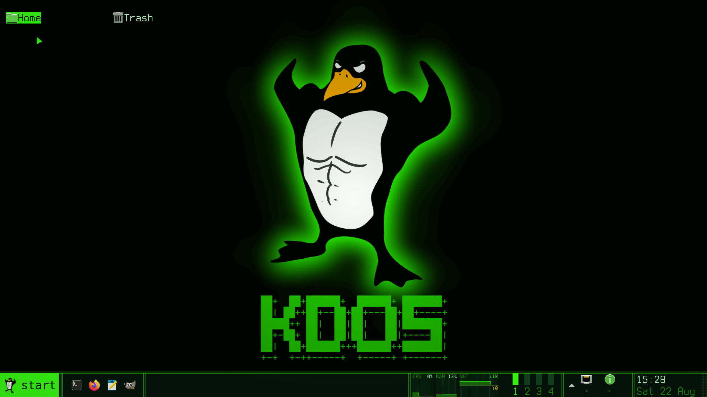
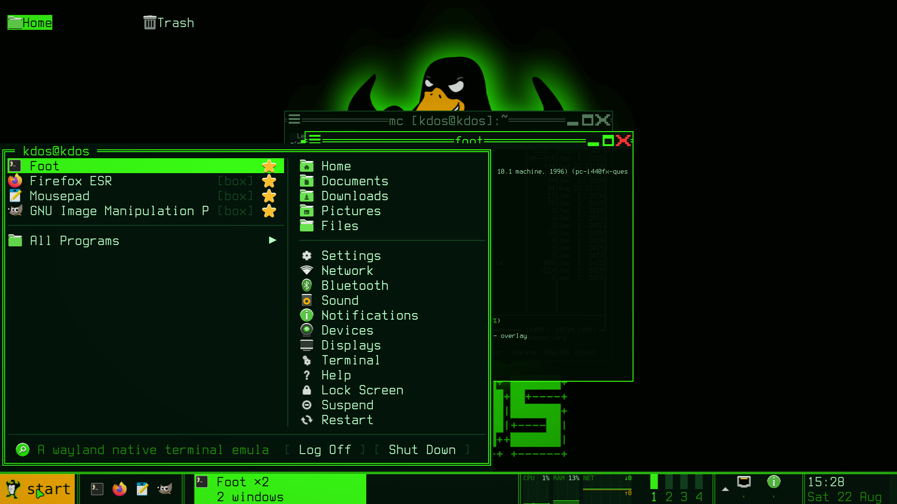
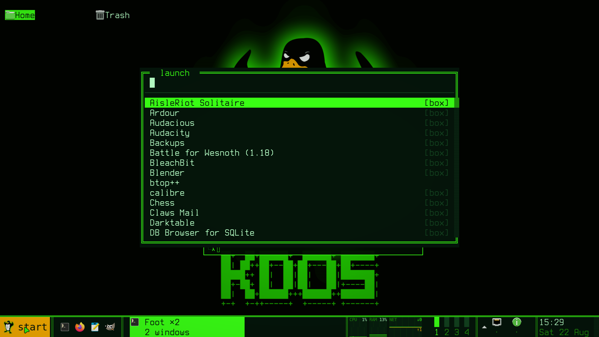
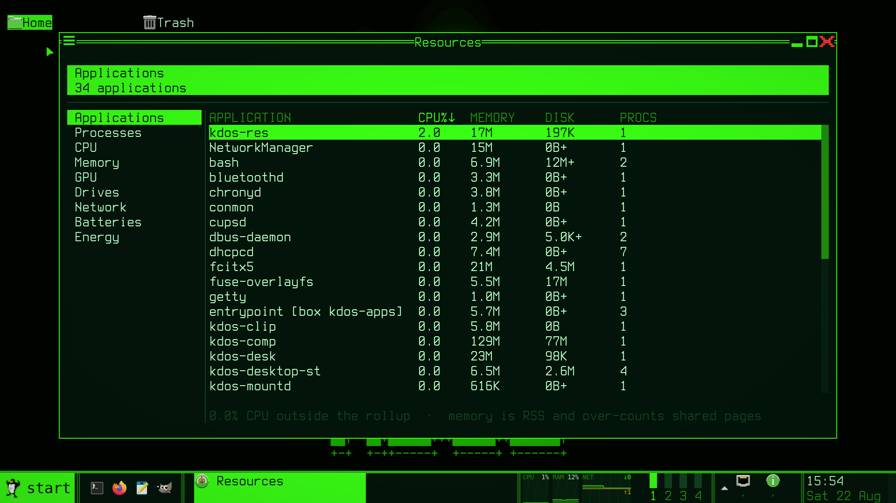
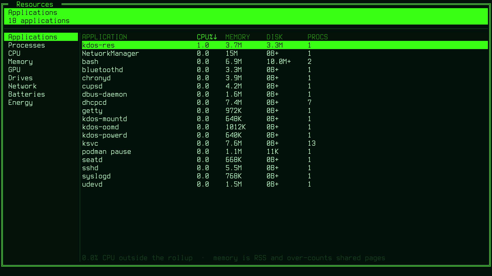

<p align="center">
  
</p>

<h1 align="center">KDOS</h1>

<p align="center"><b><i>I use KDOS btw.</i></b></p>

<p align="center">
A Linux distribution compiled from source, one <code>kpkgbuild</code> at a time —<br>
with a desktop that is a character grid all the way down.
</p>

<p align="center">
<b>musl</b> · <b>toybox</b> · <b>wlroots</b> · <b>no systemd</b> · <b>no Xorg</b> · <b>no GTK or Qt on the host</b>
</p>

<p align="center">
<sub>431 ports · Linux 7.0.10 · 407 packages on the ISO · 91 containerised applications · builds offline from this repo</sub>
</p>

<p align="center">
  
</p>

<p align="center">
<sub>Every screenshot here is 1920×1080, taken on the current ISO in a QEMU guest with virgl, so the phosphor shader is in the picture rather than described.</sub>
</p>

---

## Who this is for

KDOS assumes a reader comfortable with a build log, a package recipe, and the C
that draws the panel. It ships one user account, no first-boot wizard, no
telemetry, and no configuration layer between you and the file that takes
effect. Almost every byte of the host is compiled here from an upstream
tarball, so anything wrong is wrong somewhere you can read — and the handful of
things that are *not* compiled here are named, counted and explained in
[What is not built from source](#what-is-not-built-from-source) rather than
glossed over.

That trade is deliberate. You get a system inspectable end to end and
rebuildable from the machine itself, offline, with reproducible packages. You
take on being the integrator: no vendor to escalate to, no third-party archive,
no abstraction that quietly papers over a mistake.

It is worth your time if you want to change the desktop, the package manager or
the installer rather than configure around them; to run a workstation whose
applications are containerised by default; or to keep an offline, reproducible
source for the exact system you are running. It is the wrong choice if you need
broad hardware enablement, a large binary archive, or a system that stays out of
your way.

---

## What KDOS is

Four properties. Everything else in this repository follows from them.

**1 — Built from scratch.** The host is compiled here by a recipe in `ports/`:
431 ports, cross toolchain → musl userland → self-hosting bootstrap → libraries
→ desktop → kernel. No base image, no binary package archive. Eight ports are
exceptions — vendor firmware with no source, two bootstrap compilers, two
prebuilt font sets — and they are listed in full below.

**2 — KDOS can build KDOS.** Phase 2 is a real self-hosting pass: the chroot
rebuilds tar, musl, zlib, binutils and gcc *with itself*. The shipped system
carries gcc 15.2, binutils, rust 1.93, cmake, meson, ninja, python 3.14, make and
`kpkg`, so a running KDOS can rebuild every port in the tree — the kernel, the
compiler and the desktop included. `kdos rebuild /mnt/work` does it from the
sources on the medium, with no network at any point.

**3 — The repo builds offline.** `make build` runs `--network none`. Every
upstream tarball, every `cargo vendor` bundle and the entire ~4 GB alien-app
container image live in this repository under Git LFS. Clone it, unplug the
network, get a bootable ISO. A build that reaches the internet is a build that
stops reproducing the day a URL rots.

**4 — Applications live in boxes.** KDOS builds the *desktop*; it does not
native-port Firefox, LibreOffice or Blender. The outer ring is a Debian image
baked into the ISO, and 91 GUI applications out of it behave like ordinary
system apps: launcher entries, MIME handlers, terminal commands, one theme.

### What is not built from source

"Built from scratch" is a claim, so here is the complete list of what it does
not cover. Each was checked against the tree rather than remembered.

**Vendor firmware and microcode — no source exists to build.**

| Port | Size | What it is |
|---|---|---|
| `linux-firmware` | 619 MB source → **921 MB installed** | Upstream's complete tree, unpruned, installed with upstream's own `copy-firmware.sh --zstd` — which creates the 2307 `WHENCE` alias symlinks a plain copy would omit |
| `intel-ucode` | 17 MB | Upstream's whole Intel microcode set. Rides in front of the initramfs for the kernel's early loader |
| `sof-firmware` | 10 MB | Intel SOF audio DSP firmware and topologies. Not part of linux-firmware; Tiger Lake and newer are silent without it |
| `wireless-regdb` | 40 KB | The regulatory database. **Must** ship prebuilt: the kernel is `CONFIG_CFG80211_REQUIRE_SIGNED_REGDB=y` and verifies upstream's signature, so a locally regenerated database is rejected in silence |

The firmware tree ships **whole rather than curated**. A pruned subset is a bet
on which hardware the machine turns out to have, and losing that bet is silent:
`request_firmware()` fails and the device simply does not work.

**Two bootstrap compilers — the chicken and the egg.** Rust and Go are written
in themselves, so building either needs a working one first: `rust` takes 146 MB
of upstream stage-0 binaries, `go` 57 MB of its own bootstrap toolchain. Both
are pinned by version and sha256 like every other source and committed, so the
offline build still holds. Everything they then produce — the shipped `rustc`,
`cargo`, `go`, and every Rust program in the tree — is compiled here.

**Two prebuilt font sets.** `ttf-dejavu` (5 MB) and `terminus-ttf` (0.5 MB) ship
as `.ttf` because upstream publishes them that way. The console font
`terminus-font` is genuinely built from source: BDF through `configure` and
`make` into the PSF that `kdos-getty` loads.

**Vendored artwork, remade rather than redrawn.** `kdos-icons` (pruned Papirus
SVG), `kdos-cursors` (Bibata Xcursor binaries) and `kdos-gtk-theme` (adw-gtk3)
are upstream assets committed here and recoloured at build time by generators in
`src/packages/`. The palette is ours; the shapes are not. Each carries a
`LICENSE.notice` recording exactly what changed.

**One vendored third-party source set.** Monocypher, in
`src/libs/libksig/monocypher/` — 4 files of public-domain C99 for Ed25519,
compiled here like everything else. It is the only code under `src/` that is not
ours.

**The application container is Debian.** `ports/appbox/` is a ~3.9 GB pre-baked
Debian trixie image, and nothing in it is compiled by this repository. That is
the point of the outer ring, but it is by far the largest body of binaries on
the medium and deserves saying plainly.

**Data files are data.** `ca-certificates`, `iana-etc`, `hwdata`,
`xkeyboard-config`, `iso-codes` and `docbook-xml`/`xsl` are text or tables
installed as they arrive. One is not purely text: `alsa-ucm-conf` carries 18
small binary `.bin` files — precomputed EQ coefficients for SOF DSPs, which
belong with the firmware group in kind if not in size.

Everything else on the host — every library, every daemon, the compiler, the
kernel and the desktop — is compiled here from a tarball whose URL and sha256
are in this repository.

### The three rings

| Ring | Lives in | What is there |
|---|---|---|
| **Core** | `ports/core/` | musl, toybox, the kernel, the toolchain, init — 431 recipes |
| **Desktop** | `src/desktop/` + `wlroots` | `kdos-comp`, `kdos-shell`, `kdos-res`, lock, power, energy, oomd, mountd, boxsock, the portal |
| **Outer** | `ports/appbox/` | The Debian app image: browsers, office, CAD, media, IDEs, games |

`src/packages/` is the fourth thing: ports that are **ours** rather than an
upstream tarball — `kpkg`, the installer, the boot splash, the appbox runtime,
the theme generators, and three vendored-and-recoloured art packages.

---

## The desktop

<p align="center">
  
</p>

The desktop is ours, and it is a **grid of character cells** — not a
retro-aesthetic wrapper over a toolkit, but literally: the taskbar, the Start
menu, the launcher, the desktop icons, the file chooser, the resource monitor,
the lock screen and the installer are all drawn by `libktui` into cells, and
only application windows contain pixels. That is why the host needs neither GTK
nor Qt.

### `kdos-comp` — a frozen hard fork of labwc

labwc 0.20.0, imported wholesale, rebranded, and never merged again: ~45,000
lines of upstream C that the wlroots ecosystem exercises daily, plus 5,599 lines
of KDOS in eleven graft files and one-line hooks in 19 upstream files, every one
marked `/* KDOS */`.

| Graft | What it adds |
|---|---|
| `kdos-crt.c` | the phosphor shader the whole session renders through |
| `kdos-wallpaper.c` | the wallpaper, as scene nodes rather than a client |
| `kdos-child.c` | supervised chrome — one set per output, with a crash-loop brake |
| `kdos-group.c` | window grouping: tabbed stacks, sharing one geometry |
| `kdos-winpos.c` | window position memory, clamped into the usable area |
| `kdos-idle.c` | dim → lock → outputs off, each measured from the last activity |
| `kdos-lid.c` | the lid switch |
| `kdos-frames.c` | a frame-timing socket, for `kdos stutter` |
| `kdos-cmd.c` | a command socket — `kdos hey list`, `kdos hey run Close 7` |
| `kdos-layerfocus.c` | a click on the desktop or the panel dismisses an open menu |
| `kdos-config.c` | `~/.config/kdos/comp.conf`, parsed and never sourced |

Everything else — window management, session lock, capture, clipboard, Xwayland,
input methods, security contexts — is upstream code. That choice closed a long
list of gaps in one commit and is why the desktop's own code is small enough to
audit.

Keybinds, mouse bindings and workspaces are labwc's `rc.xml`, documented by
labwc. One line in it is load-bearing enough to be checked by `preflight.sh`:
**`<default />` must be the first child of `<keyboard>` and `<mouse>`**, because
labwc loads its built-in bindings only when the user's file defines none of that
kind. Omitting it silently throws away click-to-focus, the titlebar drag, the
window buttons, the root menu and every snap arrow — and on a booted image the
symptom is "the mouse does not work".

### The compositor renders the session through a CRT pass

wlroots has no shader API, so the pass uses the one documented seam it does
have: `wlr_scene_output_build_state()` takes a custom swapchain. The scene
composites into a buffer of ours; our GLES2 program blits that into the output's
real buffer with a three-tap horizontal bleed, a vignette, a faint phosphor
floor so black is never quite black, and — off by default — scanlines and
barrel distortion.

**The scanlines are the one part that ships off**, and the reason is the thing
underneath them: this desktop is a grid of 16×32 cells, and a dark line on
every third *physical* row shares its period with nothing on the screen, so
text drawn crisp and two-colour arrives striped. The bleed, the vignette and
the floor are what carry the look. `crt_scanlines = 60` in `comp.conf` is the
strength they shipped at, for anyone who wants them.

Three things it gets right, each of which was a bug first:

- **Direct scanout is off while it is on.** On the scanout path wlr_scene hands
  the commit a *client's* buffer plus a destination box — not a picture of the
  desktop — and the first version stretched a 13-pixel panel over the screen.
- **The texture is imported per frame and destroyed after.** Caching it per
  swapchain slot deadlocks the swapchain: a slot is reused only when its last
  lock goes, so four cached textures means `No free output buffer slot`.
- **Two fallbacks, neither of which can black the screen.** A non-GLES2 renderer
  gets no pass at all, reported at startup; anything that fails at runtime marks
  that output broken and returns to the plain commit for good.

`crt = 0` in `comp.conf` is an honest off, and `KDOS_CRT_DUMP=<prefix>` writes
the composite and the result as PPMs — which is how the pass gets looked at
without a screen.

### `kdos-shell` — one binary under 28 names

The taskbar, the Start menu, the launcher, the menus, the desktop icons, the
file chooser, the run box, the notification daemon and centre, the calendar, the
tooltips, the clipboard history, the display, audio, network, bluetooth and
device managers — all one basename-dispatched binary sharing one font cache, one
palette and one widget toolkit. `TOOLS[]` in `main.c` is the authoritative list.

Everything it draws it learns from **standard protocols**: wlr-foreign-toplevel
for the window list, ext-workspace-v1 for the pager, wlr-output-management for
the screens, StatusNotifierItem for the tray. The compositor's two private
sockets carry frame timings and window commands and nothing the chrome needs to
paint itself — which is what lets you run waybar here instead if you want to.

<p align="center">
  
</p>

The Start menu is the front door. The left column is what you *use* — pinned
above the rule, most-frequent below it, from a usage count kept in
`$XDG_STATE_HOME` — and All Programs opens the categories in place, because a
cascade needs a surface per level and buys nothing on a grid. Typing searches
applications, places and settings together, so `wifi` finds the network manager
three rows up the other column. `[box]` marks an application that lives in a
container, because the first launch of one costs a container start and you are
entitled to know that before you click.

<p align="center">
  
</p>

`Super+D` is the full-screen search over everything that can be started. Both it
and the Start menu read **one application index**, so they cannot disagree about
what exists or about what is boxed.

### The taskbar

One panel, on the bottom edge, two rows deep — one, because two means two
exclusive zones, two hit maps and the window list drawn twice, which on a
1280×800 screen with a 32-pixel font is 8% of the display spent saying the same
thing at both ends of it. A cell is 16×32 pixels, so two cells across two rows is
a 32×64 box with a 32×32 icon centred in it. That is the whole geometry of this
bar, and most of its defects have been arithmetic:

- **Icons and charts are sprite tiles — a block of cells drawn as pixels.** The
  slot rides inside the cell's codepoint, so the ordinary row diff is already the
  damage mechanism. A tile owns *two* canvases and alternates them, because
  redrawing one in place changes no cell and the frame is never re-presented: a
  clock tile would freeze at the minute it was first drawn. And a tile is never
  *required* — `sh_tile_slot()` answers −1 on a terminal, under `icons = no` and
  with no font, and every caller falls back to the glyph layout it had before,
  which is what keeps `--dump`, tty1 and the golden frames honest.
- **The meters are real area charts**, sampled on their own monotonic deadline
  rather than on the draw loop — that is why moving the mouse used to make
  `CPU 0%` and `CPU 100%` flash at pointer speed: the *number* was wrong, not the
  rendering. Received and sent are mirrored about a midline on one shared scale,
  because "269 kB/s" does not say which direction the machine is busy in, and the
  axis snaps to a ladder of round numbers with hysteresis, because a chart
  autoscaled to its own window moves its ruler while the data stands still.
  **The axis is taken over the samples that are on screen**, not over the whole
  ring: the ring is 256 samples and a band about a hundred pixels, so scanning
  all of it handed the scale to a spike nobody could see. One burst of traffic
  at login pinned it at 16 MB/s and held it there while every visible sample was
  under 120 *bytes*; when the spike finally aged out the scale fell several
  rungs at once and the whole chart leapt. `KDOS_PANEL_DEBUG=1` prints each
  meter's ring length, axis and newest value once per sample, which is how that
  was found after screenshots had failed to show it.
- **The bar is framed like a window.** Its top edge is two accent lines with a
  gap — the cross-section of `═`, the same mark the compositor draws every
  window's frame with. It is painted outside the cell grid, so the bar reads as
  a piece of chrome rather than a region of the desktop without spending a
  32-pixel row on a border.
- **A panel button toggles its popup.** Clicking the clock opened a calendar and
  clicking it again opened another one, because a popup here is a separate
  process and the panel never asked whether the last was still up. One record —
  the pid and which control opened it — and a second click on the same control
  closes it.
- **Nothing in the status area comes and goes.** The stutter chip, the restart
  mark, the clipboard depth and the removable-media count appear only when they
  have something to say — four columns at a time, which changed the wing's width
  and slid every chart sideways. They live behind one chevron of fixed width,
  drawn whether or not anything is in it.
- **Four degradation passes, in priority order.** A narrow bar drops the meters,
  then the Start word, then the quick-launch row; the window list drops its
  *text* before it drops a window. Nothing may drop a window button.

The bar answers all three mouse buttons the way taskbars have since 1995: left
toggles, middle closes politely, right opens the window menu. The status area is
controls rather than a readout — volume mutes on a click and takes ±5% from the
wheel straight through the ALSA mixer, the clock opens a calendar, the meters
open the resource monitor, the microphone lamp stops the recording. Every picture
with no label has a tooltip, spawned after 700 ms of stillness as its own process
with an empty input region, because libktui has one cell buffer per process and a
tip that ate the click aimed at the thing it describes would be worse than none.

### `kdos-res` — the resource monitor

<p align="center">
  
</p>

Nine pages — Applications, Processes, CPU, Memory, GPU, Drives, Network,
Batteries, Energy — plus a detail page per subject. It exists beside `btop`
rather than instead of it, because what it has that no other monitor on this
machine has is **identity**: every fat application here is its own container, so
a process table shows forty rows of `Web Content` and answers nobody's question.
A conmon walk turns a pid into `firefox-esr (appbox kdos-apps)`, and the
Applications page is that rollup.

**One renderer, three faces.** The same page, layout and numbers on tty1, in a
window, and in `--dump`: there is only a grid of character cells, and libktui's
backend decides who paints it — the terminal, Wayland, or an offscreen buffer.
Nothing above that line knows which. It was the tree's first xdg-toplevel
client, which is how `libkwl` came to bind xdg-decoration and ask for a
server-side frame — the thing every native window here now wears.

**No number is invented.** Every reader answers `KPR_UNREADABLE` where the
machine publishes no value and the cell renders a plain `-`. A `0` default is
how a monitor reports a sensor that does not exist as a machine that is idle,
and the GPU page is where that bites hardest: only amdgpu and NVML publish a
utilisation percentage, so every other driver gets engine *time*, labelled as
such, and a driver with no fdinfo stats gets no column rather than a column of
zeroes. A counter that went backwards is a gap, never a spike.

**And the pointer reaches all of it.** Motion lights a row, a press selects it,
a press on the row already selected opens its detail page, a press on a column
header sets the sort and a second press reverses it, and the scrollbar is
dragged rather than merely looked at. Getting that last one working turned up
the reason the *wheel* had never worked here either: both tables told
`kch_list_clamp` on every draw that the selection was what had moved, so the
next frame pulled the viewport straight back to it. One flag, set by whatever
moves the cursor and cleared by whatever moves the page, fixes both — and the
same defect was sitting in `kdos-settings` and `kdos-teams`.

**The verbs live on the detail page and nowhere else.** End, Kill and Nice are
on the full-screen page for one subject, not on a table row — a key that ended a
process from a table is a key pressed while the cursor happens to be somewhere.
The confirm modal names what will happen (*"End all Firefox — 41 processes in
appbox kdos-apps"*) with Cancel preselected; a renice is not confirmed, because
it is reversible and a dialog on every nudge teaches people to click through the
one that matters. `kdos-resctl` is the second setuid binary KDOS ships and the
whole of its security argument is that there is nothing to aim: three verbs, no
paths, no options.

### The file dialog is a character grid too

<p align="center">
  
</p>

Open and Save in a boxed GIMP or LibreOffice go through
`xdg-desktop-portal-kdos`, a bus adapter and nothing more: it spawns `kdos-pick`
and reads its stdout, so the chooser stays a normal program you can run by hand,
script, or replace. The same backend answers `Settings` (colour scheme and
accent) and `OpenURI` — "open this on the host for me", which is what a
containerised app asks when you click a link, and which had no backend at all
until it was implemented on top of `kdos-appbox open`.

Three rules it exists to keep: **every request is answered** (an unanswered one
leaves the application blocked forever); the bus loop **never blocks on a
dialog** — the fork happens in the handler, the message is reffed, the pipe joins
the poll set, so a second app's Open does not queue behind the first; and the
chooser is exec'd with `argv`.

The catch nobody documents: a GTK app routes through the portal only when it
believes it is sandboxed. A distrobox is not, so all of this existed and nothing
ever called it until `kdos-appbox` started exporting `GTK_USE_PORTAL=1`.

### Settings, and the rest of the chrome

<p align="center">
  
</p>

`kdos-settings` opens on a grid of labelled pictures rather than a sidebar of
seven words, because that is how anyone finds a page the first time; the list
view is what you land in once you pick one, and Escape steps *back* to the grid
rather than out of the program. It writes `panel.conf`, and the panel re-reads it
on the same SIGHUP `kdos theme` already sends, so the widget set, the meters and
the tray changes take effect on the bar that is on the screen.

`kdos-net`, `kdos-bt` and `kdos-audio` share one chrome: a header band that says
what its subject is doing *right now*, group headings, and real buttons labelled
with verbs and enabled from the selection. `kdos-net` is NetworkManager over
sd-bus and does not reorder under the pointer — signal strength moves on its own,
so the list is sorted once per refresh and the selection follows the SSID rather
than the index. `kdos-bt` registers an `org.bluez.Agent1`, without which a
keyboard cannot be paired at all. `kdos-devices` is the fourth and the one that
has not adopted that chrome; it enumerates cameras by V4L2 ioctl and previews a
grabbed frame as ASCII. Anchored to the panel they are popups; typed by name they
are windows, and one flag decides both.

**And a window is an xdg toplevel, which is the whole of why one can be moved.**
Layer-shell has no move and no resize in the protocol at all, so for a long
while every native surface here was a rectangle nailed to the screen while
every containerised one could be dragged and pulled about. The centred form of
each of these — settings, the four device panels, the chooser, the Open-with
dialog, the help viewer, the status popup's window form — is a toplevel now,
and the compositor decorates it with the same
`════ Title ════[_][=][X]` frame it puts on GIMP. Which is also the answer to
"why do native and alien windows look different": they no longer do, because it
is the same frame. `sh_frame()` is the one line that decides — it asks the
surface whether somebody else is already drawing a border, so a toplevel does
not wear two of them with its title written twice.

### Windows

Grouping is Haiku's Stack & Tile, the stack half: `AddToTabGroup` puts the
focused window onto the one behind it and the survivor's titlebar grows a tab per
member. A hidden member is a **minimized view** rather than a scene tree disabled
behind labwc's back, so focus skips it, wlr-foreign-toplevel already reports it
minimized, and the panel stays truthful with no second graft. The three actions
are `rc.xml`'s to bind — the shipped file leaves them unbound. Tearing a tab back
out by dragging it is not implemented.

Position memory is the other graft: a window that would otherwise be *placed* by
us reopens where it was, clamped into the output's usable area, and never applied
to a client that positioned itself, was placed by a rule, or maps maximized.

An unnamed layer surface is placed by the compositor on **one** output, and
libktui has a single cell buffer — so a second screen cannot be a second surface
of the same process, it has to be a second *process*, which is what the chrome
already was. The compositor supervises one set per output, spawned from its
output-created hook and SIGTERMed from output-destroyed. Without that a
two-monitor machine gets a panel, a window list and desktop icons on one screen
and nothing on the other.

### Lock, idle, power

`kdos-lock` is an `ext-session-lock-v1` client, and the compositor owns the
`locked` state — so a lock screen that crashes stays locked and a new client may
replace it, which is the recovery the protocol exists for. **`kdos-checkpass`
takes no arguments at all**: the account checked is the caller's real uid, so
there is nothing to aim at root, and the password arrives on stdin because
`argv` is world-readable through `/proc`. `kdos doctor` checks that setuid bit,
because losing it is silent and locks you out of your own session.

`kdos-powerd` is a root daemon on a unix socket gated by `SO_PEERCRED` — root
and `wheel`, checked on the socket rather than taken from the message, so there
is nothing to forge. All three idle stages default to 0 in a VM, because a
blanked screen over VNC is indistinguishable from a crashed compositor.

### Input methods

The compositor is the wire — text-input-v3 for the application, input-method-v2
for the engine, virtual-keyboard-v1 for the route back — and `fcitx5` is on the
other end of it, ported Wayland-only with pinyin, shuangpin and eight table
methods (`fcitx5-chinese-addons` over `libime`), Japanese (`fcitx5-anthy`) and
Korean (`fcitx5-hangul`). Two decisions there are policy rather than packaging:
**cloud pinyin is off**, because it sends what you are typing to a remote service
on a distro that boxes its applications so nothing has to phone home; and the
configuration tool is not built, because it is Qt. A boxed app reaches the input
method through the compositor, never directly — which is why `QT_IM_MODULE` is
`wayland` and `GTK_IM_MODULE` is deliberately unset.

Sandboxed clients **cannot be** an input method: `input-method-v2` and
`virtual-keyboard-v1` are outside the security-context allowlist, since the grab
delivers every keystroke on the seat. `text-input-v3` is deliberately inside it —
that is the application half, and denying it would deny input methods to the
boxed apps that need one most.

---

## Six things this desktop does that other Linux desktops do not

**1 — It names the process that made your desktop hiccup.**

```
7 frames dropped on eDP-1 (133 ms) — the busiest just then:
  calibre-idx (appbox kdos-apps)  waiting on the disk
  calibre     (appbox kdos-apps)  92% of a core
```

`kdos stutter` joins three sources that are each useless alone: the compositor's
own frame deadline (presentation events where the backend has them, the frame
clock where it does not — reported with a `source` field rather than averaged),
`/proc/pressure/*`, and `/proc/<pid>/stat`. The closest prior art states outright
that it *"cannot identify which specific process caused a frame miss"*. Two
details make the difference: **blocked before busy** (a process asleep in `D`
shows almost no CPU while it is the thing holding the disk) and container names
read from `conmon`'s argv rather than cgroups, because rootless podman with no
systemd frequently sits in `0::/`.

Over 60% of the frame budget spent in the compositor's own render is the one
causal claim it makes. Otherwise it reports what it measured and names who was
busy — attribution from a 500 ms window is circumstantial, and a tool that
claimed otherwise would be wrong the first time two things were busy at once.

**2 — The panel names the app using your microphone or camera.**

Every phone OS has done this for a decade. The reason no Linux desktop does is
not difficulty — PipeWire knows the capture node, the node knows the client, the
client knows its name, the panel knows how to draw — it is that there are four
owners and nobody owns all four. Two sources, because there are two ways to
record: a PipeWire node with `media.class = Stream/Input/Audio` counted only
while it is RUNNING (a node that *exists* is not a node that is *recording*),
and, for the camera, a process holding an fd on `/dev/video*`, because almost
nothing takes the camera through a portal. The lamp is a control: it stops the
recording.

**3 — Per-app Energy Impact.**

Windows, macOS and Android all ship it; no Linux desktop does, and the hard part
is not the measurement — RAPL and cycle-share are twenty years old — it is
*identity*: "Firefox" is forty processes in scattered cgroups. Here every fat
application already runs in its own container whose supervisor knows its name.
`kdos-energy` reports **relative shares, never watt-hours**, because RAPL sees
the CPU package and not your panel; it drops nested RAPL domains (summing the
flat listing double-counts the cores — measured: 15 W becomes 26.25 W), handles
the counter wrap, and subtracts a measured idle floor before attributing
anything.

**4 — It kills something before the desktop wedges, not after.**

The kernel's OOM killer fires when an *allocation* fails, which on a machine with
swap is minutes after the desktop stopped answering. `kdos-oomd` waits on
`POLLPRI` against a threshold **written into** `/proc/pressure/memory` — the
kernel's own trigger API, not a sampling loop that would compete for CPU with the
stall it is trying to notice. The desktop's own chrome is not eligible; boxed
processes are preferred victims, because an alien app is the likely culprit and
relaunches in seconds. The pages come back through `process_mrelease(2)` on a
pidfd taken *before* the SIGKILL, so the reclaim cannot land on a recycled pid.

**5 — A boxed app cannot photograph your screen.**

`kdos-boxsock` gives every container its own tagged Wayland socket via
`security-context-v1`; labwc's filter then hands that client a static allowlist —
surfaces, seat, dmabuf, text-input, primary selection — and none of the capture,
data-control or input-method globals. Verified: a tagged `grim` cannot bind
screencopy while an untagged one shoots the screen. That is what makes the portal
the *sanctioned* route rather than a convenience. For native programs the
equivalent is `kdos sandbox`, which is Landlock and three syscalls: every option
maps onto an access bit, and what the running kernel cannot enforce is reported
rather than pretended.

**6 — The desktop's own tools are testable without a desktop.**

`kdos-shell --dump`, `kdos-res --dump --page energy`, `kdosbuild --preview`,
`kinstall --dump plan --json`, `kdos stutter --fixture`, `kdos-oomd --fixture`,
`kdos-mountd --fixture`, `KDOS_PRIVACY_PROC` — every component that makes a
decision can be asked what it would draw or conclude, offscreen, with no
compositor and no hardware. 48 golden frames are diffed on every run. Six
geometry defects in this toolkit were invisible to the compiler and to a test
suite that could not draw; that is what these exist for.

---

## PHOSPHOR

The look is a 1983 green-screen terminal that happens to be running a modern
Wayland desktop, and it goes all the way down: `setvtrgb` loads the palette in
`rcS`, so tty1 is phosphor before anything Wayland exists.

```sh
kdos theme phosphor | amber | ice | bone
```

<p align="center">
  
</p>

One command repaints the panel, the desktop icons, the notifications, the window
frames, the CRT shader's tint, the wallpaper, the icon theme, the cursor theme,
the GTK stylesheets, `kdeglobals`, foot, btop, mc and the starship prompt — from
a single palette table compiled into every consumer as an X-macro, so nobody
keeps a second copy of the numbers.

**The desktop needs no theme file at all.** `kdos-comp` and `kdos-shell` link
`libkcolor` and read one word — the accent *name* — from
`$XDG_CACHE_HOME/kdos/theme`. A running session is retinted by a SIGHUP, not by
being handed a palette. Everything `kdos theme` writes exists for software that
is **not ours** and cannot be told: GTK and Qt apps in the box, foot, btop,
starship.

Alien apps are themed through `$HOME`, because a container shares your home
directory and nothing else — `/usr/share/themes` is invisible inside it:

| Path | Read by |
|---|---|
| `~/.themes/KDOS/` | GTK3 and non-libadwaita GTK4 |
| `~/.config/gtk-{3,4}.0/gtk.css` | libadwaita, which ignores themes entirely |
| `~/.config/kdeglobals` | every Qt app under `QT_QPA_PLATFORMTHEME=kde` |
| `~/.icons/KDOS/`, `~/.icons/KDOS-cursors/` | every toolkit, host and container |

The GTK theme is a recoloured **adw-gtk3** rather than hand-written CSS over
Adwaita, and that choice is the fix: stock GTK3 Adwaita is compiled from SASS
with literal hex in every rule, so redefining named colours reaches only the
widgets that happen to reference one. adw-gtk3 is written against named colours
end to end — rewrite ~125 `@define-color` declarations and every widget follows.

The icon theme is a pruned, hue-mapped **Papirus** (90 MB → 13.7 MB), mapped by
*family* rather than flattened: blue/green/purple to the accent,
yellow/orange/brown to the secondary, red to urgent. Papirus colour-codes
mimetypes, and collapsing every hue onto one accent turns a folder of files into
a wall of identical green lozenges. A PDF stays red, an audio file stays amber.
Cursors are a pruned, recoloured **Bibata** (27 MB → 4.4 MB) where `wait` and
`progress` ramp to amber — the same "working on it" colour the boot splash uses.

Two derived colours, and confusing them is a legibility bug: `dim` is a **fill**
at 1.63:1 and is used for fills, borders and selection backgrounds; every text
role goes through `kcol_muted()` instead, at 4.07–4.73:1. `docs/ACCESSIBILITY.md`
carries the measured table, what exists, and what never will.

**`kdos theme --audit`** re-runs every generator against a scratch `$HOME` and
compares byte for byte, symlinks included. It repairs nothing — an audit that
fixed what it found would be a `kdos theme` with a misleading name. Exit 0 clean,
1 on drift.

---

## Alien apps

<p align="center">
  
</p>

That is GIMP — glibc, GTK3, running inside rootless Podman — with KDOS's accent
on every widget and its desktop-entry `Name` in the taskbar rather than `gimp`.
The ISO ships a pre-baked **Debian trixie** image with the best open-source app
per segment: LibreOffice, Firefox, GIMP, Krita, Inkscape, Blender, FreeCAD,
PrusaSlicer, OpenSCAD, KiCad, Octave, Stellarium, Ardour, LMMS, Kdenlive, OBS,
VSCodium, Wireshark, KeePassXC, RetroArch, emulators, wine, and a shelf of games.
Heavy is the point: **the image is the offline software library**, a
Knoppix-style fat stick that gives you a full workstation with no network.

Nothing about them looks containerised in use:

```sh
gimp photo.png                  # every alien app is also a normal command
libreoffice-writer report.odt
wine setup.exe                  # a COMMAND, not an application: no launcher
```

91 applications, every one of them also a plain command — plus a handful that
are *only* commands, because some alien software is not an application:
`wine setup.exe` at a prompt is what you want, and a launcher for `wine` with no
arguments opens nothing. They appear in the launcher, register their MIME types
so they show up in "Open with" and can be default handlers, merge into the
taskbar as running windows with their own names, and share the session bus so
single-instance handoff and notifications work. **Cold start is ~18 s, warm start
0.3 s**, because login backgrounds a `nice 10` warmup while the desktop is still
settling.

```sh
kdos-appbox apps                    # what is available
kdos-appbox install thunderbird     # apt into the box
kdos-appbox create dev image=fedora-toolbox:41
kdos-appbox security dev network=private processes=private
kdos-appbox open report.odt         # the MIME route: globs → mimeapps → exec
```

The runtime is ~3,800 lines of C with **no `system()` and no shell anywhere in
it**, because app names, package names and file arguments all arrive from
`.desktop` files and `argv`. An `Exec=` line is not a whitespace-separated list —
it carries the desktop-entry format's quoting *and* its field codes, and treating
it as one is a whole class of application that appears not to start;
`kxdg_exec_split()` is the single implementation, and the selftest asserts it
against two real shapes from the shipped image.

Every sandbox profile key maps 1:1 onto a container namespace flag — `network`,
`ipc`, `devices`, `processes`, `home` — and that mapping is the design: **KDOS
does not offer confinement it cannot enforce.** Profiles apply at creation time,
because namespaces cannot be re-flagged on a live container, and the tool says so
instead of silently doing nothing.

> The committed image is one bake behind its own `Containerfile`: the KDE
> application segment and the Qt platform-theme labels were added after it was
> packed, so the shipped box has 91 apps and takes the GTK theming route. That
> is a re-bake (`make fetch-apps`, needs network), not a config bug.

---

## kpkg

```sh
kpkg install foo       # build from ports and install
kpkgadd  foo.tar.xz    # install a pre-built package
kpkgdel  foo           # remove
kpkgdepends foo        # resolved install order
```

**A port is two files.** `kpkgbuild` is declarative metadata that is *parsed,
never sourced*; `build.sh` beside it is the build and is ordinary bash.

```
name        = mesa
version     = 25.3.3
release     = 1
source      = https://mesa3d.org/archive/mesa-$version.tar.xz
sha256      = 9ba0…  mesa-25.3.3.tar.xz
description = OpenGL and Vulkan implementation
depends     = libdisplay-info libinput pixman seatd eudev libxkbcommon
vendoring   = rust
```

Splitting them is what lets `bash -n` syntax-check all 449 build scripts in
`testing/preflight.sh`, and what stopped kpkg exec'ing bash just to *read* a
recipe. The shell stayed in a file rather than moving into the format because
there is no embeddable shell worth vendoring — and because `ports/core/rust`
writes a `config.toml` heredoc containing a line that reads exactly `[build]`.

**Packages are reproducible.** Building a port twice yields a byte-identical
`.tar.xz`: sorted members, `uid/gid 0`, mtime from a pinned `SOURCE_DATE_EPOCH`,
GNU format, single-threaded xz, and a `umask(022)` before the build. Measured on
real ports, including a second build under `umask 077`, `XZ_OPT=-T0` and
`TZ=Asia/Kolkata` — the three things that used to change the bytes. That is the
precondition for everything below:

```sh
kpkg verify --repro zlib          # build it twice; the two must be identical
kpkg keygen builder               # Ed25519, via vendored Monocypher
kpkg index /repo --sign builder.key
kpkg binhost /repo zlib           # use the prebuilt package, or say why not
kpkg delta old.tar.xz new.tar.xz  # 3 KB instead of 85 KB on a point release
```

**Two hashes replace Gentoo's entire USE-flag matching problem**, because KDOS
has no USE flags: a prebuilt package is usable when the architecture, the
*build-config* hash (arch, libc, target, compiler version, C/C++/LD flags) and
the *recipe* hash (SHA-256 over kpkgbuild, build.sh, postinstall.sh and every
patch) all equal the client's own. Anything else builds from source, and the exit
code says which happened. The same recipe hash is what makes the build rebuild a
port whose recipe changed without being told — with a third state that matters on
an older tree: **no recorded hash reads as unknown, never as changed.**

Signing is Ed25519 through vendored Monocypher — libsodium is a shared library,
BearSSL has no Ed25519 *signing*, and OpenSSL is the opposite of "links nothing
but musl". **The index is signed, not 407 packages**: it carries every package's
hash, so one signature covers them all transitively. A bad signature is refused;
a missing one is allowed, because local builds are never signed, unless
`KPKG_REQUIRE_SIG=1`. KDOS ships **no key** in `/etc/kdos/keys`, because shipping
one would be asking you to trust whoever built the image — which is the question
signing exists to let you answer yourself.

Deltas are `zstd --patch-from` over the **uncompressed** tars (two `.tar.xz`
files built from nearly identical trees share almost no bytes — that is what a
compressor does), and a delta is never trusted: it is applied and the *result* is
hashed against the `C:` the signed index already carries.

### `kdos cve` — offline vulnerability tracking

```
KDOS cve  —  Alpine secdb of 2026-08-12 (0 days old), the ports tree

  curl        8.17.0    fixed in 8.21.0   CVE-2025-14017,CVE-2025-14524,… +29 more
  zlib        1.3.1     fixed in 1.3.2    CVE-2026-22184,CVE-2026-27171

  389 checked, 262 not in the database, 28 behind a recorded fix
```

A vendored 270 KB table merged from six Alpine branches, answered by version
comparison rather than a scan, on a machine that cannot reach a CVE feed. Four
details change the answer: Alpine's `-rN` is packaging and is cut off; `fixed in
0` means "never affected"; the newest fix a pin is behind is the one reported;
and **a package Alpine does not carry is UNKNOWN, never clean** — 262 of 389 are
in that state and the summary says so.

---

## The C libraries

Twelve static archives under `src/libs/`, ~21,000 lines, **linking nothing but
musl** — with exactly one declared exception, which is why it is a separate
archive.

| Lib | Owns |
|---|---|
| `libkbase` | alloc + OOM hook, strings, files, paths, flock, group membership, the `KbArgv` builder and the process helpers |
| `libkcolor` | the palette table, HLS, the hue-family classifier, the recolour primitives |
| `libktui` | terminal ownership, cell buffer + diff flush, input decoding, widgets, modals, the three glyph tiers, sprites, offscreen rendering |
| `libkcell` | the fcft glyph cache and the cell → ARGB painter, the pixel canvas, the shape-vector ASCII engine |
| `libkicon` | the icon atlas and the PNG lookup behind every sprite |
| `libkwl` | libktui's **Wayland backend** — surface roles, shm buffers, input, clipboard, `kwl_input_cells` |
| `libkchrome` | the shared chrome: header band, group heading, button bar, list/wheel/scrollbar rule |
| `libkproc` | every reading about the running machine, from a root that can be moved: `/proc`, `/sys`, the conmon box identity, the sample ring |
| `libkxdg` | desktop entries, the mime glob table, and the one correct way to turn an `Exec=` line into argv |
| `libkpkg` | the package database, the ports tree, the solver, `kp_vercmp`, the recipe hashes |
| `libksig` | Ed25519 signing, key files, keyrings (vendored Monocypher) |
| `libkbuild` | phase discovery, the phase-env metadata block, build plans, the snapshot inventory |

The constraint is load-bearing: **`kinstall` links libktui in phase 1**, before
any library exists to link against. `libkwl` needs fcft, pixman, xkbcommon and
wayland-client, so splitting it out is what keeps the installer linking zero
libraries on the first bootable image. `libkproc` links libkbase and nothing
else, which is what lets a root daemon take it.

Three rules the extraction exists to keep, each a bug that was already there:
symbols are prefixed (two of our own programs could not be linked together);
frame state is private (`ui.consumed = 1` appeared in two dozen places in the
installer alone); and chrome hit-ids belong to the library, not to whichever
application registered them first.

`libktui` draws at **three glyph tiers** — eighth blocks where UTF-8 is
available, `░▒█` on the Linux console, `.:#` otherwise — because the console font
is 512 glyphs and an eighth-block bar there is not ugly, it is *invisible*.

`libkcolor` reproduces Python's `colorsys` exactly, including the odd
`2.0 - maxc - minc` and `round()`'s half-to-even, verified over 8,476 colours × 4
schemes against CPython. Not pedantry: the vendored Papirus and Bibata artwork is
committed, and a generator that rounds differently diffs against files already in
git.

---

## Boot

<p align="center">
  
</p>

Past the bootloader, KDOS starts the way its windows do: a flash, the picture
unfolding out of a hairline, scanline banding burning off as the tube warms up,
POST lines with `OK`/`FAIL` columns, and a collapse back into a line and a dot.

That is `kdos-splash` — ~1,100 lines of static C drawing straight to `/dev/fb0`,
with the wordmark rendered from the shipped Terminus console font scaled up, so
the logo is real bitmap type rather than an image. It starts in the initramfs and
**keeps running across `switch_root`**: its control FIFO lives on devtmpfs, which
is *moved* into the new root, so one process spans both halves of boot and the
screen never blinks. Three facts, one debug cycle each:

- **Deferred takeover means nothing is being scanned out.** Writing to `/dev/fb0`
  before the DRM fbdev client does its modeset paints a buffer nobody is looking
  at. One byte to `/dev/tty0` ends the deferral — and only a *real glyph* does
  it: escape sequences are eaten by the VT state machine and spaces are skipped
  by the render path.
- **mmap writes need an explicit flush**, so each frame ends with a
  `FBIOPAN_DISPLAY` to the offset it is already at.
- **The process survives `switch_root` with a ghost root.** Open fds keep working
  — that is the whole trick — but every path it resolves *by name* afterwards
  points into the deleted initramfs, so the `quit` client detects the daemon by
  opening the FIFO and watching for `ENXIO`.

The progress bar is fed **additively**: each phase adds its own step count as it
learns it, so `done == total` happens at every phase boundary — which is why the
splash clamps at 99% until `quit` arrives. A boot that shows 100% and then sits
there is a bug report waiting to happen.

**CPU microcode rides in front of the initramfs**, because the early loader runs
before any filesystem exists and scans the raw initrd for two literal paths.
Nothing in that cpio may be compressed, the Intel bundle is upstream's whole set
rather than a per-family prune, and it must consume to *exactly* its last byte —
`scan_microcode()` ends `return size ? NULL : patch;`, so one stray file means
the kernel loads nothing at all. The build walks the records the same way and
fails instead.

Also on the boot path: **A/B root slots** with the boot counting in the initramfs
(rEFInd has none, and a kernel that boots into a wedged userland must still spend
an attempt), a state file written with the fsync-fsync-rename dance because the
ESP is FAT and a torn write there bricks the machine, and **LUKS2** with the
passphrase prompted through the splash on `/dev/tty1` and fed to `cryptsetup
--key-file=-` on stdin.

`tty1` autologins as `kdos`, and the banner at the top of the terminal in the
first screenshot on this page is what greets you. `kdos-banner` paints it one
raster line at a time with a bright beam leading the fill, then one frame of
reverse video for the CRT thump; any keypress skips the rest, and a dumb `TERM`,
a pipe or a short terminal all fall back to a plain print. `fastfetch` runs with
`--logo none` and the two columns are pasted together here, because asked to
draw a logo fastfetch moves the *cursor* back up over it — output that cannot be
replayed one line at a time. The penguin is decoded from the same quantised
mascot the splash draws, so the banner, the splash and `kdos.png` cannot drift
apart. The console font is `ter-kdos32n`: Terminus xos4-2 with six spacing
diacritics swapped for the double box-drawing glyphs the wordmark needs — loaded
by a getty wrapper that first forces fbcon's deferred takeover, because a
`setfont` any earlier is silently wiped.

<p align="center">
  
</p>

That is `kdos-res` again, on tty1 — the same code, the same layout, no
compositor, no icons, and the three-level glyph tier the console font can
actually render.

---

## Installing to a disk

```sh
sudo kinstall                      # the ten-page wizard
sudo kinstall --dry-run            # rehearse: logs every command, runs none
sudo kinstall --dump plan --json   # what it would do, as data
sudo kinstall --config answers.conf --unattended
```

`kinstall` is a dependency-free C TUI drawn with `libktui` — no ncurses, no
libraries at all beyond musl — and it **writes nothing until the summary is
confirmed**. Every page fills a config struct and only the install step touches
the disk; `Next` on the summary page is deliberately refused, because the install
starts from the button and only from the button.

Two things it does that a terminal installer usually cannot:

- **The mouse works on a bare tty.** The Linux console has no mouse reporting and
  KDOS ships no gpm, so `input.c` opens `/dev/input/event*` itself, keeps its own
  pointer (relative devices scaled by the real cell size read from
  `/sys/class/graphics/fb0/virtual_size`, absolute ones mapped directly) and
  draws it as an inverted cell. Under `foot` it uses SGR-1006 instead.
- **It looks the same in both places.** The whole interface is eight colours,
  because a 512-glyph console font makes the VT steal the foreground intensity
  bit — so `A_BOLD` changes the *font page* rather than the weight. On a tty it
  installs its own palette through `PIO_CMAP` and restores what `kdos-getty`
  loaded; elsewhere the same eight slots go out as 24-bit SGR.

The filesystem is a **table, not a branch** (`ki_filesystems[]`): ext4, btrfs or
xfs, with every consumer reading the same row — the menu, the mkfs argv, the
fstab line and the swapfile step. `fs_passno` is 1 for ext4 and 0 for the others
because there is no `fsck.btrfs` worth running; the swapfile is `fallocate` on
ext4, `dd` on xfs (which refuses unwritten extents) and `btrfs filesystem
mkswapfile` on btrfs. A filesystem whose mkfs is missing is still listed and
refuses *before* anything is written, because a control that snaps back under the
cursor is worse than one that explains itself.

LUKS2 is a checkbox on the layout page, and the boot options then carry **two**
UUIDs: `cryptdevice=UUID=<container>:kdosroot` names the LUKS volume and
`root=UUID=<filesystem>` names what is inside it, which does not exist until the
first is open. The passphrase is refused at the questionnaire when the image has
no cryptsetup — after the point of no return is the wrong place to discover it.

---

## Building it

```sh
make fetch        # every upstream tarball + vendor bundle (LFS)
make fetch-apps   # bake the Debian app image (needs network; only when it changes)
make build        # cross toolchain → userland → desktop → kernel → ISO
make run          # boot the ISO in QEMU
```

The build runs inside an Alpine container with `--network none`, so it cannot
contaminate — or depend on — your host.

| Phase | What it does |
|---|---|
| 0 | Cross toolchain — binutils + gcc for `x86_64-kdos-linux-musl` |
| 1 | Base userland — musl, toybox, bash, native gcc, kpkg, kinstall |
| 2 | Self-hosting bootstrap — the chroot rebuilds its own toolchain |
| 3 | Core libraries, build systems, interpreters |
| 4 | Userland and the Wayland base |
| 5 | The desktop — wlroots, kdos-comp, kdos-shell, kdos-res, the daemons, the portal |
| 5 | Kernel + modules (a separate directory; the two 5s do not overlap) |
| 6 | Packaging — theme, user, appbox, initramfs, ISO |

**The orchestrator is `kdosbuild`** — C on `libkbuild`, compiled on demand by a
two-second `cc` of a program that links nothing but libc. It draws with the same
`libktui` as the installer, which is what killed the third TUI toolkit in this
tree. One structural note: the build *is* the main loop (libktui's input has a
timeout), so there are no threads, no locks, and no progress callbacks that must
avoid drawing concurrently with their caller. `--json` puts the same traversal
out as NDJSON, and `--preview <screen> <WxH> <tier>` draws any of its screens
offscreen so a layout can be looked at without a two-hour build.

Two things make iterating on that build bearable:

**Snapshots.** Every completed phase is archived to `build/snapshots/`. What gets
archived is declared by the phase itself, in a metadata block the orchestrator
**parses and never sources** — several of those files end with `rm -rf
/var/cache/kpkg/work`, which at source time would hit the build container.
Restores are layered and newest-wins.

**Build plans.** Snapshots answer "go back"; plans answer "re-run just this."

```sh
# changed something under fs/ → re-sync it and rebuild the ISO, nothing else
make build BUILD_ARGS="--phases 01_phase1,06_packaging --steps 01_phase1:00_file_system.sh"

# changed a kpkgbuild → rebuild that port and repackage
make build BUILD_ARGS="--phases 04_phase4,06_packaging --rebuild mesa"
```

Three things make that safe: snapshots are suppressed whenever a plan narrows
execution; `kpkg install -f` forces only what was *named*; and the 17 mark-file
guards stand down only for a step the plan picked by name.

**`fs/` sync is manifest-guarded and packages are swept.** `cp -r` overwrites but
never removes, so without the manifest a dropped path lingers forever: a stale
binary blocking its replacement, an old icon riding three ISO rebuilds, 94 dead
launchers beside their 91 replacements. Without the sweep, a port deleted from
`ports/` leaves its package installed forever — measured on this branch, 529 MB
of a desktop that had been removed a milestone earlier.

---

## What proves it

There is no CI service here; there are two scripts and a rule that anything they
cannot check gets checked by hand and written down.

**`testing/preflight.sh`** — 18 checks, seconds, no container: every package in a
`packages.txt` has a port; every `packages.txt` resolves to a dependency order
with clean stdout; every `depends` key names a port that exists; every source a
port ships is named by a `sha256` in its recipe; every KDOS daemon an init script
starts is installed by a port; `bash -n` over 449 build scripts; **every `.c` in
one of our own ports is actually compiled by its recipe** (a source the build.sh
neither names nor globs passes every gate on this machine and fails to *link* in
the build); the shipped `rc.xml` still carries `<default />`; **every command
named in `rc.xml` and `menu.xml` is provided by the tree**; and **every flag one
`kdos-shell` tool passes another is one the other accepts** — the check three
dead panel controls needed, since an unknown argument exits before a surface
exists and no compile or golden frame can see it.

**`testing/selftest.sh`** — 30 sections, half a minute, host-only. It compiles
every library under `-Werror`, runs the invariants established by diffing against
the implementations they replaced, then proves behaviour end to end: kdosbuild
against a synthetic two-phase tree (build, snapshot, restore, plan narrowing, a
deliberate failure); kpkg's reproducibility under a hostile environment; the
binhost refusing an edited index, a tampered package and an untrusted key; the
tray host against a **real second process** on a private `dbus-daemon`; the
FileChooser portal answering `Settings` while a dialog is open; `kdos theme
--audit` against a real generated `$HOME`; and the shell's front ends and all nine
`kdos-res` pages drawn **offscreen with libkwl stubbed out**, diffed against 48
golden frames at more than one width — because a geometry defect is usually a
defect at *one* width.

A check nobody has broken on purpose is a check nobody has tested, so both of
those were: a planted `labnag` in `menu.xml` fails preflight, a hint row widened
by twenty cells fails the chooser's geometry assertion, and a stray `.c` dropped
into a port fails the compile-coverage check. Run the suite sanitized when you
touch a parser — it is clean that way, and it found two real defects a plain run
could not see (a base-256 tar size field overflowing a `long long`, and a `memcpy`
from NULL on every desktop entry's first key):

```sh
CC="cc -fsanitize=address,undefined -g" testing/selftest.sh
```

The fixtures are the other half: recorded `/proc`, `/sys` and `powercap` trees for
the energy daemon, the OOM daemon, the resource monitor and the mount daemon; two
`/proc` snapshots 500 ms apart plus the compositor's own events for `kdos
stutter`; six live-recorded upstream listings for the version checker; and a
five-row security database for `kdos cve`.

And the part no script covers: the ISO gets booted headless, driven over a serial
console, and photographed — `testing/vnc-shot.py`, which is also what took every
picture on this page. That is where the defects a dump cannot see come from: a
theme signal that reached two of the four things that repaint, a `pkill` pattern
that would have killed the session's own helper scripts, a chart drawn one row
tall, and a window with no titlebar because nothing had ever bound
xdg-decoration.

---

## Running it

- **CPU:** x86_64 with KVM
- **RAM:** 4 GB to run, 8 GB+ to build comfortably
- **Disk:** the ISO is ~9.5 GiB; a full build tree is ~40 GB, plus ~35 GB more if
  you keep phase snapshots

Login is **`kdos` / `kdos`** (uid 1000, in `wheel`, so `sudo` works with the same
password). The live ISO and an installed disk behave identically, including
rootless containers.

> **Note on QEMU:** `make run` uses plain virtio-vga, where wlroots falls back to
> its software renderer. You get the whole desktop — but **no CRT pass**, because
> a fullscreen post-process on software rendering is a slideshow and the pass
> declines anything that is not GLES2. The real thing needs `-device
> virtio-vga-gl` (virgl): `make run-hw` runs it interactively through a
> containerised QEMU 10, and `testing/vnc-shot.py --gl` is the headless form of
> the same rig that took every picture on this page.

Useful on a running system:

```sh
kdos help          # commands + the keybind cheat sheet
kdos doctor        # check the things that actually break on this distro
kdos status        # packages, containers, alien apps, session
kdos why <path>    # what provides this, and why it is that way
kdos stutter       # why the desktop hiccuped, with the app's name
kdos cve           # pinned versions with known holes — offline
kdos march probe   # what this CPU can do, and whether it is worth it
kdos hey list      # every window, from a prompt
kdos sandbox       # run a native app under Landlock
kdos rebuild <dir> # rebuild KDOS from the sources on this machine
```

`kdos doctor` is not a generic health check — it tests the specific failures this
distro has hit before, down to `readlink /proc/self/root` catching an initramfs
that used the wrong `switch_root` and quietly broke every container:

```
Containers
  [ ok ] mount namespace root is /
  [ ok ] subuid mapping present
Desktop
  [ ok ] accent applied (phosphor)
  [ ok ] boxed KDE apps read the KDOS palette (kdeglobals)
  [ ok ] kdos-checkpass is setuid root
  [ ok ] kdos-resctl is setuid root
  [ ok ] kdos-powerd listening
  [warn] no RAPL energy domain on this machine — per-app energy cannot be
         measured here at all
  [ ok ] kdos-comp is reporting frame timing (kdos stutter)
  [ ok ] screen-capture portal installed and selected for KDOS
```

It reports a third level besides ok and warn — **skip, with a reason** — because
half the hardware section cannot be answered in a VM, and reporting those `ok`
would be a green line for something never tested.

---

## Repository layout

```
kdos/
├── ports/
│   ├── core/<name>/         # kpkgbuild + build.sh + upstream tarball (LFS)
│   ├── appbox/              # Containerfile, launcher generator, image chunks
│   ├── fetch                # downloads every source= URL, runs cargo vendor
│   └── update               # kdos-portup: is upstream newer than the pin?
├── src/
│   ├── libs/                # libkbase libkcolor libktui libkcell libkicon
│   │                        #   libkwl libkchrome libkproc libkxdg libkpkg
│   │                        #   libksig libkbuild
│   ├── desktop/             # kdos-comp (labwc fork), kdos-shell, kdos-res,
│   │                        #   kdos-lock, kdos-powerd, kdos-energyd,
│   │                        #   kdos-oomd, kdos-mountd, kdos-boxsock,
│   │                        #   xdg-desktop-portal-kdos
│   ├── build/kdosbuild/     # the build orchestrator (C, host-only)
│   ├── tools/               # kdos-portup (host-only)
│   └── packages/            # ours: kpkg, installer, splash, appbox,
│                            #   theme generators, kdos-tools, art
├── fs/                      # copied verbatim into the rootfs
├── script/                  # phase directories + the orchestrator's entry point
├── testing/                 # preflight, selftest, fixtures, goldens, QEMU rigs
├── docs/                    # KDOS-DESKTOP.md is the desktop's plan of record
├── Dockerfile               # the Alpine build sandbox
└── Makefile
```

There is no `fs/etc/X11/`, and there never will be.

---

## Documentation

- **`CLAUDE.md`** — the working briefing: current state, and the reasoning that
  constrains it. Almost every "never do X" in it is a bug that already cost a
  debug cycle.
- **`docs/KDOS-DESKTOP.md`** — the desktop's plan of record, a status block per
  milestone.
- **`docs/KDOS-DESKTOP-MATURITY.md`** — the defect inventory and what landed.
- **`docs/ACCESSIBILITY.md`** — measured contrast, what exists, what never will.
- **`docs/KDOS-ROADMAP.md`** — the full menu of work.
- **`docs/KDE-ON-HOST-REJECTED.md`** — the alternative that lost, and why.

---

## License

MIT for the KDOS-authored parts. Vendored artwork keeps its upstream license —
see `LICENSE.notice` in `src/packages/kdos-cursors/`, `kdos-icons/` and
`kdos-gtk-theme/`, each of which records exactly what was changed. Monocypher is
public domain. Every port under `ports/core/` is upstream's own code under
upstream's own terms.

Go forth and segfault.
