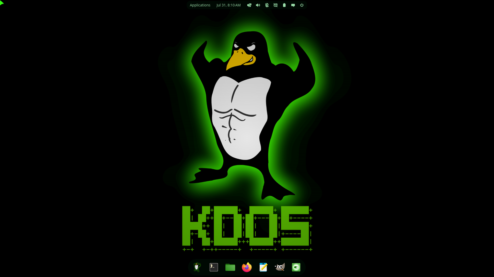
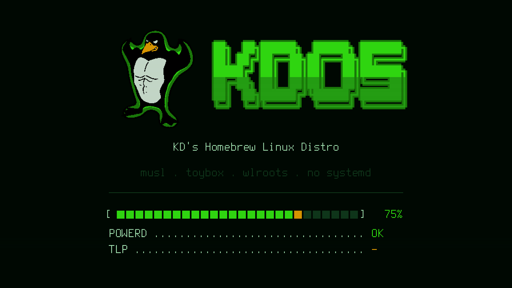
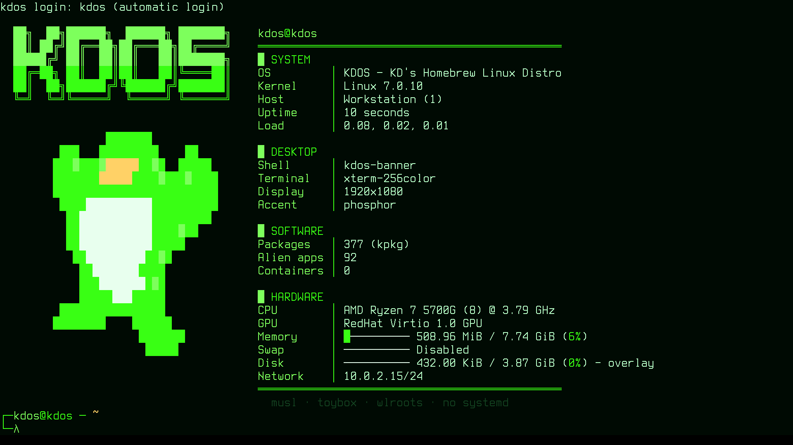
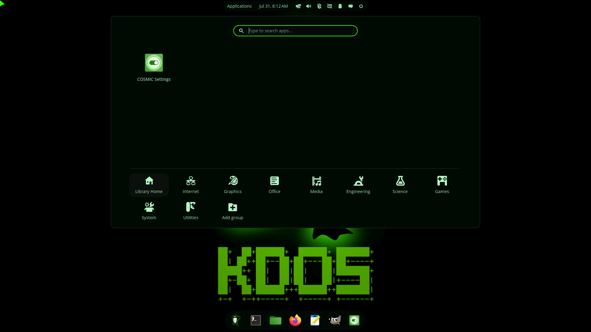
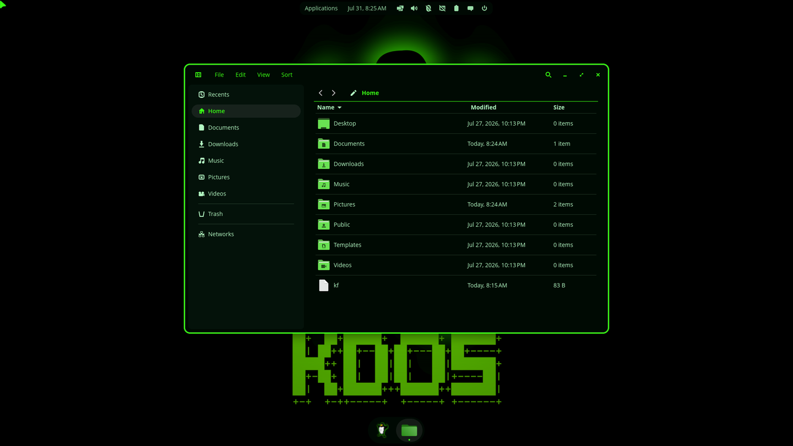
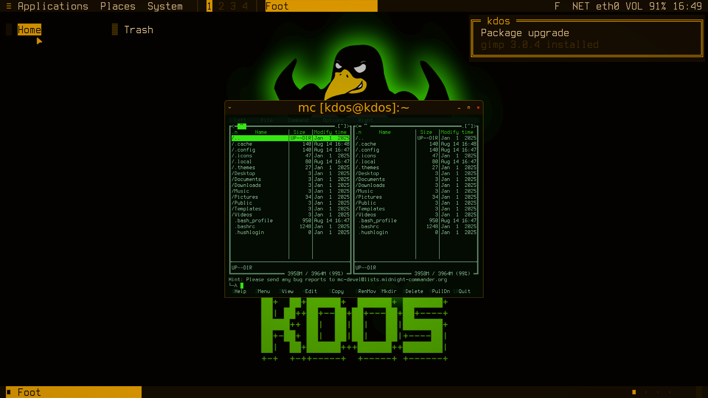
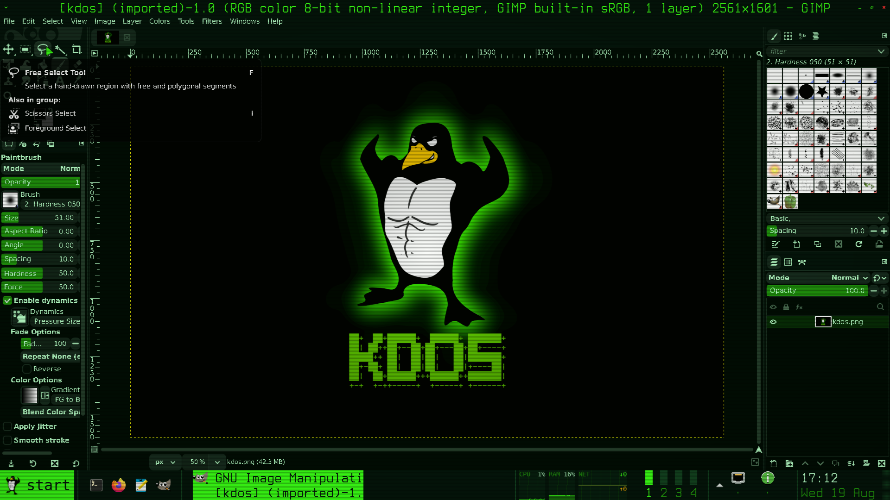
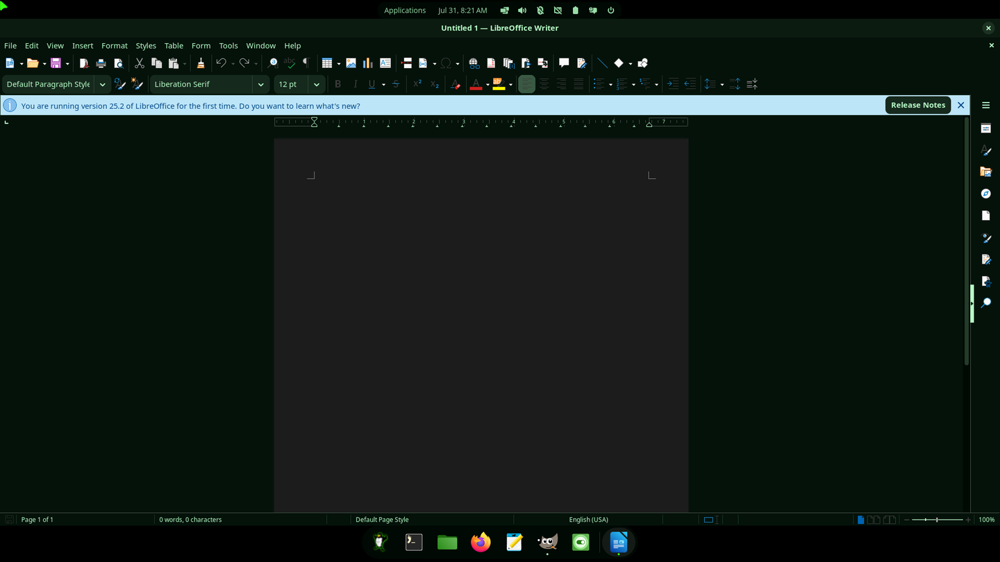
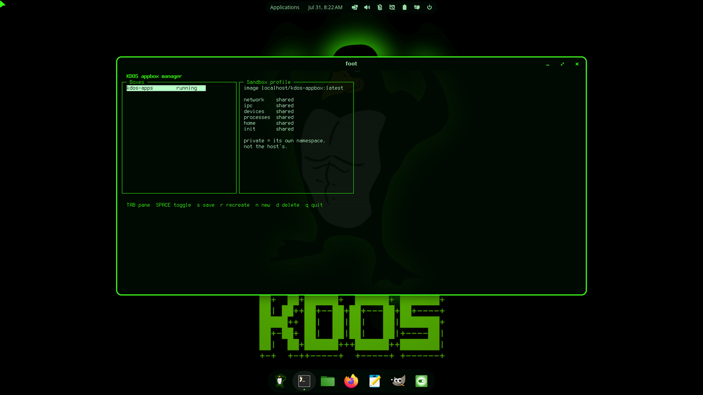

<p align="center">
  
</p>

<h1 align="center">KDOS</h1>

<p align="center"><b><i>I use KDOS btw.</i></b></p>

<p align="center">
A Linux distribution compiled from source, one <code>kpkgbuild</code> at a time.<br>
<b>musl</b> · <b>toybox</b> · <b>COSMIC</b> · <b>no systemd</b> · <b>no Xorg</b> · <b>no GTK or Qt on the host</b>
</p>

<p align="center">
<sub>387 ports · 353 packages installed · Linux 7.0 · Wayland only · ~90 containerised GUI apps baked in · builds offline from this repo</sub>
</p>

<p align="center">
  
</p>

---

## Who this is for

Someone who already knows what `switch_root` does, has an opinion about init
systems, and reads a build log for fun. KDOS ships one user, no first-boot
wizard, and a package manager that is 900 lines of bash. Nothing here is
hidden from you, and nothing here holds your hand.

If you want a distro that just works so you can get on with your life, this is
not that distro. If you want to read every line of the thing you boot, keep
going.

---

## Philosophy

### 1. Built from scratch

Every byte of the host system is compiled here, from an upstream tarball, by a
recipe in this repo. There is no upstream binary archive, no base image, no
"and then we pull in Debian." 387 ports, each a `kpkgbuild` — sourced shell
declaring a `name`, a `version`, a `source` and a `build()`. No DSL, no
manifest format, no opinions you can't override with `vim`.

Following Linux From Scratch means the toolchain bootstraps itself: a cross
compiler targeting `x86_64-kdos-linux-musl`, then a musl userland, then a
self-hosting pass where the chroot rebuilds tar, musl, zlib, binutils and gcc
**with itself**.

### 2. KDOS can build KDOS

That self-hosting pass is not a formality. The shipped system carries gcc 15,
binutils, rust, cmake, meson, ninja, python 3.14, make and `kpkg`. A running
KDOS can compile every port in the tree, including its own kernel, its own
compiler and its own desktop. The distro is not the output of some other
distro's toolchain — it owns the whole chain.

### 3. The repo builds offline, completely

`make build` runs the entire build inside a container with `--network none`.
Every upstream tarball, every `cargo vendor` bundle for the Rust desktop, and
the whole ~4 GB alien-app container image live **in this repository** under Git
LFS. Clone it once, unplug the network, get a bootable ISO.

That is a deliberate constraint, not a convenience. A build that reaches out to
the internet is a build that stops reproducing the day an upstream URL rots.

### 4. Alien apps

KDOS does not native-port Firefox, LibreOffice, Blender or VSCodium — those are
things `apt` already packages well, and relitigating that would take years and
produce something worse. Instead the outer ring is a **Debian container baked
into the ISO**, and ~90 GUI apps out of it behave like ordinary system apps:
they appear in the launcher, they register MIME types, they run as terminal
commands, and they wear the same theme as everything else.

The host stays musl, toybox and 353 packages. The applications stay glibc.
Neither has to compromise.

---

## The Three Rings

| Ring | Lives in | What's there |
|---|---|---|
| **Core** | `ports/core/` | musl, toybox, kernel, kpkg, init, the whole toolchain |
| **GUI sliver** | `ports/core/` (its own block) | COSMIC — compositor, panel, launcher, settings, files, portals — plus foot and the Wayland CLI utils |
| **Outer ring** | `ports/appbox/` | The Debian app image: browsers, office, CAD, media, games |

Plus `src/packages/` — the ports that are **ours** rather than an upstream
tarball: the boot splash, the appbox runtime, the theme generator, and the
three vendored-and-recoloured art packages (cursors, icons, GTK theme).

---

## Boot

<p align="center">
  
</p>

Past the bootloader, KDOS starts the way its windows do: a flash, the picture
unfolding vertically out of a hairline while the deflection settles, scanline
banding burning off as the tube warms up. Boot then reports itself as POST
lines — `MOUNTING FILESYSTEMS ....... OK` — and signs off by collapsing back
into a line and a dot.

That is `kdos-splash`: ~700 lines of static C drawing straight to `/dev/fb0`,
with the wordmark rendered from the shipped Terminus console font scaled up, so
the logo is real bitmap type rather than an image. It starts in the initramfs
and **keeps running across `switch_root`** — its control FIFO lives on
devtmpfs, which is moved into the new root rather than remounted — so one
process spans both halves of boot and the screen never blinks. It hands the
console back, black, right before agetty.

It fails open: no framebuffer, no splash, no fuss. And every boot message still
goes to the serial console regardless, so a machine that dies behind a pretty
screen is debuggable from there.

The progress bar is fed additively — each boot phase adds its own step count as
it learns it — and deliberately clamps one segment short of full until the
system is actually up. A boot that shows 100% and then sits there is a bug
report waiting to happen.

---

## The console

<p align="center">
  
</p>

`tty1` autologins as `kdos`. The banner is composed by `kdos-banner`, which
paints it one raster line at a time with a bright beam leading the fill, then a
single frame of reverse video for the CRT power-on thump. Any keypress skips
the rest; a dumb `TERM`, a pipe, or a terminal too short for the art all fall
back to a plain print.

The penguin is decoded from the same quantised mascot the boot splash draws, so
the banner, the splash and `kdos.png` cannot drift apart. The console font is
`ter-kdos32n` — Terminus xos4-2 with six spacing diacritics swapped out for the
double box-drawing glyphs the logo needs — loaded by a getty wrapper that first
forces fbcon's deferred takeover, because a `setfont` any earlier is silently
wiped.

`tty2` and the serial console give you a root login.

---

## The desktop

KDOS runs **COSMIC** (System76 — Rust, smithay, iced): compositor, panel, dock,
app library, launcher, settings, notifications, files, portals — one pinned
epoch release across all 17 ports. It needs neither GTK nor Qt, which is
exactly why the host has neither.

```sh
kdos-desktop       # from a tty
```

<p align="center">
  
</p>

The app library is grouped by freedesktop Categories into Internet, Graphics,
Office, Media, Engineering, Science, Games, System and Utilities — which is how
~90 containerised apps stay findable.

Keys worth knowing: `Super` launcher, `Super+T` terminal, `Super+A` app
library, `Super+Q` close, `Super+Y` toggle tiling, `Super+1..9` workspaces,
`PrtSc` screenshot. Remap anything in Settings → Keyboard.

**Companion tools**, all Wayland-native: `foot` (terminal), `grim`+`slurp`
(screenshot + region), `wl-clipboard`, `imv` (image viewer).

**Stack:** PipeWire 1.6 with a PulseAudio compat shim and the full GStreamer
1.28 set; NetworkManager 1.56 with `wpa_supplicant`, `nftables`, `dnsmasq` and
polkit; `seatd` for seat management; `basu` for sd-bus without systemd;
xdg-desktop-portal with the COSMIC backend for screenshots, screencast and file
pickers.

---

## PHOSPHOR

The look is a 1983 green-screen terminal that happens to be running a modern
Wayland desktop. It is not a wallpaper — it goes all the way down. `setvtrgb`
loads the palette in `rcS`, so tty1 is phosphor before anything Wayland exists.

<p align="center">
  
</p>

**One palette, four accents.**

```sh
kdos theme phosphor | amber | ice | bone
```

<p align="center">
  
</p>

One command repaints the COSMIC theme, the panel and dock backgrounds, the icon
theme, the cursor theme, the GTK stylesheets, foot, btop and the starship
prompt — from a single palette table. COSMIC repaints live; the terminal and
monitor pick it up on next start.

**The interesting part is that alien apps follow.** A container shares your
`$HOME` and nothing else, so `/usr/share/themes` is invisible inside it.
Everything a containerised app needs therefore lives under `$HOME`, written by
the same generator that themes the host:

| Path | Read by |
|---|---|
| `~/.themes/KDOS/` | GTK3 and non-libadwaita GTK4 |
| `~/.config/gtk-{3,4}.0/gtk.css` | libadwaita, which ignores themes entirely |
| `~/.icons/KDOS/` | every toolkit, host and container |
| `~/.icons/KDOS-cursors/` | cursor lookup in the container |

<p align="center">
  
</p>

That is GIMP — glibc, GTK3, running inside Podman — with KDOS's accent on every
widget. It works because the GTK3 theme is a recoloured **adw-gtk3** rather
than hand-written CSS over Adwaita: adw-gtk3 is written against GTK *named
colours* end to end, so rewriting ~125 `@define-color` declarations repaints
every widget instead of the handful that happen to reference a name. Qt apps
follow via `QT_QPA_PLATFORMTHEME=gtk3` plus a Fusion style override.

The icon theme is a **pruned, hue-mapped Papirus** (90 MB → 13.7 MB). Colours
are mapped by *family* rather than flattened — blue/green/purple to the accent,
yellow/orange/brown to the secondary, red to urgent — because Papirus
colour-codes mimetypes, and collapsing every hue onto one accent turns a folder
of files into a wall of identical green lozenges. A PDF stays red, an audio
file stays amber, and the alien apps keep their own brand marks. Cursors are a
recoloured, pruned Bibata (27 MB → 4.4 MB), where `wait` and `progress` ramp to
amber — the same "working on it" colour the boot splash uses.

---

## Alien apps

<p align="center">
  
</p>

The ISO ships a pre-baked **Debian trixie** image with the best open-source app
per segment — LibreOffice, Firefox, GIMP, Krita, Inkscape, Blender, FreeCAD,
PrusaSlicer, OpenSCAD, KiCad, Octave, Stellarium, Ardour, LMMS, Kdenlive, OBS,
VSCodium, Wireshark, KeePassXC, RetroArch, a shelf of games, and about seventy
more. Heavy is the point: **the image is the offline software library**, a
Knoppix-style fat stick that gives you a full workstation with no network.

Nothing about them looks containerised in use:

```sh
gimp photo.png              # every alien app is also a normal command
libreoffice-writer report.odt
```

They appear in the launcher, they register their MIME types (so they show up in
"Open with" and can be default handlers), they merge into the dock as running
windows with their own icons, and they share the session bus so single-instance
handoff and notifications work. Cold start (no container at all) is ~18 s;
warm start is **0.3 s**, because the login backgrounds a low-priority warmup
while the desktop is still settling.

The runtime behind this is `kdos-appbox` — ~1200 lines of C with **no
`system()` and no shell anywhere in it**, because app names, package names and
file arguments all arrive from `.desktop` files and argv, and a shell in the
middle turns any of them into an injection point.

```sh
kdos-appbox apps                    # what's available
kdos-appbox list                    # boxes and their profiles
kdos-appbox install thunderbird     # apt into the box
kdos-appbox create dev image=fedora-toolbox:41
kdos-appbox security dev network=private processes=private
kdos-appbox tui                     # full-screen manager
```

<p align="center">
  
</p>

You can run more than one box, each with its own image and its own **sandbox
profile**. Every profile key maps 1:1 onto a container namespace flag —
`network`, `ipc`, `devices`, `processes`, `home`. That mapping is the whole
design: KDOS does not offer confinement it cannot actually enforce, so there is
no security theatre in the UI. Profiles apply at creation time, because
namespaces cannot be re-flagged on a live container, and the tool says so
instead of silently doing nothing.

For single-binary tools there is also `kdos-fetch-static <name> <url> <sha256>`
— curl, verify, chmod, done.

---

## kpkg

The package manager is ours, and it is small enough to read in an afternoon.

```sh
kpkg install foo       # build from ports and install
kpkgadd  foo.tar.xz    # install a pre-built package
kpkgdel  foo           # remove
kpkgdepends foo        # resolved install order
```

A port is a directory with a `kpkgbuild` and its tarball:

```bash
# description	: Wayland compositor for the COSMIC desktop
# homepage	: https://github.com/pop-os/cosmic-comp
# depends	: libdisplay-info gbm libinput pixman seatd eudev libxkbcommon

name=cosmic-comp
version=1.4.0
release=1
source="https://github.com/pop-os/cosmic-comp/archive/refs/tags/epoch-$version.tar.gz"
vendoring=rust

build() {
    tar xf $PORT_SRC/${name}-vendor-${version}.tar.xz
    export RUSTFLAGS="-C target-feature=-crt-static"
    cargo build --release --frozen --offline
    install -Dm755 target/release/$name "$PKG/usr/bin/$name"
}
```

`vendoring=rust` is what makes the offline build possible: `make fetch` runs
`cargo vendor` once and commits the result beside the tarball, so the build
container never needs crates.io.

---

## The `kdos` command

```sh
kdos help          # commands + COSMIC keybind cheat sheet
kdos theme amber   # repaint everything
kdos status        # packages, containers, session
kdos doctor        # check the things that actually break on this distro
kdos version
kdos-shot region   # screenshot to clipboard and ~/Pictures/Screenshots
```

`kdos doctor` is not a generic health check — it tests the specific failures
this distro has hit before, down to `readlink /proc/self/root` catching an
initramfs that used the wrong `switch_root` and quietly broke every container.

---

## Building it

```sh
make fetch        # download all upstream tarballs + vendor bundles (LFS)
make fetch-apps   # bake the Debian app image (needs network; only when it changes)
make build        # cross toolchain -> userland -> desktop -> kernel -> ISO
make run          # boot the ISO in QEMU
make run-hw       # boot with virgl (needed for the desktop; see below)
```

The build runs inside an Alpine container with `--network none`, so it cannot
contaminate — or depend on — your host. It is organised into phases:

| Phase | What it does |
|---|---|
| 0 | Cross toolchain — binutils + gcc for `x86_64-kdos-linux-musl` |
| 1 | Base userland — musl, toybox, bash, native gcc, kpkg, kinstall |
| 2 | Self-hosting bootstrap — the chroot rebuilds its own toolchain |
| 3 | Core libraries, build systems, interpreters |
| 4 | Userland and the GUI sliver |
| 5 | Kernel + modules |
| 6 | Packaging — theme, user, appbox, initramfs, ISO |

Two things make iterating on a 2–4 hour build bearable.

**Snapshots.** Every completed phase is archived to `build/snapshots/`. `make
build` opens a picker; choose a phase and the build restores that tree and
continues from the next one. Restores are layered, so restoring phase 3 still
picks up the cross toolchain from phase 1.

**Build plans.** Snapshots answer "go back"; plans answer "re-run just this."

```sh
# changed something under fs/ -> re-sync it and rebuild the ISO, nothing else
make build BUILD_ARGS="--phases 01_phase1,06_packaging --steps 01_phase1:00_file_system.sh"

# changed a kpkgbuild -> rebuild that port and repackage
make build BUILD_ARGS="--phases 04_phase4,06_packaging --rebuild cosmic-comp"

make build BUILD_ARGS=--plan     # interactive picker, '/' fuzzy-searches ports
```

**Artifacts:** `build/iso-build/kdos.iso` (bootable, ~8.7 GiB — the app library
is most of that), `build/fs/` (the rootfs, chroot-able for inspection),
`build/kdos.qcow2` (persistent disk for `make rundisk`).

---

## Running it

- **CPU:** x86_64 with KVM
- **RAM:** 4 GB to run, 8 GB+ to build comfortably
- **Disk:** the ISO is ~8.7 GiB; a full build tree is ~40 GB, plus ~35 GB more
  if you keep phase snapshots

Login is **`kdos` / `kdos`** (uid 1000, in `wheel`, so `sudo` works with the
same password). The live ISO and an installed disk behave identically —
including rootless containers, which use fuse-overlayfs on the live overlay and
switch to the kernel's native overlay once installed on ext4.

> **Note on QEMU:** `make run` uses plain virtio-vga and will get you a console
> but **no desktop** — smithay refuses software EGL renderers, so the
> compositor comes up with no outputs. Use `make run-hw` (virgl + blob) or real
> hardware. Every screenshot in this README was captured from a QEMU guest via
> `make run-hw`'s stack.

### Installing to a disk

Bare-metal install is `sudo kinstall`, or **Install KDOS** in the app library.

`kinstall` is a dependency-free C TUI in `src/kinstall/` — no ncurses, no
libraries at all beyond musl. It runs a ten-page wizard (preflight, keymap,
time zone, disk, layout, accounts, accent + services, summary, install, done)
and **writes nothing until the summary is confirmed**; every page before that
is reversible, and the sidebar walks back to any of them.

Two things it does that a terminal installer usually cannot:

- **The mouse works on a bare tty.** The Linux console has no mouse reporting
  and KDOS ships no gpm, so on tty1 the installer opens `/dev/input/event*`
  itself, tracks the pointer and draws it. Under `foot` it uses ordinary
  SGR-1006 reporting instead. Click anything, scroll any list.
- **It looks the same in both places.** The whole interface is designed to
  eight colours, because a 512-glyph console font steals the VT's foreground
  intensity bit. On a tty it installs its own palette through `PIO_CMAP` and
  restores the one `kdos-getty` loaded on exit; in a truecolor terminal the
  same eight slots are emitted as exact hex. Picking an accent on the
  penultimate page retints the installer live.

```sh
sudo kinstall                      # the wizard
sudo kinstall --dry-run            # rehearse: logs every command, runs none
sudo kinstall --save answers.conf  # write an answer file
sudo kinstall --config answers.conf --unattended
```

A run logs to `/var/log/kinstall.log`.

---

## Repository layout

```
kdos/
├── ports/
│   ├── core/<name>/         # kpkgbuild + upstream tarball (LFS)
│   ├── appbox/              # Containerfile, launcher generator, image chunks
│   └── fetch                # downloads every source= URL, runs cargo vendor
├── src/
│   ├── kpkg/                # the package manager
│   ├── kinstall/            # the installer (C, no libraries)
│   └── packages/            # ports that are ours: splash, appbox, theme, art
├── fs/                      # copied verbatim into the rootfs
├── script/                  # build.py orchestrator + phase directories
├── testing/                 # per-port build tests, QEMU runners
├── docs/screenshots/
├── Dockerfile               # the Alpine build sandbox
└── Makefile
```

There is no `fs/etc/X11/`, and there never will be.

---

## License

MIT for the KDOS-authored parts. Vendored artwork keeps its upstream license —
see `LICENSE.notice` in `src/packages/kdos-cursors/`, `kdos-icons/` and
`kdos-gtk-theme/`, each of which records exactly what was changed. Every port
under `ports/core/` is upstream's own code under upstream's own terms.

Go forth and segfault.
