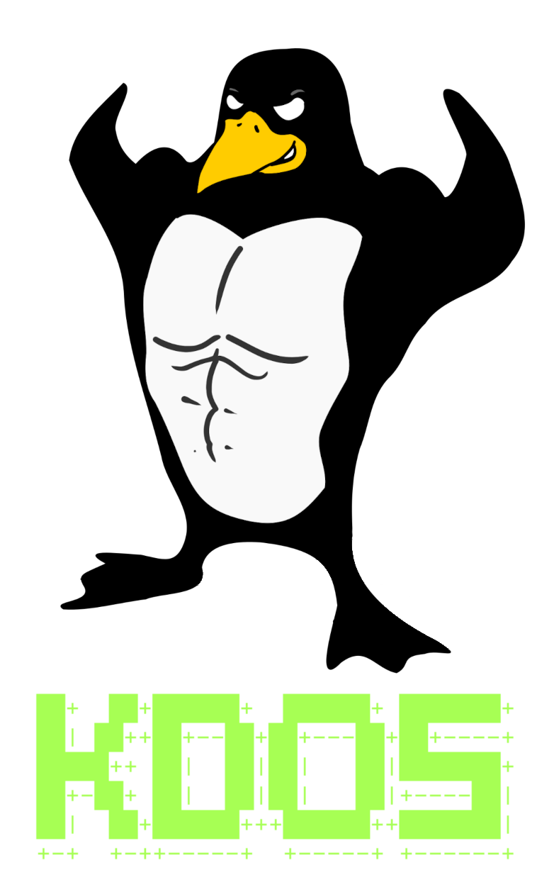
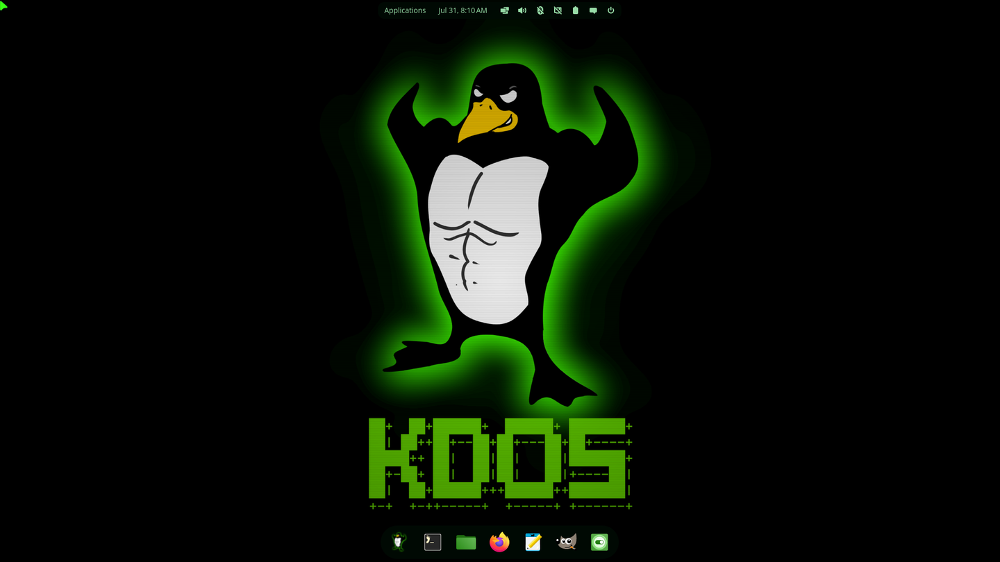
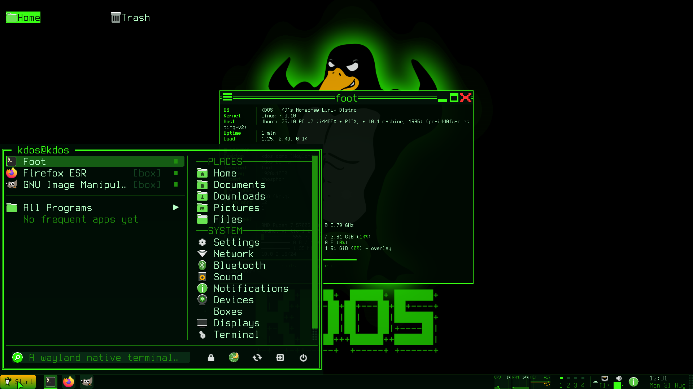
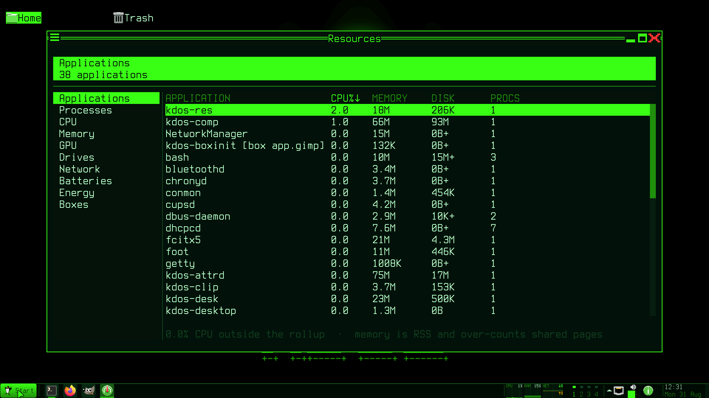
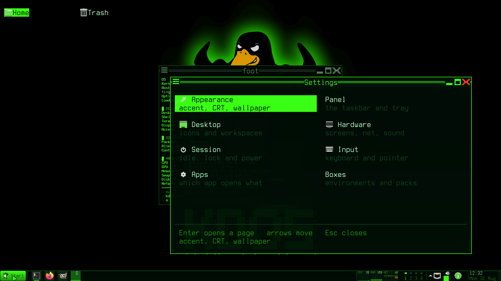
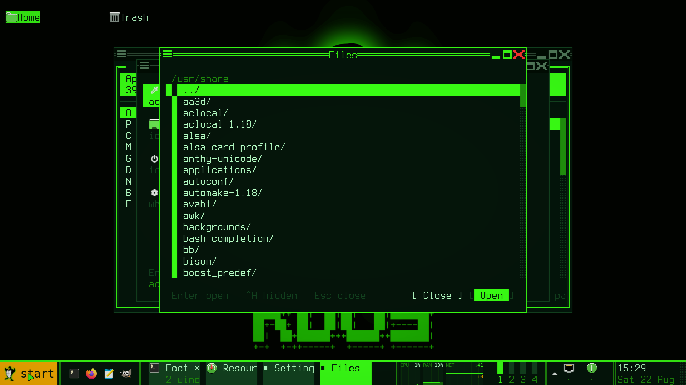

<p align="center">
  
</p>

<h1 align="center">KDOS</h1>

<p align="center">
A Linux distribution compiled from source, one <code>kpkgbuild</code> at a time,<br>
with a desktop whose every surface is a grid of character cells.
</p>

<p align="center">
<b>musl</b> · <b>toybox</b> · <b>wlroots</b> · no systemd · no Xorg · a desktop drawn in cells
</p>

<p align="center">
<sub>1,999 upstream ports · 24 of its own · Linux 7.2.7 · 73 containerised applications · builds with the network off</sub>
</p>

<p align="center">
  
</p>

<p align="center">
<sub>1920×1080, captured on a QEMU guest. The phosphor shader turns itself off on software
rendering, so the screenshot shows the cell grid underneath it.</sub>
</p>

---

This page is for anyone meeting KDOS for the first time: what it is, how it differs from other
distributions, what it can do, how to try and build it, and where to read next. The full
documentation is a book under [`docs/kdos/`](docs/kdos/README.md).

## What KDOS is

KDOS is a complete operating system built in this repository from upstream source archives: a
cross toolchain, a musl userland, a self-hosting bootstrap, 1,999 upstream ports, a Wayland
compositor, a panel, a terminal, an installer and a package manager. There is no base image and no
binary archive to fall back on.

Four properties shape the rest of the tree.

**It is built from source, and the exceptions are listed.** Firmware, microcode, radio images and
emulator ROMs ship as upstream built them, most of it because no source is published. The Rust,
Go, Zig, Haskell, Java and OCaml compilers each need a working compiler of their own kind, so each
starts from a pinned upstream bootstrap. The Noto and Nerd Fonts symbol fonts and the fonts some
applications bundle install upstream's built font files, some ports install data that has no
other source form (models, maps, game content), and a few web front ends ship the JavaScript
upstream built. The application catalogue is Debian binaries by
design, and runs only in boxes. The complete list is in
[Why KDOS](docs/kdos/01-philosophy/why-kdos.md#what-is-not-built-from-source).

**KDOS can build KDOS.** The build's self-hosting phase, `20_selfhost`, rebuilds tar, musl,
zlib, binutils, diffutils, m4, gawk and gcc inside the new system, with itself. The shipped system carries gcc, binutils, rust,
cmake, meson, ninja, python3, make and the package manager, so a running installation can rebuild
any single port, the compiler and the kernel included, once its source is present. A full rebuild
of the system still needs a build machine.

**The build runs offline.** Every source file a recipe uses is named by a `sha256 =` line in that
recipe. `make fetch` is the one step that touches the network. After it, `make build` runs in a
container started with `--network none`.

**Applications are native ports, with boxes beside them.** Graphical applications are ported
natively, each with the toolkit it is written in: web browsers, an office suite, graphics and
video editors, CAD, software radio and an offline reference library among them. Their recipes sit
in `ports/core/` beside every other port, each on one of 102 subject shelves: GIMP is
`ports/core/graphics/gimp/`, Firefox ESR `ports/core/browsers/firefox-esr/`.
Beside them, a catalogue of 73 applications, each declared as a set of Debian packages over one of
seven shared runtimes or directly on the Debian base, is built by podman on the machine that
installs it, over the network. Each runs rootless in its own container, called a *box*.

## How it differs

Most distributions ship glibc, GNU coreutils, systemd, an Xorg server with a display manager, a
desktop built on GTK or Qt, and prebuilt binary packages from an archive. KDOS makes a different
choice at each of these points: musl for the C library; toybox for the core userland, with
util-linux, procps-ng and a few GNU tools where toybox falls short; toybox `init`, numbered shell
scripts and the `ksvc` supervisor in place of systemd; Wayland only, with rootless Xwayland for X11
clients and no display manager; a desktop whose every surface draws character cells and links no
GUI toolkit, while GTK, Qt, KDE Frameworks, wxWidgets, FLTK and Tk are built for the applications
that use them; and packages compiled from 2,023 recipes, on a build host for the installation
image and on the machine itself for updates.
[How KDOS differs](docs/kdos/01-philosophy/how-kdos-differs.md) compares each choice with the
usual alternatives, says why KDOS chose differently, and lists what is given up.

## What it can do today

| Area | What is there |
|---|---|
| The desktop | A Wayland compositor (`kdos-comp`, a fork of labwc 0.20.0 whose KDOS code lives in twenty-three source files of its own, with a CRT-style phosphor shader), a panel program, `kdos-shell`, whose one binary provides 54 surfaces (the panel itself, the Start menu, launcher, settings, file chooser, notifications, network, Bluetooth, audio, displays, the store and more), a terminal, a resource monitor and a lock screen |
| Applications | Native ports compiled with the rest of the host, among them Firefox ESR, LibreWolf, Chromium, Thunderbird, LibreOffice, GIMP, Krita, Inkscape, Blender, FreeCAD, KiCad, Kdenlive, OBS Studio, QGIS, Kodi, TeX Live and Wine, built Wayland-first with their X11 backends compiled in; and 73 catalogue applications, among them Zathura, Scribus, ParaView, Maxima, Scilab, VSCodium, Meld, Claws Mail and Hugin, each built on demand into its own box and movable between machines as a pack file, signed when a signing key is configured |
| The host | 1,999 upstream ports built on musl: PipeWire audio, NetworkManager, Xwayland for X11-only programs, GTK 3 and 4, libadwaita, WebKitGTK, Qt 5 and 6, QtWebEngine and KDE Frameworks 6 for the applications, podman and QEMU, GCC and Clang/LLVM, Rust, Go, Zig, Haskell, Node.js and Python, cross toolchains for ARM, RISC-V and AVR, SDR and FPGA tooling, and CUPS printing |
| Boot and install | A boot splash, an optionally encrypted root, A/B root slots, and `kinstall`, a text-mode installer that also runs unattended from an answer file |
| Its own software | 17 C libraries written for this system, the package manager and the installer (both compiled in the bootstrap phase directly from `src/system/`), and 24 recipes of its own: the desktop, five root daemons, the `kdos` command and its 31 subcommands, `help` included |

<table>
<tr>
<td></td>
<td></td>
</tr>
<tr>
<td></td>
<td></td>
</tr>
</table>

## Status and limits

This is the v0.2 line. It installs, boots, runs a desktop and runs boxed applications, and its
interfaces are stable enough to document. It is not a release with a support commitment or a
tested hardware matrix: whoever runs it is the integrator.

The natively ported applications and the toolkits under them are recipes written and wired into
the build. None of them has been through a build, so none has been started on a KDOS image.

Some things you may expect are not there. A screen reader reads applications but not the desktop's
own windows; there is no graphical login screen; there is no public server of prebuilt packages;
nothing creates the second A/B root slot for you. Every such gap is listed in
[Known gaps](docs/kdos/06-reference/known-gaps.md), and the maturity of each subsystem, with the
evidence behind each verdict, is in [Status](docs/kdos/06-reference/status.md).

KDOS suits someone comfortable with a build log, a package recipe and the C that draws the panel.
It ships one user account, no telemetry, and no configuration layer between you and the file that
takes effect. Look elsewhere if you need broad hardware enablement, a large binary archive or
commercial support.

## Trying it

No v0.2 image is published. The [releases](https://github.com/kunaldawn/kdos/releases) on this
repository are `v0.1`, whose ISO belongs to an earlier line that the book does not describe, and
`sources-001` and `sources-002`, which hold the source archive and no image. To run v0.2, build it
(next section), then boot the result in a virtual machine:

```sh
make run          # QEMU with KVM and UEFI, 4 GB of memory, software rendering
make run-hw       # accelerated graphics with the phosphor pass on; needs Docker and the NVIDIA container toolkit
```

`make run` needs QEMU, `/dev/kvm` and the OVMF firmware at `/usr/share/ovmf/OVMF.fd`. On the live
image the session starts on the first virtual terminal, logged in as `kdos` (password `kdos`).

To try it on real hardware, write the image to a USB stick. This overwrites the whole of
`/dev/sdX`:

```sh
sudo dd if=build/iso-build/kdos.iso of=/dev/sdX bs=4M status=progress conv=fsync
```

Boot the stick and install with `sudo kinstall`. The installer writes nothing to disk until you
confirm its summary page.

[Getting started](docs/kdos/02-user-guide/getting-started.md) walks through all of this, and
[Installation](docs/kdos/02-user-guide/installation.md) covers the installer page by page.

## Building from source

You need a Linux machine with Docker, `git`, `curl`, `sha256sum` and a C compiler. Every compiler
the build itself uses runs inside a container built from the repository's `Dockerfile`, so no
other toolchain is installed on your machine.

| Cost | |
|---|---|
| Time | Many hours for the first build: the whole system is compiled, GCC several times over and the kernel included. Later builds are narrow and short |
| Disk | About 41.5 GB (38.6 GiB) of upstream sources, plus tens of gigabytes under `build/`, and more for a complete set of the optional phase snapshots (the tree compressed once plus a layer per phase), whose size is not yet measured |
| Network | For `git clone`, `make fetch`, and the first `make build`, which builds its container image. The compile itself runs with the network off |

```sh
git clone https://github.com/kunaldawn/kdos
cd kdos
git config core.hooksPath script/hooks   # once per clone: the pre-push layout and source checks
make fetch                               # every upstream source, verified by sha256
make fetch-check                         # optional, offline: anything missing or wrong
make build                               # the result is build/iso-build/kdos.iso
make run
```

A clone holds recipes, not upstream archives. `make fetch` takes each file from the local cache
`ports/.srccache/`, then from the KDOS source archive (release assets of `kunaldawn/kdos`, located
through the committed `ports/sources.idx`), then from the recipe's upstream URL, and keeps the
first copy whose hash matches. Run it again after a pull or a branch switch; it downloads only what
is new. On a terminal, `make build` first asks whether to start fresh or restore a snapshot.

[How KDOS is built](docs/kdos/05-developer/how-kdos-is-built.md) follows the build from
`git clone` to a bootable ISO, phase by phase. [Developing](docs/kdos/05-developer/developing.md)
lists every make target and shows how to rebuild one port, one desktop program or only the
packaging instead of everything.

## The book

The documentation under [`docs/kdos/`](docs/kdos/README.md) is one book in six parts. Its index
page carries the full table of contents and four reading paths.

| Part | Covers | Start with |
|---|---|---|
| I. Introduction | What KDOS is, how it differs, its principles and decisions | [Why KDOS](docs/kdos/01-philosophy/why-kdos.md) |
| II. Using KDOS | Installing, the desktop, applications, theming, administration, accessibility | [Getting started](docs/kdos/02-user-guide/getting-started.md) |
| III. Architecture | Boot, the session, packaging, packs and boxes, security, design, windows | [Architecture overview](docs/kdos/03-architecture/overview.md) |
| IV. Programs | The compositor, the panel, the terminal, the daemons, the installer, the `kdos` command | [The programs](docs/kdos/04-programs/README.md) |
| V. Building and developing | The build, recipes, the C libraries, desktop software, testing | [How KDOS is built](docs/kdos/05-developer/how-kdos-is-built.md) |
| VI. Reference | Ports, commands, configuration, paths, gaps, status, glossary | [Command index](docs/kdos/06-reference/command-index.md) |

## Repository layout

```
ports/core/       1,999 upstream ports on 102 shelves, ports/core/<shelf>/<name>/: a kpkgbuild
                  and a build.sh each, patches where needed
ports/            the shelf list (shelves), fetch, update and publish tools, and sources.idx
src/libs/         17 C libraries written for this system
src/desktop/      the compositor, the panel, the terminal, the lock screen, the resource
                  monitor, the screen recorder, the per-box Wayland socket, the portal backend
src/daemons/      the five root daemons the desktop talks to
src/system/       the package manager, the kdos command, packs and boxes, the installer
src/art/          the theme generators, icons, cursors, the boot splash, the demo
src/devtools/     kdosbuild (the orchestrator behind make build) and kdos-portup (behind
                  ports/update)
fs/               copied as-is into the target root filesystem
script/           kdosbuild.sh (what make build runs), the shared environments under env/,
                  the shared port lookup under lib/, the chroot's entry under chroot/,
                  and the pre-push hook under hooks/
script/phases/    the thirteen build phases, each with its phase.env and either its
                  numbered step scripts or its package list (packages.txt or packages.d/)
testing/          preflight, the self-test, fixtures, goldens, the QEMU rig
docs/kdos/        the book
```

[Repository layout](docs/kdos/06-reference/repository-layout.md) annotates every directory.

## Contributing

Most contributions are ports: adding a piece of software or updating one. A port is a directory
on one shelf of `ports/core/`, `ports/core/<shelf>/<name>/`, holding two files, `kpkgbuild`
(declarative metadata) and `build.sh`.
[Writing ports](docs/kdos/05-developer/writing-ports.md) covers the format and walks through adding
a port end to end. A version bump looks like this:

```sh
ports/update <port>                 # accept the new version; the version and sha256 lines are rewritten and the source fetched
testing/preflight.sh                # the tree's wiring, in two to three minutes
make build BUILD_ARGS="--phases 41_system,70_image --rebuild <port>"   # the phase whose list names the port
ports/publish <port>                # upload the new source and add its line to ports/sources.idx (maintainer token)
git commit ports/core/<shelf>/<port> ports/sources.idx
git push                            # the pre-push hook refuses a broken ports layout, or a source the archive lacks
```

Uploading to the source archive needs write access to `kunaldawn/kdos`. Without it, run
`ports/publish --check <port>` to list what the archive lacks and name those ports in your pull
request, so a maintainer publishes them. The pre-push hook also refuses a push when it cannot reach
the archive at all; `KDOS_SKIP_PUBLISH_CHECK=1` skips that check for a push you know is safe.
Before it, the hook checks the layout offline at the tip of every pushed ref: each recipe exactly
at `ports/core/<shelf>/<name>/`, its shelf listed in that commit's `ports/shelves`, no shelf named
`libs`, `core` or after a port, and no bare name held twice across `ports/core` and `src/<area>/`.
`KDOS_SKIP_LAYOUT_CHECK=1` skips that one.

Two rules apply to every change. A change updates the documentation that describes the behaviour
it changes, in the same commit. And the host carries no systemd and no Xorg server, and the desktop
programs link no GUI toolkit; toolkits are built only for the applications that use them. The
reasons are in [Principles](docs/kdos/01-philosophy/principles.md), and the test harnesses that check a change
before a full build are in [Testing](docs/kdos/05-developer/testing.md).

## Licence

The KDOS-authored parts are MIT (see [`LICENSE`](LICENSE)). Vendored artwork keeps its upstream
licence: see `LICENSE.notice` in `src/art/kdos-cursors/`, `kdos-icons/` and
`kdos-gtk-theme/`, each of which records what was changed. Monocypher, vendored in `libksig`, is
dual-licensed BSD-2-Clause or CC0-1.0. `kdos-comp` and `kdos-bb` are forks of GPL-2.0 projects and
keep that licence along with their upstream copyright headers. Every port under `ports/core/` is
upstream's own code under upstream's own terms.
