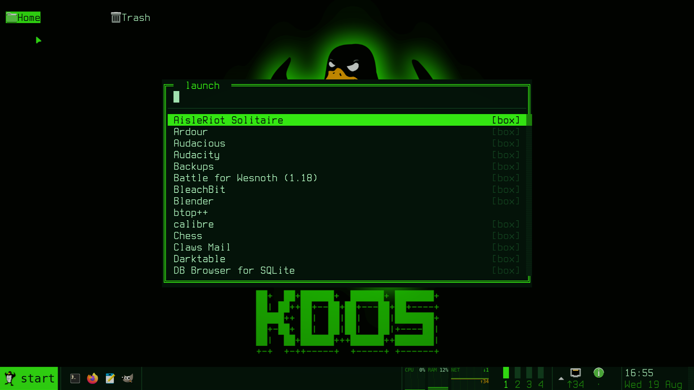

# Applications

This chapter is for anyone who wants graphical software on a KDOS machine: a browser, an office
suite, an image editor, a CAD package. It describes the applications KDOS compiles natively,
arranged by what you want to do, and then the software it does not compile: how to find, install,
launch, update and remove that software, how to carry a set of it to another machine without a
network, how files and links reach it, and how to manage the *boxes* it runs in. Read
[The desktop](desktop.md) first if you have not used the Start menu; for the file format and the
machinery underneath boxed software, see [Packs and boxes](../03-architecture/packs-and-boxes.md)
and [kdos-appbox](../04-programs/kdos-appbox.md).

## Where applications come from

Applications reach a KDOS machine by two routes.

**Native applications** are compiled from source by the KDOS build, from recipes in the ports tree,
and installed into the system image like every other program. They are on the medium you boot
from, they are copied to the disk by the installer, and they need no network at any point. This is
where the everyday software lives: Firefox ESR, Thunderbird, LibreOffice, GIMP, Krita, Inkscape,
Kdenlive, KiCad, FreeCAD, Blender, QGIS, GNU Radio and many more.

**Boxed applications**, also called *alien apps*, are software KDOS does not compile. A *catalogue*
shipped on the medium describes each one, and your machine builds it on demand, in containers, from
Debian packages, which needs a network. The catalogue carries what is not ported natively and some
alternatives to what is.

The line between the two follows one question: does a machine with no network need it? What it
needs is ported natively, and the catalogue carries the rest. See
[Decisions](../01-philosophy/decisions.md#native-applications-on-the-medium-a-store-that-builds-the-rest)
for the reasoning, and [How KDOS differs](../01-philosophy/how-kdos-differs.md#applications) for how
other distributions deliver the same software. How far along each part is, is recorded in
[Status](../06-reference/status.md#applications-and-boxes).

## Native applications

A native application is a *port*: a recipe under `ports/core/` that the build compiles and packages
(see the [glossary](../06-reference/glossary.md#port)). The applications are listed in the phase 4
package list, `script/04_phase4/packages.txt`, in named sections such as *Internet and
communication*, *Documents and office*, *Pictures* and *Sound, video and discs*; the section below
follows those sections. [The ports catalogue](../06-reference/ports-catalogue.md) lists every port
by phase and group, libraries included, and [How KDOS is built](../05-developer/how-kdos-is-built.md)
tells how the build runs.

Because a native application is part of the system, it behaves like any other installed program. An
application with a window of its own brings its desktop entry in its package, so it has a row in the
Start menu and the launcher, it answers the search, it can be pinned, and it opens the file types it
claims. Its command is on your `PATH`. It starts at once, with no container to bring up, and the
Start menu does not mark it `[box]`. It is updated with the rest of the system (see [Keeping it
current](administration.md#keeping-it-current)), not with `kdos app`.

Data an application needs is ported too, so it is on the medium rather than fetched on first use:
KiCad's symbol, footprint and template libraries, the GIMP manual, the TeX Live documentation,
Celestia's star catalogues and textures, the Whisper `base.en` speech model, and the free data sets
of the games (OpenTTD's graphics, sounds and music, Freedoom, Xonotic's and SuperTuxKart's data).

### Toolkits, Wayland and X11

Applications are ported with the toolkit their upstream uses: GTK 3 and GTK 4 with libadwaita,
WebKitGTK (both its GTK 3 and its GTK 4 API), Qt 5 and Qt 6, QtWebEngine, KDE Frameworks 6 (without
the Plasma desktop), wxWidgets, FLTK and Tk, plus OpenJDK for the Java programs. The desktop itself
links none of them: the compositor, the panel, the daemons and the portals draw character cells
through KDOS's own libraries (see [The design language](../03-architecture/design-language.md)).

Every toolkit is built with its Wayland backend and its X11 backend, and the login profile,
`/etc/profile.d/10-wayland.sh`, makes Wayland the first choice:

| Toolkit | How it chooses |
|---|---|
| GTK 3 and GTK 4 | `GDK_BACKEND` is left unset, so an application tries Wayland first; one that sets `GDK_BACKEND=x11` for itself gets the X11 backend |
| Qt 5 and Qt 6 | `QT_QPA_PLATFORM="wayland;xcb"`: the X11 (`xcb`) platform is used only when the Wayland plugin cannot start |
| Firefox ESR, Thunderbird | `MOZ_ENABLE_WAYLAND=1` |
| SDL | `SDL_VIDEODRIVER=wayland` |
| Java (AWT and Swing) | Runs on Xwayland; `_JAVA_AWT_WM_NONREPARENTING=1` tells it there is no reparenting window manager |

A program with no Wayland path at all, such as VLC 3, Xastir (a Motif program), or a Tk or Swing
program, runs on *Xwayland*, the X server that runs as a client of the compositor. Xwayland is the
only X server on the system: it serves native and boxed X11 programs alike, it is built with GLX so
an X11 program that draws through OpenGL works, and the system carries the X core fonts
(`misc-fixed`, Adobe's 75 dpi set and the cursor font) that Motif and Xt programs ask it for. There
is no Xorg server and no display manager.

Native GTK applications open their file dialogs through the desktop's file-chooser portal, because
the login profile sets `GTK_USE_PORTAL=1`; Firefox ESR does the same through its shipped
preferences. Open and Save dialogs are therefore `kdos-pick`, the desktop's own file browser, in
native and boxed applications alike. Qt 6 applications read the palette, fonts and icons that
`kdos theme` writes (`QT_QPA_PLATFORMTHEME=kde`); how each toolkit takes the accent is in
[Theming](theming.md).

## Native applications by need

Each table names the applications ported for one kind of work. The names are the applications'
own, and the command that starts each is its upstream name. Those with a window of their own have a
row in the Start menu; the rest, such as llama.cpp, Waypipe or ClamAV, run from a prompt.

### Browsing the web and the small internet

| Application | What it is for |
|---|---|
| Firefox ESR | The default web browser, on GTK 3. Its shipped policies file turns off telemetry and update checks |
| Chromium | Chromium's browser, on GTK 3 |
| LibreWolf | A Firefox derivative with privacy defaults |
| Falkon | KDE's browser, on QtWebEngine |
| qutebrowser | A keyboard-driven browser with vim-like keys, on QtWebEngine |
| NetSurf | A small browser with its own layout engine, for old or slow machines |
| Lagrange | Gemini, Gopher, Spartan and Finger |

`w3m`, a text-mode browser, runs in a terminal and on a bare console.

### Mail, chat and calls

| Application | What it is for |
|---|---|
| Thunderbird | Mail, calendar, contacts and feeds; the default handler for `mailto:` links. Its telemetry and update checks are off, as Firefox's are |
| Dino | XMPP chat with OMEMO encryption, file transfer, and voice and video calls (GTK 4) |
| Nheko | Matrix chat with end-to-end encryption and calls (Qt 6) |
| Konversation, Quassel IRC | IRC. Quassel's core can stay connected while the client is closed |
| Mumble | Low-latency group voice chat, with the Mumble server for a LAN |
| KDE Connect | Files, clipboard, notifications and media control between this machine and a phone |

In a terminal, `aerc` reads mail over a local `notmuch` index, `profanity` is an XMPP client and
`newsboat` reads feeds; [Administration](administration.md#mail) sets mail up.

### Sharing files and reaching other machines

| Application | What it is for |
|---|---|
| qBittorrent, Transmission, Deluge | BitTorrent clients; each also has a web or headless mode |
| FileZilla | FTP, FTPS and SFTP with a two-pane site manager |
| Syncthing Tray | Status and control of a local Syncthing |
| Remmina | Remote desktop over RDP, VNC, SPICE and SSH |
| FreeRDP | The RDP engine under Remmina, with its own SDL client, `sdl-freerdp` |
| wlvncc | A Wayland-native VNC client |
| Waypipe | Runs a Wayland program on another machine and shows its window here |

### Phones

`ifuse`, over `usbmuxd`, mounts an iPhone's or iPad's documents as a directory; Android File
Transfer shows an Android phone's storage in a window. KDE Connect, above, links a phone over the
network once the `kdeconnect` firewall name is on ([Administration](administration.md#opening-a-service)).

### Office, documents and reading

| Application | What it is for |
|---|---|
| LibreOffice | Documents, spreadsheets, presentations, drawings and databases |
| Gnumeric | A spreadsheet with careful statistics, reading Excel and OpenDocument |
| AbiWord | A word processor that reads and writes Word, OpenDocument and RTF |
| Okular | The default PDF viewer; also PostScript, DjVu, EPUB, XPS and comics |
| PDF4QT | View and edit PDFs: annotate, redact, sign, compare, split and merge |
| Calibre | E-book library, converter and editor; its viewer is the default for EPUB, MOBI and FB2 |
| KOReader | An e-book and document reader with no toolkit, suited to small or old machines |
| GnuCash | Double-entry accounting for a household or a small business |
| HomeBank | Personal finance: accounts, budgets and reports |
| Qalculate! | A calculator with units, currencies and symbolic algebra |
| GoldenDict-ng | Dictionary lookup over StarDict, DSL, MDict and other formats |

`typst` and `ledger` run from a prompt; `ocrmypdf` adds a searchable text layer to a scanned PDF.

### Writing text, notes and typesetting

| Application | What it is for |
|---|---|
| Kate | The default text editor: tabs, split views, projects and language servers |
| Geany | A lightweight programmer's editor (GTK) |
| Lite XL | A small editor with no toolkit, drawn through SDL |
| Zim | A desktop wiki of linked notebook pages, with a journal and tasks |
| QOwnNotes | Plain-text Markdown notes with a live preview |
| TeX Live | TeX, LaTeX, pdfTeX, XeTeX, LuaTeX, MetaPost and BibTeX, with its documentation |
| TeXstudio | A LaTeX editor with a live PDF preview |
| LyX | A structure-first document processor that writes LaTeX |

Konsole, KDE's terminal emulator, is ported too; the desktop's own terminals are `foot` and
[kdos-term](../04-programs/kdos-term.md).

### Scanning, OCR and printing

| Application | What it is for |
|---|---|
| Skanlite | Scan through SANE: preview, select and save |
| gImageReader | OCR through Tesseract, from a scan, an image or a PDF |
| system-config-printer | Add and configure CUPS printers |

The printer drivers are ported with them: HPLIP for HP printers and scanners, `brlaser` for
Brother monochrome lasers, SpliX for Samsung, Xerox, Dell and Lexmark SPL printers, Gutenprint, and
the Foomatic database. [Administration](administration.md#printing) covers the print service.

### Pictures, drawing and photos

| Application | What it is for |
|---|---|
| GIMP | Raster image editing and photo retouching, with its manual installed |
| Krita | Digital painting, illustration and frame-by-frame animation |
| Inkscape | Vector drawing in SVG, with PDF import |
| darktable, RawTherapee | RAW photo development |
| digiKam | Photo library: tagging, face recognition and RAW import, with showFoto |
| Gwenview | The default picture viewer |
| gThumb | Browse, tag and edit photos and videos (GTK 4) |
| KolourPaint | A simple paint program |
| Flameshot | Screenshots with an annotation editor |
| Glaxnimate | Vector animation and motion design |
| Pencil2D | Hand-drawn 2D animation |
| Converseen | Batch image conversion and resizing |
| Font Manager | Browse, compare and enable fonts |
| swayimg | An image viewer with no toolkit |
| GrafX2, Goxel | Pixel art in the Deluxe Paint tradition, and a 3D voxel editor |

`Print` takes a screenshot with the desktop's own `kdos-shot`; ImageMagick, `vips` and `exiftool`
work from a prompt.

### Music and audio

| Application | What it is for |
|---|---|
| Strawberry | The default music player and collection organiser |
| Rhythmbox, Elisa, Audacious | Other music players |
| Audacity, Tenacity, Kwave | Recording and audio editing |
| Ardour | A digital audio workstation: multitrack recording, editing and mixing |
| LMMS | Pattern-based music production with synthesizers and samples |
| Hydrogen | A drum machine and sequencer |
| MuseScore Studio | Music notation: write, play back, print and export scores |
| MusicBrainz Picard | Tag and rename music files from the MusicBrainz database |
| Schism Tracker, MilkyTracker, Furnace, ft2-clone, pt2-clone | Trackers, from Impulse Tracker and Fasttracker II to chiptune |

In a terminal, `mpd` with `rmpc`, `termusic` and `cmus` play music; `sox` converts and edits.

### Video

| Application | What it is for |
|---|---|
| Haruna | The default video player, over mpv |
| mpv | A player with no toolkit, with the `uosc` on-screen controls |
| VLC | VLC 3 with its Qt 5 interface; it runs on Xwayland |
| SMPlayer, Celluloid | Other players over mpv |
| Kodi | A full-screen media centre for local and network media |
| Kdenlive, Shotcut | Multitrack video editing |
| OBS Studio | Screen recording and live streaming |
| HandBrake | Video transcoding, with `HandBrakeCLI` |
| Avidemux | Simple cuts, filters and re-encodes |
| MKVToolNix | Create, split and edit Matroska files |
| Kamoso | Pictures and video from a webcam |

`Alt+Print` records the screen with the desktop's own `kdos-record`; `ffmpeg` and `mediainfo` work
from a prompt.

### Burning discs

K3b writes data, audio and video CDs, DVDs and Blu-ray discs and copies them. Brasero and Xfburn
are simpler burners, on GTK. From a prompt, `cdrdao` writes audio CDs disc-at-once and
`growisofs` (from `dvd+rw-tools`) writes DVDs and Blu-ray.

### Files, disks and safety

| Application | What it is for |
|---|---|
| Dolphin | The file manager a double-clicked folder opens in |
| Ark | The default archive manager for zip, tar and 7z |
| Filelight, QDirStat | What is using the disk |
| GParted | Create, resize, move and check partitions; the filesystem tools it drives are ported with it |
| GNOME Disks | Partition, format, encrypt, image and benchmark disks |
| Impression | Write a disk image to a USB stick or memory card |
| Déjà Dup | Scheduled, encrypted backups |
| KeePassXC | A password manager for KeePass databases, with one-time codes |
| VeraCrypt | Encrypted volumes and containers |
| Kleopatra | OpenPGP and S/MIME certificates, over GnuPG |
| ClamAV | Virus scanning. It ships no signature database: run `sudo freshclam` once, with a network, before the first scan |
| ImHex | A hex editor for reverse engineering |
| Resources | A system monitor for processors, memory, GPUs, disks and network |

The desktop's own tools for the same jobs are `mc`, `kdos-pick --browse`, `kdos-res` and `btop`; see
[The desktop](desktop.md#files).

### Virtual machines and remote consoles

Virtual Machine Manager (`virt-manager`) creates and runs virtual machines through libvirt and QEMU,
and shows their consoles over SPICE or VNC. QEMU runs from a prompt as well. See
[Administration](administration.md) for the services these need.

### Maps and navigation

| Application | What it is for |
|---|---|
| Organic Maps | Offline maps with search and turn-by-turn routing |
| Marble | A virtual globe and world atlas |
| GPXSee | View and analyse GPS tracks over offline maps |
| QMapShack | Topographic maps, elevation models and GPS tracks |
| Viking | Manage GPS tracks, waypoints and routes on maps |
| JOSM | Edit OpenStreetMap data (Java) |
| OpenCPN | Chart plotting and navigation for boats |
| QGIS | A full geographic information system; see below |

### Reference, learning and offline knowledge

| Application | What it is for |
|---|---|
| Kiwix | Read ZIM libraries, such as Wikipedia, offline; the default for `.zim` files. `kiwix-serve` serves them to other machines |
| Zeal | Offline API documentation sets |
| Kolibri | An offline learning platform of courses and quizzes |
| Stellarium | A planetarium |
| Celestia | A 3D space simulator |
| Kalzium | The periodic table of the elements |
| KAlgebra, KTurtle, KGeography, KTouch, KWordQuiz, Parley | KDE's education set: graphing, programming, geography, typing and vocabulary |
| GCompris, Tux Paint | Activities and drawing for young children |

### Local AI, speech and translation

These run on this machine's processor and send nothing to a remote service:

| Program | What it is for |
|---|---|
| llama.cpp | Local language models, from a prompt or as a local server |
| whisper.cpp | Speech to text; the `base.en` model is installed with it |
| Piper | Text to speech |
| translateLocally | Machine translation |

### Software radio

| Application | What it is for |
|---|---|
| GNU Radio | Signal-processing blocks and GNU Radio Companion, for building receivers and transmitters |
| Gqrx, SDR++, CubicSDR | Receivers with a spectrum and waterfall |
| SDRangel | Receive, transmit and decode many modes |
| SatDump | Receive and decode weather and science satellites |
| Universal Radio Hacker | Record, demodulate and decode wireless protocols |
| Inspectrum | Inspect a recorded signal |

The drivers for RTL-SDR, HackRF, Airspy, LimeSDR, USRP and the FUNcube Dongle, and SoapySDR over
them, are ported with them.

### Amateur radio and mesh networks

| Application | What it is for |
|---|---|
| WSJT-X, JS8Call | FT8, FT4, WSPR and other weak-signal modes; keyboard messaging |
| fldigi, flmsg, flamp, flrig | Sound-card digital modes, message forms, multicast file transfer and rig control |
| FreeDV | HF digital voice |
| QSSTV | Slow-scan television |
| Gpredict | Satellite tracking and pass prediction |
| CHIRP | Program a radio's memory channels |
| KLog | A logbook |
| Pat, ARDOP | Winlink email over radio |
| Xastir | APRS maps and messaging (Motif, on Xwayland) |
| xnec2c | Antenna modelling |
| Nomad Network, Sideband | Messages and pages over a Reticulum mesh |
| Contact | A terminal client for a Meshtastic radio |

The Meshtastic and RNode firmware images are ported as well, to flash a LoRa radio with no network.

### CAD, electronics, 3D printing and 3D

| Application | What it is for |
|---|---|
| FreeCAD | Parametric 3D CAD, with FEM through CalculiX and meshing through Netgen and Gmsh |
| SolveSpace | Parametric 2D and 3D CAD with a constraint solver |
| OpenSCAD | Solid models written as scripts |
| LibreCAD, QCAD | 2D CAD with DXF |
| KiCad | Schematics, PCB layout, Gerber viewing and SPICE simulation, with its official libraries |
| Horizon EDA, LibrePCB | Other schematic and PCB tools |
| Qucs-S | Circuit simulation over ngspice |
| Digital, Logisim-evolution | Digital logic design and simulation for teaching |
| PrusaSlicer, OrcaSlicer, Cura | Slice 3D models into G-code for a printer |
| Blender | 3D modelling, sculpting, animation and rendering |
| LinuxCNC, bCNC, Candle, CNCjs | Drive a CNC machine or a laser |

### Science, data and development

| Application | What it is for |
|---|---|
| GNU Octave | MATLAB-compatible numerical computing |
| R, RKWard | Statistics, and a KDE front end to R |
| LabPlot, Veusz | Plots and data analysis |
| Cantor | Worksheets over Python, R, Octave, Maxima and others |
| QGIS | Desktop GIS |
| JupyterLab | Notebooks served on this machine |
| Spyder | A scientific Python IDE |
| Qt Creator, KDevelop | IDEs for C, C++ and Qt |
| KDiff3, Git Cola | Compare and merge files; a Git GUI |
| DB Browser for SQLite | Create, browse and query SQLite databases |

### Clinic, shop and family

DCMTK handles medical DICOM images; Zint and gLabels make barcodes, labels and business cards, and
`ptouch-print` prints on Brother P-touch label printers; Gramps keeps a family tree; the Tryton
client and GNU Health run a clinic's records.

### Accessibility

Orca is the screen reader, Dasher enters text by steering a pointer or a switch, `wvkbd` is an
on-screen keyboard, and `wl-kbptr` (the menu's Keyboard Pointer) and `wtype` move the pointer and
type from the keyboard. What
each can and cannot reach on this desktop is in [Accessibility](accessibility.md).

### Windows programs

Wine runs Windows programs, 64-bit and 32-bit. Wine Mono and Wine Gecko are ported with it, so a
program that asks for .NET or for Wine's HTML engine does not wait for a download.

### Games and emulators

The games are native ports, each with its free data set: OpenTTD, The Battle for Wesnoth, SuperTux,
SuperTuxKart, Luanti, Warzone 2100, Endless Sky, Freeciv, Widelands, Xonotic, Cube 2: Sauerbraten,
Pioneer, Cataclysm: Dark Days Ahead, Dungeon Crawl Stone Soup, Brogue, Neverball, The Powder Toy,
Flare and DDraceNetwork; Freedoom with the Chocolate Doom, Crispy Doom and dsda-doom engines; KDE's
and GNOME's card and puzzle games; and chess with Stockfish. Engines for games you own are ported
too: Yamagi Quake II, Ironwail, ioquake3, DevilutionX, OpenRCT2, fheroes2 and ScummVM.

RetroArch comes with its cores for Game Boy Advance, Game Boy, SNES, NES, Mega Drive, PlayStation,
Nintendo 64 and Nintendo DS. The standalone emulators are mGBA, Mednafen, DOSBox Staging, DOSBox-X,
Fuse (ZX Spectrum), VICE (Commodore), Hatari (Atari ST), Stella (Atari 2600), Mupen64Plus,
Amiberry (Amiga), PPSSPP and openMSX.

### Services for a LAN

A few ports are servers for a small network rather than applications: Radicale (calendars and
contacts), maddy (mail), ngIRCd (IRC), MiniDLNA (media for televisions) and Network UPS Tools. See
[Administration](administration.md#syncing-and-serving-on-the-network).

### Programs for old hardware

The *light tier* is a set of programs with no GTK or Qt, for the oldest hardware and for software
rendering: Lite XL, KOReader, the `uosc` controls for mpv, GrafX2, Goxel, the trackers, Sniffnet
(network traffic by host and program), Inlyne (a Markdown viewer), Surfer (a waveform viewer for
simulation traces), `wl-mirror` (an output mirrored into a window, for a projector) and the
`fuzzel` launcher. mpv and `swayimg`, listed above, need no toolkit either.

## What an alien app is

An *alien app* is a graphical application that this repository does not compile. It runs in a
*box*: a rootless Podman container of its own, named after the application's catalogue id
(`app.scribus`, `app.hugin`). A box shares your home directory by default, so the files you work on
are the same files inside and outside it. It is a packaging boundary, not a security boundary
against you; see [The security model](../03-architecture/security-model.md).

An alien app reaches your machine by one of two routes, and the route decides what kind of box it
gets:

- **Installed from the catalogue**, it is a stack of container images this machine builds: a base
  system, a shared runtime (for example the GTK or Qt libraries), and the application on top. Its
  box, a *store box*, is created over that top image, and the container engine keeps the box's
  writable layer in its own storage.
- **Imported from an exported set**, it is a *pack*: a read-only filesystem image whose hash, and
  signature where there is one, the pack daemon `kdos-packd` checks before it mounts anything. An
  exported pack holds the application's whole flattened root, base and runtime included. Its box, a
  *pack box*, is that pack with a writable layer composed over it, kept under
  `~/.local/share/kdos/boxes/<name>/`.

Either way the application behaves like a native one. It has a launcher in the Start menu, it opens
the file types it claims, it can be your default handler for a type, and it has a command you can
type at a prompt. The container shows only on the first launch of a session, which is slower.

## What the catalogue carries

The catalogue is the file `/usr/share/kdos/appstore/catalogue` (in the source tree,
`src/packages/kdos-appbox/catalogue`). It describes software rather than containing it: nothing is
baked into the ISO, and an application is built by Podman on the machine that asks for it. The
store, the installer and `kdos app` all read this one file, so a row added to it is offered by all
three.

Counted in the shipped file:

| Row kind | Count |
|---|---|
| Applications (`app`) | 73 |
| Shared runtimes (`runtime`) | 7 |
| Bases (`base`) | 2 |
| Data sets (`data`) | 2 |
| Groups (distinct names on `group` rows) | 7 |
| Commands meant to be typed (`cmd`) | 25, in 16 applications |

The runtimes are `rt-gtk`, `rt-qt`, `rt-kde` (built on `rt-qt`), `rt-media`, `rt-sci`,
`rt-electron` and `rt-wine`. Each application is built on one runtime, or directly on a base, and
each runtime on a base, so a runtime is built and stored once however many applications use it. The
two bases are:

- `base` — Debian 13 (trixie), built from the `debian:trixie-slim` image, with what every graphical
  application needs: fonts, icon themes, the Mesa GL and VA-API libraries, D-Bus and the XDG
  utilities;
- `alpine` — the `alpine:3.24.1` image, about 3 MB of busybox and musl, a clean scratch system to
  try something in. It has no packages of its own, and no application is built on it.

Most rows are packages from the Debian archive. One application Debian does not carry, VSCodium,
is fetched as a `.deb` from its own release page and handed to Debian's package manager, which
resolves its dependencies normally. How the Debian packages are pinned is described under
[The Debian snapshot](#the-debian-snapshot).

### What the rows cover

The rows are applications KDOS does not build natively, and a few alternatives to ones it does:
document readers and note-taking, page layout and panorama stitching, mail and chat, 3D viewing and
reconstruction, electronics viewers and logic analysis, audio routing and effects, development
tools, and a wide range of science (chemistry and materials codes, astronomy, GIS, statistics,
biology and numerical computing), with a few utilities and games.

Groups are how the store and the installer offer the catalogue:

| Group | What it holds |
|---|---|
| `essential` | Zathura |
| `office` | Documents, spreadsheets and reading |
| `creative` | Images, audio and video |
| `dev` | Programming and electronics |
| `science` | Computation, modelling and data |
| `make` | 3D modelling, slicing and CAD |
| `games` | Games and emulators |

The installer ticks `essential` by default. The base and runtime an application needs come with it;
they are never chosen on their own.

## Finding and installing

`kdos app` is the command-line half of the store:

```sh
kdos app list                        # what is installed here
kdos app list --all                  # every application and data set, with its state
kdos app groups                      # the seven groups and what is in each
kdos app search image                # match id, name, category and summary
kdos app info app.scribus            # name, category, state, what it is built on, a size estimate
kdos app install app.scribus         # one application
kdos app install creative            # a whole group
kdos app install app.scribus --dry-run # print what would be built, without building it
kdos app install --pending           # the applications chosen during installation
```

`kdos app show` is another name for `info`. Every verb that builds, removes, exports or imports runs
`kdos-appbox` to do the work, so the command line and the store cannot disagree about what
installing means.

Installing builds the application on this machine, one image per layer: installing Scribus builds
`kdos/base`, then `kdos/rt-qt`, then `kdos/app.scribus`, in that order, and then creates the box.
The next Qt application finds the base and the runtime already built and needs only one more pass of
Debian's package manager. `--dry-run` prints the generated container build files instead, and counts
a shared runtime once, as a real install would. Sizes are shown as estimates everywhere: what the
package manager resolves depends on the snapshot, and shared layers are stored once however many
applications use them.

When you install several applications and one fails, the others stay installed and the failure is
named, as `N of M did not install`. Nothing is rolled back.

An application that is useless without a data set can name it with a `needs` row, and installing the
application then builds the data set too; the shipped catalogue has none. Both data sets are
installed by name: `data.kicad-packages3d`, the KiCad 3D model library, whose `graft` row names
`/usr/share/kicad/3dmodels`, where the natively built KiCad looks, and `data.tesseract-langs`,
language files for Tesseract OCR. A data set is built but not grafted into its application's box;
see [What does not work](#what-does-not-work).

`kdos app install --pending` reads `/var/lib/kdos/apps-pending`, where the installer records the
groups you ticked when it did not install them: it had neither a set to import nor a network, or
the import or the build failed. After a failure the file is kept, so running the command again does
the rest. The file belongs to root and the command runs as you, so it stays in place after a run in
which everything installed too; a further `--pending` then tries the same groups again and reports
each application as not installed because its box exists. Delete the file once everything has
installed:

```sh
sudo rm /var/lib/kdos/apps-pending
```

The first login after installation says in a notification that the chosen applications are ready to
install, once; delete `~/.config/kdos/apps-offered` to see it again.

Two limits apply before you start:

- **Installing needs a network and takes minutes**: several for one application, the better part
  of an hour for a large group. An exported set installs offline instead; see
  [Carrying a set to another machine](#carrying-a-set-to-another-machine).
- **On a live session, what you install does not outlast the session.** Installing works there:
  the container engine's storage is pinned to `fuse-overlayfs`, which can stack its layers on the
  live session's overlay. But the images and the box are written under `$HOME`, which on a live
  session is that overlay, held in memory and lost at power-off unless the session has a
  persistence store (`kdos persist`; see
  [Boot and init](../03-architecture/boot-and-init.md#the-live-medium-and-persistence)). Install
  KDOS to disk to keep them. `kdos doctor` reports a `$HOME` on an overlay.

### The store

`kdos-store` is the same catalogue as a window, titled *Applications*. Open it from the Start menu,
or with `kdos menu summon setup.applications`. Its tabs are `Groups`, `All`, up to nine category
tabs ordered most-populated first, and `Installed`. The tab row holds twelve tabs at most, `Other`
never gets one, and an application whose category has no tab is found under `All`. Each row shows
the application's name, the runtime it is built on and an estimate of its size; on the `Groups` tab
each row shows the group, how many applications it holds and their size. An application that is
already installed is marked `[·]` and cannot be ticked. The footer keeps a running size estimate of what you
have ticked.

| Key | Action |
|---|---|
| `Left`, `Right` | Previous or next tab |
| `Space` | Tick or untick the row; on the `Groups` tab, every application in the group |
| `Enter` | Install the application under the cursor; on the `Groups` tab, tick or untick the group |
| `F5` | Install everything ticked |
| `F6` | Import the set at `~/apps.ktar` |
| `F7` | Export everything ticked to `~/apps.ktar` |
| `r` | Refresh, after an install finishes |

The store builds nothing itself. An install, import or export runs `kdos-appbox` in a terminal
window of its own, so you can read the package manager's output and close the store while it works.
On a virtual console with no terminal emulator to open, the store says so and points you to
`kdos app install`. The store takes no file name: to export to or import from another path, use
`kdos app` at a prompt.

## Carrying a set to another machine

```sh
kdos app export ~/apps.ktar creative app.vscodium   # on a machine that has them installed
kdos app import ~/apps.ktar                          # on the other machine: the SELECTION ids
kdos app import ~/apps.ktar app.scribus              # only part of the set
```

Export flattens each installed application's image, with its base and runtime, into one pack and
puts the set in one `.ktar` file, together with an index of every pack's hash. An application named
in the selection but not installed here is skipped with a message. The index is signed when the
variable `KDOS_PACK_KEY` names a readable key file; without one the set still exports and imports,
and the export states that the index is unsigned. Import does not read the index.

Import hands each pack to `kdos-packd`, which checks the pack itself, against the hash the pack
carries and against its signature where it has one, so a tampered pack is refused rather than run. An imported application is
therefore verified where one built from the catalogue is not, and no network is needed at any
point. Importing needs `kdos-packd` running and an account in `wheel`, because the daemon's socket
accepts only root and `wheel`. A pack the daemon refuses is named and skipped; the rest of the set
still imports, and the command ends with a count of what imported and what failed.

The archive holds a `SELECTION` file, plain text with one id per line, so a set can be read,
compared and edited by hand. A group named on the export command line is written as a `group` line
and its members are not listed under it. An import with no ids reads only the id lines and skips
every `group` line, so it imports the applications that were named individually and not the
members of a group. In the example above, `kdos app import ~/apps.ktar` imports VSCodium alone; the
creative applications the archive carries are imported by naming them:

```sh
kdos app import ~/apps.ktar app.scribus   # a member of a group, named on its own
```

The installer looks for a set on a stick too; see
[Installation](installation.md#8-applications) for what it does with one. On a live session an
imported application runs, but its box's writable layer is held in memory and lost at power-off.

## Launching

A native application starts like any program: from its row in the Start menu or the launcher, or
by typing its command. The rest of this section is about boxed applications.

Start an installed boxed application from its row in the Start menu or the launcher, by typing its
command, or by id with `kdos app launch`:

```sh
scribus                      # the command on your PATH
kdos app launch app.scribus  # by id; installs it first if it is not installed
```



The command is a *shim*: a symbolic link named after the application that points at `kdos-appbox`,
which reads its own name, looks the application up and starts it in its box. Shims for applications
you install go in `~/.local/bin`, which the login profile puts on your `PATH`; the table that maps
each shim to its box is `~/.local/share/kdos/alien-apps`. `kdos app launch` on an application that
has no launcher, because it is a command-line tool, says so and names `kdos app info`.

A first launch is slow, because a container has to be created or started and its first process
has to finish setting the box up before anything runs in it. A cold launch, with no container at
all, has been measured at about 18 seconds; a launch into a box that is already running skips all
of that. That is why the Start menu marks boxed applications `[box]`, and why a "Starting
app" notification appears while a box comes up.

It is also why, when you log in, the session runs `kdos-appbox warmup` in the background at
`nice` 10. The warmup reads your pinned applications from `~/.config/kdos/favorites`, where each
line is a desktop id optionally followed by a launch code such as `code=WW`, and starts the boxes
of up to eight of them, one at a time. It takes the whole line as the desktop id, so a line that
carries a launch code names no desktop entry and is skipped; every line of the shipped list
carries one, so on a new account the warmup starts no box until you pin a boxed application
without a code. A second warmup while one is running does nothing.

To see where a launch spent its time, read `$XDG_RUNTIME_DIR/kdos-appbox.trace`, which gets one
timestamped line per stage.

### Adding a terminal program to the menu

`kdos app tui` gives a terminal program a Start-menu entry of its own, without editing a desktop
file by hand. The Start menu's route `setup.tui` runs the same command.

```sh
kdos app tui add "Disk usage" ncdu                     # prints the entry's name, kdos-tui-disk-usage
kdos app tui add btop btop --icon utilities-system-monitor --category System
kdos app tui ls                                        # the entries this command made
kdos app tui rm disk-usage                             # remove one
```

| Option | Effect |
|---|---|
| `--float` | Write `X-KDOS-Float=true`: ask for an unanchored window |
| `--size COLSxROWS` | Write `X-KDOS-Size`: the terminal's size, at least `4x2` |
| `--icon NAME` | The menu icon (default `system-run`) |
| `--category X` | The menu category (default `Utility`) |

`--float` and `--size` are hints that only `kdos-term` honours. An entry this command writes names
no terminal (it carries no `X-KDOS-Term` key), so the desktop opens it in `foot`, which is not
given either hint: the window opens at `foot`'s default size and the compositor places it.

The display name becomes the file name: lower case, with every run of characters other than
letters and digits turned into one dash. Entries are written to
`~/.local/share/applications/kdos-tui-<name>.desktop`; the prefix keeps an entry from shadowing a
shipped one of the same name. `rm` takes the name with or without the prefix, and removes only an
entry this command wrote, which it recognises by the `X-KDOS-TUI=true` key. `kdos app tui` needs
neither `kdos-packd` nor membership of `wheel`.

## Opening files

Double-clicking a file, or running `kdos-appbox open <path>`, finds the file's type from its name
and then a program to open it. The lookup is the freedesktop one: the file name against the shared
MIME database's glob table, where the longest matching suffix wins, then `mimeapps.list` (default
applications first, then added associations), then each `mimeinfo.cache`. Boxed applications are
found exactly like host ones, because installing one writes its file types into the same places.

```sh
kdos-appbox open report.pdf             # open with the default handler
kdos-appbox open --print report.pdf     # print the type, the candidates and the handler, and open nothing
kdos-appbox open --choose report.pdf    # pick a handler
```

When more than one program claims the type and none is set as the default, `kdos-appbox open` asks,
with `kdos-openwith`; `--choose` asks whatever the defaults say. `kdos-openwith` is also the "Open
with" dialog of the desktop, and its *Always use this application* box makes the choice the default
for that type. A boxed application can be the default handler for a type. When nothing claims a
type, the request goes to the system's `xdg-open` script. One call opens up to four files, all with
the handler chosen for the first.

The shipped defaults send each everyday type to a native application:
folders to Dolphin, PDF to Okular, books to Calibre's viewer, text to Kate, pictures to Gwenview,
video to Haruna, music to Strawberry, web links to Firefox ESR and mail links to Thunderbird. The
full table is in [the desktop guide](desktop.md#opening-a-file).

`xdg-open` on KDOS is another name for the same program, so links from any program go to your chosen
handler. Links clicked *inside* a box open on the host: a boxed application asks the desktop portal
(a session service that carries requests such as "open this link" out of a box; see
[Portals](../03-architecture/session.md#portals)) to open them, and the portal launches the host's
handler, so a help link in a boxed application opens in your browser.

Printing works from inside a box. The host's print service socket, `/run/cups`, is shared into a box
when the box is created, and the application's own print dialog talks to it directly. Because a
box's shared directories are fixed at creation, a box created while the print service was not
running cannot print until it is created again; see
[Profile changes and re-creating a box](#profile-changes-and-re-creating-a-box).

## Commands that live in boxes

Not all boxed software is an application you click. Sixteen catalogue applications carry a
program meant to be typed, twenty-five in all: `gmic`, `solve-field`, `cp2k`, `grib_ls`, `gmx`,
`ghdl`, `rr`, `glxgears` and the rest, listed in the catalogue as `cmd` rows. They are solvers,
converters, toolchains and tools driven from a prompt, and they get no menu entry: a launcher for
`gmx` with no arguments would do nothing. To see them all:

```sh
grep '^cmd' /usr/share/kdos/appstore/catalogue
```

Run one in its application's box with `-b`:

```sh
kdos-appbox -b app.gmic run gmic input.png -blur 3 -o output.png
kdos-appbox -b app.gromacs run gmx mdrun -h
```

`-b` (or `--box`) names the box. Without it, `kdos-appbox run` works out the box from an installed
application's launcher, and a command-line tool has none.

Where a shim exists, typing the name is shorter. Shims are made for the programs an application's
own desktop entries name, and for `wine`, `winecfg` and `winetricks` wherever the box carries them.
Most command-only tools have no desktop entry and so no shim; use `kdos-appbox -b` for those. A shim
is never made under the name of a host tool (`git`, `gnuplot`, `mpv`, `python3`, the shell and
file tools, and KDOS's own commands among them), because `~/.local/bin` comes ahead of the system
directories on `PATH` and the shim would take the name over from the host program.

## Updating

Native applications are updated with the system; see
[Keeping it current](administration.md#keeping-it-current). This section is about boxed
applications.

A boxed application is rebuilt only when you ask for it. `kdos app install` reuses every image that
already exists, so installing an application that is already here builds nothing: each image
reports that it is already here, the step that creates the box fails because the box exists, and
the command ends by reporting `1 of 1 did not install`. To rebuild an application, remove it and
install it again:

```sh
kdos app remove app.scribus
kdos app install app.scribus
```

This rebuilds the application's own image, and any runtime that no other installed application
was using. Neither the base image nor the pulled `debian:trixie-slim` is removed, so under
`snapshot = auto` the rebuild reads the same snapshot date as before. Packages move to a newer snapshot only when the catalogue names a later
date, or when this machine pulls a newer `debian:trixie-slim`.

An imported set behaves differently. Each exported pack is stamped with the time of the export as
its version, and `kdos-packd` keeps one superseded version of each pack on disk when a newer one is
imported, so an update can be undone. That is `retain` in
[`/etc/kdos/packd.conf`](../06-reference/configuration.md#etckdospackdconf), which ships set to `1`;
`retain = 0` keeps none.

Importing a newer set installs the new pack even for an application whose box already exists, but
the step that creates the box then fails, and the import reports `<name>: the pack installed and the
box did not` and counts the application as failed. To move such a box onto the new pack, remove the
box first with `kdos-box remove <name>` and then import; the box's writable layer and settings stay,
and the new box is composed on the newest version of each pack.

### The Debian snapshot

The Debian packages come from a pinned snapshot of the Debian archive, set by the catalogue's
`snapshot` key:

| Value | Effect |
|---|---|
| `auto` (shipped) | The date is read from the sources file inside the `debian:trixie-slim` image this machine pulled, so the packages installed on top always match the system under them |
| a date, such as `20260824T000000Z` | Every machine builds against the same snapshot |
| `off` | The live Debian archive; builds are not reproducible |

The `debian:trixie-slim` tag moves as Debian publishes new images, so under `auto` two machines
agree on the snapshot only when they pulled the same image. If the date cannot be read out of the
image, the build warns that it is using the live archive and carries on rather than refusing.

## Removing

```sh
kdos app remove app.scribus   # one application
kdos app remove creative      # a whole group
```

Removing an application:

- removes its box; the box's settings in `~/.config/kdos/boxes/<name>.conf` stay, so installing it
  again picks them up;
- deletes the application's image, and any runtime image no other installed application uses;
- never deletes the base image, which every application sits on;
- regenerates the launchers, shims and file-type associations from what remains.

What happens to the work inside the box depends on the kind of box. Your own files in your home
directory are never touched, because the box shares your home directory. A store box's writable
layer, meaning anything the application wrote outside your home directory, lives in the container
and is removed with it. A pack box's writable layer stays in `~/.local/share/kdos/boxes/<name>/`,
and its packs stay in `kdos-packd`'s store.

## Boxes

Every application gets its own box, named after it. You do not need to manage boxes to use
applications, but `kdos-box` manages them directly:

```sh
kdos-box list                                      # every box: its image, state and profile
kdos-box enter app.scribus                         # a shell inside one, in a new terminal window
kdos-box create scratch base=image:alpine:3.24.1   # a new box; base= also takes pack:<id>
kdos-box start | stop | restart | remove <name>
kdos-box gc                                        # stop idle boxes now (--dry-run to preview)
```

`kdos-box enter` sets `KDOS_BOX` to the box's name inside it, which a shell prompt can show. The
full command set, including `run`, `apps`, `export` and `import`, is in
[kdos-appbox](../04-programs/kdos-appbox.md#kdos-box).

### A pack box's writable layer

Five commands work on the writable layer under `~/.local/share/kdos/boxes/<name>/`, and so apply
to pack boxes (imported applications and boxes created with a `pack:` base). A store box keeps its
writable layer in the container engine's storage, where these commands do not reach.

```sh
kdos-box snapshot app.scribus before-plugin        # a full copy of the writable layer, tagged
kdos-box snapshots app.scribus                     # list them
kdos-box rollback app.scribus before-plugin        # put one back
kdos-box clone app.scribus scribus-test            # a new box on the same base, with the work copied
kdos-box freeze app.scribus                        # what the box changed, captured as one pack
```

`kdos-box freeze` packs only what the box has *written* over its base, which on a real working box
is a small fraction of its whole root. A pack box is created over mounted packs rather than a
container image, so there is no image to commit, and freezing is the way to capture its state.

To start a second box from the same software with an empty workspace, read the first box's `base`
with `kdos-box profile <name>` and pass it to `kdos-box create`.

### Profiles

A box's settings live in `~/.config/kdos/boxes/<name>.conf`, its *profile*. `kdos-box profile
<name>` shows it, and `kdos-box profile <name> key=value` changes it. The Boxes page of
`kdos-settings` edits the same file. Every key maps onto something the box enforces, and the printed
profile marks any setting it cannot deliver on this machine. See
[kdos-appbox](../04-programs/kdos-appbox.md#box-profiles) for the keys.

### Profile changes and re-creating a box

Namespaces (the kernel namespaces that separate the box's processes, network and users from the
host's) and shared directories are set when a box is created and cannot be changed on a running
container, so a profile change to them takes effect only when the box is created again. Remove the
box with `kdos-box remove <name>`; its profile is kept. Then:

- for a pack box, the next launch creates the box again from the kept profile;
- for a store box, run `kdos app install <id>`, which finds every image already built and creates
  only the box.

### Idle boxes

Your session runs `kdos-box gc` every ten minutes. It stops a running box whose profile sets
`autostop` and which has been running for longer than that `autostop` time. It asks the compositor
first: a box with a window on the screen is never stopped, and when there is no session to ask,
nothing is stopped. `autostop` is off (`0`) unless you set it, for example with `kdos-box profile
app.scribus autostop=30m` or on the Boxes page of `kdos-settings`.

## Accessibility inside a box

The desktop's own surfaces cannot be read by a screen reader. A boxed application uses its own
toolkit's accessibility support and the at-spi2-core its box's image carries, and a screen reader
run inside the same box can read it. That support is off by default, so that no boxed application
spends its start-up probing for an accessibility bus;
`touch ~/.config/kdos/a11y` turns it on for every box, and `KDOS_A11Y=1` for one launch. Native
applications are read by Orca on the host; see [Accessibility](accessibility.md).

## What does not work

- **Applications that need raw block devices**: partitioners, SMART tools, disk utilities. A
  rootless container cannot open a disk, so their launchers are left out even when a package
  carries them. Those jobs belong to the native tools on the host (`parted`, `testdisk`,
  `ddrescue`, `partclone`), which run as root.
- **Applications that require a particular compositor's private protocols**, such as KDE's
  screenshot tool Spectacle, which needs KWin. Screenshots are the host's `kdos-shot`.
- **Microsoft core fonts for Wine**, and `winetricks`. Both download Windows components at run
  time, which an offline system cannot promise, so a Windows program asking for Arial gets a
  substitute.
- **Data sets reaching their applications.** The catalogue's `graft` and `boxgraft` rows say where
  a data set should appear, but neither `kdos app install` nor an exported pack applies them. A
  data set installed from the catalogue is built as an image of its own, so KiCad does not see the
  3D model library and Tesseract does not see the extra languages.

## See also

- [Packs and boxes](../03-architecture/packs-and-boxes.md) — the pack format, composition and the
  catalogue's machinery
- [kdos-appbox](../04-programs/kdos-appbox.md) — the launcher, the box manager, and every profile key
- [The desktop](desktop.md) — the Start menu, the launcher and the file manager
- [Theming](theming.md) — how native and boxed applications get the palette
- [The kdos command](../04-programs/kdos-command.md) — `kdos app` and `kdos doctor` in full
- [The ports catalogue](../06-reference/ports-catalogue.md) — every native port, by phase and group
- [Known gaps](../06-reference/known-gaps.md) — what does not exist, across the system

<!-- book-nav -->
---

*Part II — Using KDOS, chapter 8.* Previous: [7. The desktop](desktop.md) · [Contents](../README.md) · Next: [9. Theming](theming.md)
