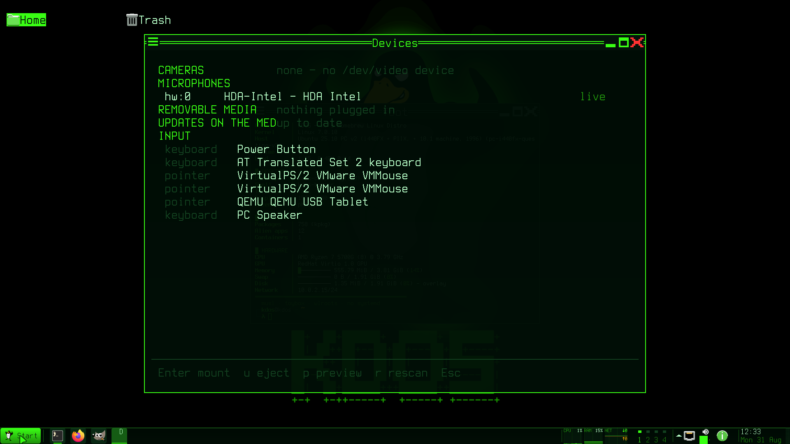

# The desktop

Living in the KDOS desktop: the panel, the menus, windows and workspaces, the full keybinding
table, notifications, the clipboard, locking and power, displays and devices. Everything here is
drawn as a grid of character cells — see
[the design language](../03-architecture/design-language.md) for why, and
[kdos-shell](../04-programs/kdos-shell.md) for how.

The desktop starts with `kdos-desktop` from a terminal. There is no display manager.

## What is on the screen

| Piece | Program |
|---|---|
| Window frames, the root menu, the phosphor shader | [`kdos-comp`](../04-programs/kdos-comp.md), the compositor |
| The panel along the bottom | `kdos-shell` |
| Icons on the wallpaper | `kdos-desk` |
| Everything that pops up from the panel | Other names of the same `kdos-shell` binary |

There is **one panel**, on the bottom edge, two rows tall. The second row is not padding: it
carries the clock's date, a window button's own title under its application name, and the live
meters strip.

## The panel

Left to right:

| Element | Left click | Middle click | Right click |
|---|---|---|---|
| **Start button** | Opens the Start menu | — | The System menu |
| **Quick launch** | Launches the pinned application | — | Unpins it |
| **Window list** | Toggles the window: minimises the one you are in, restores one you are not, opens the member list for a group | Opens a **new instance** | The window menu |
| **Meters strip** | [`kdos-res`](../04-programs/kdos-res.md) | `kdos stutter` | `kdos-energy` |
| **Workspace squares** | Switch workspace | — | — |
| **Tray items** | Activate the item | Secondary activate | The item's context menu |
| **Overflow chevron** | The status popup | — | — |
| **Volume** | A slider you can drag | Mute | — |
| **Network** | The network manager | — | — |
| **Clock and battery** | The calendar | — | — |

Dragging an icon along the quick-launch row reorders it, and the order is written to
`~/.config/kdos/favorites`. Dropping it off the row does nothing.

The panel degrades in four passes as the bar fills up, and the order is the priority: first the
meters go, then the Start button collapses to its mark, then the quick-launch row goes. **No pass
ever drops a window button.** Before that, the window list drops its *text* — every window keeps
a button showing its icon and its minimised state — because a picture that identifies the window
is worth more than a word beside it.

### The meters strip

Fifteen cells of live graphs on the panel's second row: CPU, memory, and the network as a
mirrored pair — received above the midline in the accent colour, sent below in the secondary, on
one shared scale. Summing them would hide the only thing anybody watches a network meter for.

Which meters appear is `meters =` in `~/.config/kdos/panel.conf`, and the order is the order of
importance, because a narrow bar drops them from the right. The available meters are `cpu`,
`ram`, `disk`, `net` and `diskio`.

### The notification area

The widgets on the right are a list, not a fixed layout: `right =` in `panel.conf` names them in
order. An unknown name is reported rather than ignored.

Widgets that only sometimes have something to say — the stutter chip, the restart mark, the
clipboard depth — live behind **one chevron of fixed width**, listed by `overflow =`. That keeps
the panel from changing width when one of them appears, which would slide every chart sideways.

### Tooltips

Hovering anything on the panel for about three quarters of a second raises a tooltip that says
what it is and what its three buttons do. A window button's tooltip carries a small live picture
of the window, which is the only way to tell three terminals apart by looking.

## The Start menu

`Super+A`, or the Start button.

The left column is what you **use**: pinned applications above the rule, most-frequently-launched
below it. The right column carries Places, the settings and the power actions. **All Programs**
opens the category list in place rather than cascading.

Typing searches — and the search covers more than applications. Every fixed row carries synonyms,
so typing `wifi` finds the network manager. Applications on the medium that are not installed
appear under **INSTALL FROM THE MEDIUM**, and choosing one installs the pack and opens the
application in the same action.

An application that runs in a box is marked `[box]`, because the first launch of one costs a
container start and you are entitled to know before you click.

The star at the right edge of a row pins the application to the quick-launch row.

![The Start menu: pinned applications on the left with `[box]` markers, Places and System on the right, and the search field showing the selected row's description](../../screenshots/start-menu.png)

## Windows

Window frames are drawn by the compositor and are part of the same visual set as everything else:
square corners, a two-pixel accent border, a title bar carrying the same double rule the cell grid
draws with, and hard-edged block buttons.

A frame may carry a small coloured square at the left of the title — a **box chip**, showing which
box the window came from. It appears only for a box that has been given its own accent colour, so
a default install has none.

Where the same application runs in two boxes, the box name is appended to its taskbar label to
tell them apart. Where it does not need disambiguating, nothing is appended.

**Move** by dragging the title bar, or `Super` and drag anywhere in the window. **Resize** from
the border, or `Super+Alt` and drag.

## Keybindings

The complete set, from the shipped `~/.config/kdos-comp/rc.xml`. `Super` is written `W` there.

### Applications and the shell

| Key | Action |
|---|---|
| `Super+Return` | Terminal (`foot`) |
| `Super+grave` | Focus the terminal, or start one |
| `Super+A` | Start menu |
| `Super+D` | Launcher |
| `Alt+F2` | Run box |
| `Super+E` | File manager (`mc` in a terminal) |
| `Super+I` | Settings |
| `Super+/` | Documentation browser |
| `Super+F1` | Keybinding sheet |
| `Super+C` | Calendar |
| `Super+F2` | Window list |
| `Super+F3` | Audio |
| `Super+F4` | Network |
| `Super+F5` | Bluetooth |
| `Super+F6` | Devices and removable media |
| `Ctrl+Shift+Escape` | Resource monitor |
| `Super+Shift+N` | Notification centre |

### Windows

| Key | Action |
|---|---|
| `Super+Q` | Close |
| `Super+N` | Minimise |
| `Super+M` | Maximise / restore |
| `Super+F` | Fullscreen |
| `Super+S` | Shade |
| `Super+T` | Always on top |
| `Super+O` | Show on all workspaces |
| `Super+Tab` / `Super+Shift+Tab` | Cycle windows |
| `Super+←` `→` `↑` `↓` | Snap to that edge |
| `Super+Alt+←` `→` `↑` `↓` | Move to that edge |
| `Super+Ctrl+←` `→` `↑` `↓` | Grow to that edge |
| `Super+Shift+D` | Show the desktop |
| `Super+Space` / `Alt+Space` | Root menu |

### Workspaces

| Key | Action |
|---|---|
| `Super+1` … `Super+9` | Go to that workspace |
| `Super+Shift+1` … `9` | Send the window there |
| `Super+,` / `Super+.` | Previous / next workspace |
| `Super+Shift+,` / `.` | Send the window previous / next |

Four workspaces are configured. Keys for 5–9 are bound already, so raising `<desktops number>` in
`rc.xml` makes them work; the panel strip has room for four digits and does not scroll, so beyond
four the wheel over the strip is the pointer's way there.

### Session, media and screen

| Key | Action |
|---|---|
| `Super+L` | Lock |
| `Super+Escape` | End the session — **it asks first** |
| `Print` | Screenshot a region |
| `Shift+Print` | Screenshot the whole screen |
| `Super+P` / `XF86Display` | Display settings |
| Volume up / down / mute | On-screen volume |
| Mic mute | Mutes the microphone |
| Brightness up / down | On-screen brightness |

`Super+Escape` writes the list of open windows *before* it asks the question, because after the
answer there is no session left to ask. That list is only read back if
`~/.config/kdos/session-restore` exists.

**If you change `rc.xml`, keep `<default />` as the first child of both `<keyboard>` and
`<mouse>`.** labwc loads its built-in bindings only when your file defines none of that kind, so
a file that binds one key throws every default away — including click-to-focus, the title-bar
drag and the window buttons. Put your own bindings after it.

## Notifications

Toasts appear in a corner and expire. **Hovering one holds its countdown** while you read it, and
its border changes colour so you can see that it has stopped.

Everything that expired is kept. `Super+Shift+N` opens the notification centre, which is the
history — including everything that arrived while the screen was locked or while you were looking
at another workspace. The panel badge counts what has arrived since you last opened it.

Middle-clicking the badge toggles **do not disturb**, which silences toasts without losing them:
the notification is still recorded and still counted, and the sending application cannot tell the
difference. An **urgent** notification is shown anyway.

Clicking a toast dismisses it.

## The clipboard

Copy and paste work in both directions, including the middle-click primary selection. `kdos-clip`
is the clipboard history, reachable from the overflow popup or by name.

## Files

`kdos-desk` draws the desktop. Right-clicking the wallpaper opens New Folder, New File, Open
Terminal Here, Sort Icons, Refresh, plus Applications, Change Wallpaper, Display Settings and
Settings. `~/Desktop` is created if it is missing.

`Delete` on a desktop icon moves the file to the freedesktop trash — the same implementation
`kdos trash` uses from a prompt, so the two mean the same thing.

`kdos-pick --browse` is the file browser; the same program is the file dialog that boxed
applications get through the portal, so Open and Save in Firefox or GIMP are drawn on this grid
rather than by their own toolkit.

Double-clicking a file opens it with the handler for its type. `kdos-openwith` chooses a
different one.

## Lock, idle and power

`Super+L` locks. The lock screen asks the compositor to hold every output, and the compositor —
not the lock client — owns the locked state: if the lock program crashes, the screens stay
covered and a new lock client can replace it.

The idle policy is one timer with three stages, each measured from your last activity rather than
from the previous stage: **dim**, then **lock**, then **outputs off**. Activity ends the dim and
powers the screens back on. It never unlocks. An application holding an idle inhibitor stops the
policy entirely.

All three timers **default to zero in a virtual machine**, because a blanked screen over a remote
display is indistinguishable from a crashed compositor. Set any `idle_*` key in
`~/.config/kdos/comp.conf` to turn them on anyway. See
[Configuration](../06-reference/configuration.md).

Suspend, restart and shut down are in the Start menu's footer and in the System menu. Each asks
before acting.

## Displays

`Super+P` opens `kdos-display`: the outputs, their modes, scale, and which is enabled.

Screens are laid out edge to edge from the left in list order. A vertical arrangement, an overlap
or a deliberate gap cannot be expressed — that is a deliberate narrowing, since what people
usually want is an order.

Each output gets its own panel and its own desktop icons. Both panels list every window rather
than only that output's; see [Known gaps](../06-reference/known-gaps.md).

## Removable media and devices

`Super+F6` opens `kdos-devices`: removable media, cameras and the rest. A stick is offered by
index rather than by path, and mounting is done by a root daemon that decides the device, the
mountpoint and the options itself.

Everything removable is mounted `nosuid,nodev` and, by default, `noexec`. The mountpoint is
`/media/<user>/<label>`.

The daemon refuses to offer four things: an internal disk, a filesystem the kernel cannot mount,
anything named in `/etc/fstab`, and the medium this system booted from. See
[the daemons](../04-programs/daemons.md).

## Who is using the camera and microphone

The panel shows a lamp naming the application currently recording — the application's own name,
not `pipewire`. The microphone lamp is also a **control**: clicking it mutes. `XF86AudioMicMute`
does the same.

The tooltip names the box the application is in, which on a machine where every application is
containerised is the half that says *which* Firefox.

## When the desktop misbehaves

A **stutter chip** appears in the panel when the compositor has dropped at least three frames in
the last ten seconds, and clicking it opens the attribution: which frames were late, by how much,
whether the compositor itself was slow, and who was busy at the time. The chip goes away when the
desktop stops missing frames.

For everything else, the meters strip is the way in: left click for
[`kdos-res`](../04-programs/kdos-res.md), middle for `kdos stutter`, right for `kdos-energy`.

## See also

- [kdos-shell](../04-programs/kdos-shell.md) — every surface on this page, in detail
- [kdos-comp](../04-programs/kdos-comp.md) — frames, the CRT pass, and the configuration keys
- [Applications](applications.md) — installing and launching boxed software
- [Theming](theming.md) — accents, the CRT knobs and wallpaper
- [Configuration](../06-reference/configuration.md) — every key on this page, with defaults
- [The design language](../03-architecture/design-language.md) — why it looks like this
