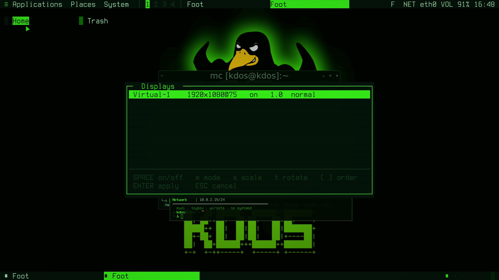
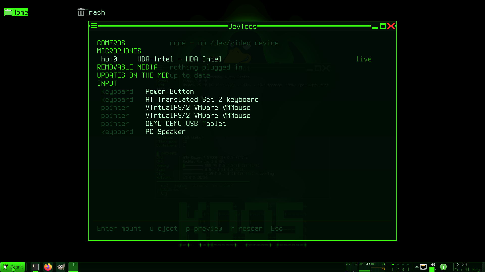

# The desktop

This chapter is for anyone sitting at a KDOS desktop. It describes what is on the screen, what each
part of the panel does when you click it, every keyboard and pointer binding the system ships, and
how the Start menu, windows, notifications, files, the clipboard, locking, displays and removable
media behave. Read [Getting started](getting-started.md) first if you do not yet have a running
session. Each section names the file that controls what it describes; every key in those files is
listed with its default in [Configuration](../06-reference/configuration.md).

## What is on the screen


| Piece | Program |
|---|---|
| Window frames, the compositor's menus, the phosphor pass | [`kdos-comp`](../04-programs/kdos-comp.md), the compositor |
| The panel | `kdos-shell` |
| Icons on the wallpaper | `kdos-desk` |
| Everything that opens from the panel | Other names of the same `kdos-shell` binary |

The *phosphor pass* is a shader that makes the whole screen imitate a CRT; see the
[glossary](../06-reference/glossary.md).

The compositor starts one panel and one desktop-icon surface per screen. The panel sits on the
bottom edge and is two character cells tall. Its second row carries the clock's date, the meters
strip and, when window buttons show their names, each window's title under its application name.

The panel's shape is set in `~/.config/kdos/comp.conf`. Each of these keys becomes part of a
program's command line, so the compositor reads them once, when the session starts: a change takes
effect at your next login, and a reload in the meantime logs that it was deferred. A key written
with an empty value is ignored and the default stays in force.

| Key | Default | What it does |
|---|---|---|
| `panel` | `bottom` | `bottom`, `top`, or `off` (`none` is accepted as `off`) |
| `panel_cells` | `2` | Height in cells, 1 to 4. With `1` there is no second row, no meters strip, and a window button shows a name and no icon |
| `panel_font` | `Terminus:pixelsize=20` | The bar's font, which sets its height. Name a size Terminus has: 12, 14, 16, 18, 20, 22, 24, 28 or 32; any other size is drawn at the nearest one, and the bar then sits a pixel off everything measured against it |
| `panel_margin` | `0` | Pixels between the bar and the screen edge, 0 to 64. A non-zero value floats the bar off three sides, and maximised windows stop at the gap |
| `panel_opacity` | `80` | Background opacity in percent, 20 to 100. Text and icons stay opaque |
| `panel_autohide` | `no` | `yes` shrinks the bar to a one-row strip until the pointer reaches it |
| `chrome_font` | `Terminus:pixelsize=32` | The font of the surfaces the compositor starts: the desktop icons, the dock-app column, notifications and the Wi-Fi passphrase prompt. Menus and popups opened from the panel draw in the built-in `Terminus:pixelsize=32` whatever it says. It is a pixel size; for a 4K screen name the scalable face, `Terminus (TTF):pixelsize=64`, because bitmap Terminus stops at 32 |
| `clock_format` | `%H:%M` | The panel clock, as a `strftime` format; `%a %d %H:%M` adds the day and date |
| `desktop_icons` | `yes` | `no` turns off `kdos-desk` and leaves the wallpaper bare |
| `icons` | `yes` | `no` draws a character glyph wherever a picture would go |
| `slit` | `no` | `yes` starts `kdos-slit`, a column of small gadgets configured in `~/.config/kdos/slit.conf`, one gadget per line as `<interval_s> <width_cells> <command> [args…]` |

The wallpaper and the phosphor pass are also `comp.conf` keys; [Theming](theming.md) covers them.
Settings' Panel and Desktop pages write the same keys.

## How the desktop is drawn

Almost everything KDOS draws is a grid of character cells in one colour palette, in the Terminus
font: the panel and everything that opens from it, the desktop icons, the lock screen, the boot
splash and the text console on `tty1`. A cell is half as wide as it is tall. The `panel_font` key
above sets the cell size of the bar, and `chrome_font` that of the desktop icons and notifications;
the menus and popups the panel opens keep the built-in size, 32 pixels.

Three things are not on that grid:

- **The compositor's own chrome**: title bars, the compositor's menus and the window-switcher
  display, drawn as text sized to one cell; see [Windows](#windows).
- **Applications running in a box.** A *box* is the container a graphical application runs in (see
  the [glossary](../06-reference/glossary.md)). Such an application draws whatever its own toolkit
  draws.
- **Pictures**, such as icons and window previews, which occupy whole cells.

[The design language](../03-architecture/design-language.md) explains why the desktop looks like
this, and [kdos-shell](../04-programs/kdos-shell.md) explains how each surface is built.

## The panel

These are the pieces that are always on the panel, from left to right. The occasional ones (the
recording lamps, the now-playing controls, the clipboard depth, the CPU readout, the update and
restart marks, the stutter chip) are widgets you can add, remove and reorder; the second table
below says how each answers a click, and [the notification area](#the-notification-area) explains
how to choose them.

| Element | Left click | Middle click | Right click |
|---|---|---|---|
| Start button | The Start menu | Run a command (`kdos-run`) | The System menu |
| Window list | Pinned and not running: launches it. Running: shows or hides its window, or lists the windows of a group | Launches another instance | The window menu. On a pinned button with nothing running, unpins it at once |
| `+N` cell | A list of the windows that did not fit | — | — |
| Meters strip | `btop` in a terminal | The stutter report | The energy report |
| Workspace squares | Switch workspace | — | — |
| Tray items | Activate the item, or its menu if the item is only a menu | Secondary activate | The item's menu |
| Overflow chevron | The status popup, listing what is behind it | — | — |
| Network | The network manager, `kdos-net` | — | The network manager |
| Volume | A slider you can drag; the wheel over it changes the volume by 5% | Mute or unmute | Audio devices and volumes |
| Battery | The calendar | — | Settings' Session page |
| Notification badge | The notification centre | Do not disturb, on and off | — |
| Clock | The calendar. The clock and the battery share this popup, so either one closes what the other opened | — | — |
| Show desktop (the last column) | Minimises every window, or brings back the ones it minimised when nothing is on screen | — | — |

Resting the pointer on the show-desktop column fades every window so you can see the desktop, and
moving away brings them back; only a click minimises them.

The widgets that come and go answer clicks like this:

| Widget | Left click | Middle click | Right click |
|---|---|---|---|
| Microphone lamp | Mute every capture switch on the sound card; a second click restores them | The same as a left click | Audio devices and volumes |
| Camera or screen lamp | Devices (`kdos-devices`) | — | Devices |
| Removable media | Devices | — | Devices |
| Now playing | Play or pause | Previous track | Next track |
| CPU readout | The resource monitor, [`kdos-res`](../04-programs/kdos-res.md) | — | — |
| Clipboard depth | Clipboard history | — | — |
| Stutter chip: the compositor has been dropping frames; see [When the desktop misbehaves](#when-the-desktop-misbehaves) | The stutter report | — | — |
| Restart mark: running programs that an upgrade has replaced and that need restarting | Which running programs an upgrade has replaced | — | — |
| Update mark: how many updates this machine is behind | The update surface, `kdos-update` | — | — |

The CPU readout is drawn only on a one-row panel. On the default two-row panel the meters strip
carries the same figure with a graph.

Pinned launchers and running windows share one row. A pinned application that is running uses its
pinned slot instead of appearing twice, and the underline under a button shows that it is running.
Drag a pinned icon along the row to reorder it; the order is saved to `~/.config/kdos/favorites`.
Releasing the icon anywhere off the row cancels the drag.

By default a window button is a picture with no label, which makes the panel a dock. The
`task_labels` key in `~/.config/kdos/panel.conf` changes that: `no` (the default) shows pictures
only, `auto` lets the bar choose (full labels, then shortened ones, then pictures) and `yes` always
keeps the label. `start_label = no` removes the word from the Start button and leaves only its mark.

As the bar fills up it tries four layouts in turn, each giving up more than the one before:

| Pass | What is shown |
|---|---|
| 0 | Everything |
| 1 | The meters are dropped |
| 2 | The Start button also shrinks to its mark |
| 3 | Pinned applications that are not running are also dropped |

No pass drops a window button. Windows that do not fit go behind a `+N` cell: the mouse wheel over
the row steps through them, and a click on the cell lists them. With `task_labels = auto` the row
gives up its label text before any of those passes, because each pass reserves only the room the
window buttons need as pictures.

### The meters strip

The meters strip is up to sixteen cells of live graphs on the panel's second row. The default set is
CPU, memory and network. The network meter is a mirrored pair: data received is drawn above the
midline in the accent colour and data sent below it in the secondary colour, on one shared scale.

Choose the meters with `meters =` in `~/.config/kdos/panel.conf`. Six are available:

| Name | Shows | Cells |
|---|---|---|
| `cpu` | Processor load, as a percentage | 5 |
| `ram` | Memory in use, as a percentage | 5 |
| `disk` | How full `/` is, as a percentage | 5 |
| `temp` | The hottest sensor, on a fixed 0–100 °C scale | 5 |
| `net` | Network received and sent, mirrored | 6 |
| `diskio` | Disk read and written, mirrored | 6 |

Sixteen cells is a fixed limit; [kdos-shell](../04-programs/kdos-shell.md) explains why. Two
percentage meters and one mirrored meter add up to exactly sixteen; two mirrored meters and anything
else do not fit. List the names in order of importance: when the set is too wide, or the bar too
narrow, meters are dropped from the right. `meters =` with nothing after it turns the strip off.

For example, to watch disk activity instead of memory:

```ini
meters = cpu diskio net
```

That is 5 + 6 + 6 = 17 cells, so the last meter, `net`, is dropped. `meters = cpu diskio` fits.

### The notification area

The widgets on the right of the panel are a list you control. `right =` in `panel.conf` names them
from left to right. A name the panel does not know is skipped and reported in the session log, so a
typo does not pass silently. A widget left out of the list does not appear on the bar.

| Name | Widget |
|---|---|
| `pager` | The workspace squares |
| `tray` | Status icons from running applications |
| `more` | The overflow chevron |
| `media` | Removable media |
| `privacy` | The microphone, camera and screen-recording lamps |
| `mpris` | Now-playing controls for a media player |
| `clipboard` | Clipboard history depth |
| `cpu` | The CPU readout |
| `stutter` | The stutter chip |
| `update` | The update mark: how many updates this machine is behind |
| `restart` | The restart mark |
| `net` | Network |
| `volume` | Volume |
| `battery` | Battery |
| `notify` | The notification badge |
| `clock` | The clock |

The default order is the order of that table:

```ini
right = pager tray more media privacy mpris clipboard cpu stutter update restart net volume battery notify clock
```

Some widgets appear only when they have something to report. Three of them, the stutter chip, the
restart mark and the clipboard depth, live behind the overflow chevron by default, as listed by
`overflow =` (default `overflow = stutter restart clipboard`, using the same names as `right =`).
The chevron takes two columns whenever anything is listed for it, whether or not those widgets have
anything to show, so the panel keeps its width and the meters beside it do not slide sideways.
`overflow =` with nothing after it puts those widgets back on the bar, and with `overflow =` and
`tray_hide =` both empty there is no chevron.

`tray_hide =` lists status-icon ids that are kept off the bar and shown in the chevron's popup
instead. The default is `tray_hide = fcitx fcitx5 org.fcitx.fcitx5`, which puts the input-method
icon in the popup; `tray_hide =` with nothing after it puts it back on the bar. A tray item that
publishes a menu has that menu drawn by `kdos-traymenu`.

Settings' Panel page writes these keys and tells the running panel at once. After editing
`panel.conf` by hand, tell the panel yourself:

```sh
pkill -x -HUP kdos-shell
```

### Tooltips

Rest the pointer on anything on the panel for 0.7 seconds and a tooltip says what it is and what its
mouse buttons do. A window button's tooltip includes a small picture of the window, which tells
apart several windows of the same application.

## The Start menu

`Super` is the key with the Windows or logo mark on it, between `Ctrl` and `Alt`. Press `Super+A`
or `Super+F10`, or click the Start button.

### Layout

The menu has three columns. The first holds pinned applications above the rule and up to ten of
your most frequently launched ones below it. **All Programs** opens the category list in place
rather than as a cascade of submenus, and selects the category you opened last.

The second column holds two groups:

- Places: your home folder and the standard folders, plus a **Files** row that opens the file
  browser.
- Recent: up to six files you have opened recently. It appears only once there are some.

The third column is the System group: Settings, Network, Bluetooth, Sound, Recorder,
Notifications, Devices, Boxes, Displays, Terminal, Help and About.

On a screen narrower than 100 columns the menu draws two columns instead of three, and the System
group folds behind a single **Settings** row. The rows named by `@toplevel` in
`/etc/kdos/menu.conf` (by default Network, Sound, Displays and Terminal) stay listed beside it; a
copy of that line in `~/.config/kdos/menu.conf` overrides it.

The footer holds five power actions: Lock Screen, Suspend, Restart, Log Off and Shut Down.
Restart, Log Off and Shut Down ask before they act. Suspend does not ask, because waking the machine
undoes it.

### Searching

Start typing to search. There is no field to click: the first letter you type turns the left
column into results, `Esc` clears the search, and a second `Esc` closes the menu. The search covers
applications, every row in the right column, the power actions and every named *route* (a stable
`verb.noun` name for a place in the system, such as `setup.network`, defined in
`/etc/kdos/menu.conf`). Each fixed row also answers to synonyms: typing `wifi` finds Network. A
search with results offers **Clear search** as its first row.

An application that runs in a box is marked `[box]`, because its first launch has to start a
container and takes noticeably longer. The mark at the right edge of an application row pins or
unpins it.

### Two-letter codes

A line in `~/.config/kdos/favorites` may carry a code, for example `mc code=FM`. The code is drawn
on the pinned row, and typing exactly those two letters in the Start menu opens that application at
once, with no arrows and no `Enter`. The shipped favorites are:

| Application | Code |
|---|---|
| `mc`, the file manager | `FM` |
| `btop`, the system monitor | `MO` |
| `lazygit` | `GI` |
| `foot`, the terminal | `TE` |
| `firefox-esr` | `WW` |
| `org.xfce.mousepad`, a text editor | `ED` |
| `gimp` | `IM` |

The last three run in boxes and appear only once they are installed. At most eight pinned
applications are shown: the first eight entries whose application is installed. An entry with
nothing installed behind it is skipped and does not use up a place. The panel's pinned launchers
read the same file.

### Terminal programs

Terminal programs are applications here. btop, lazygit, yazi, aerc, calcurse, visidata, nmtui
and the other installed terminal programs each carry a desktop entry, so they appear in the menu,
answer the search, pin to the panel and open with a double-click like a program with its own window.
The desktop supplies the terminal, which is `foot`. The entry belongs to the package, so installing
a program adds its row and removing the program removes the row.

KDOS also ships its own terminal, `kdos-term`, built from the same cell libraries as the panel. It
is listed among the applications, in All Programs and in search results, as **Terminal**, or run
`kdos-term` to open one. The **Terminal** row in the System column starts `foot`, as `Super+Return`
and the `TE` code do. See [kdos-term](../04-programs/kdos-term.md).

### Installing applications

When the medium you booted from carries application packs, a search also lists matching applications
that are not installed yet, under **INSTALL FROM THE MEDIUM**, and each category of All Programs
lists them under **ON THE MEDIUM**. Choosing one installs it and opens it in one action. The
standard image carries no packs, so these rows appear only on a medium that has them. To build
applications from the catalogue instead, open the application store, `kdos-store`, from the command
palette's setup routes (`Super+Ctrl+H`; the command palette is described under [Keyboard
shortcuts](#applications-and-shell-surfaces)). See [Applications](applications.md).

### The System menu

The System menu, opened by right-clicking the Start button, is a plain list: four of the eight
accents (phosphor, amber, ice and bone; `kdos-style` offers all eight), Boxes, Displays, Network
(`nmtui`), Files (`mc`), Task Manager (`btop`), System status, Energy Impact, Doctor, the key and
command help, Terminal, and the five power actions.

![The Start menu: pinned applications on the left with `[box]` markers, Places and System on the right, and the search field showing the selected row's description](../../screenshots/start-menu.png)

## Windows

The compositor draws window frames to match everything else: square corners, a two-pixel accent
border and hard-edged block buttons. The title is `Terminus (TTF)` at 24 points, which is 32 pixels
at 96 dpi, so the title bar is one cell tall and lines up with the grid even though it is not made
of cells.

A frame may carry a small coloured square at the left of its title. That is a *box chip*, showing
which box the window came from. It appears only for a box given its own colour with `accent =` in
`~/.config/kdos/boxes/<name>.conf`, so a fresh install shows none. When the same application runs in
two boxes, the panel adds the box name to its window label, as in `GIMP (arch)`.

To move a window, drag its title bar, or hold `Super` and drag anywhere in the window. To resize
one, drag a border, or hold `Super` and right-drag anywhere in the window. Many boxed applications
draw their own decorations and have no title bar to grab, which is why the `Super` forms exist.

Windows remember where they were. When an application's window closes, its position, size, workspace
and shaded state are saved to `$XDG_STATE_HOME/kdos/winpos` (the two hundred most recent
applications are kept), and the next time it opens it goes back there. A window that places itself,
a window placed by a rule, a dialog, and a window that opens maximised, tiled or fullscreen are left
alone. When another window of the same application already sits at the remembered position on that
workspace, the new one is not put on top of it: the compositor's ordinary placement search,
described in [the window
model](../03-architecture/window-model.md#placement-is-a-search-not-a-cascade), finds it a place
instead. Set `window_memory = no` in `comp.conf` to turn this off; this key takes effect on a
reload.

## Keyboard shortcuts

These tables are the complete set KDOS ships. They come from `~/.config/kdos-comp/rc.xml`, where
`Super` is written `W`, `Shift` `S`, `Ctrl` `C` and `Alt` `A`. `Alt+Tab`, `Alt+Shift+Tab` and
`Alt+F4` are not in that file: they are compositor defaults, which the file's `<default />` line
pulls in.

`Super+F1` shows a shortcut card generated from your own `rc.xml`, so it stays accurate when you
change the file.

### Applications and shell surfaces

| Shortcut | Opens |
|---|---|
| `Super+Return` | A terminal (`foot`) |
| `Super+grave` | The scratchpad terminal |
| `Super+A`, `Super+F10` | The Start menu |
| `Super+D`, `Super+F7` | The launcher: a search over installed applications only |
| `Super+Space` | The command palette: one search over open windows, applications, routes, settings pages, shortcuts and, from the third character typed, files under your home folder |
| `Alt+F2` | Run a command |
| `Super+E` | Files (`mc` in a terminal; see the next table) |
| `Super+I` | Settings |
| `Super+/` | The documentation browser |
| `Super+F1` | The keyboard shortcut card |
| `Super+C` | The calendar |
| `Super+F2` | The Team Monitor: every window with its process and box, for closing or terminating one |
| `Super+F3` | Audio devices and volumes |
| `Super+F4` | Network |
| `Super+F5` | Bluetooth |
| `Super+F6` | Devices and removable media |
| `Super+Shift+F` | Find: files by name or contents, applications, recent files |
| `Super+Shift+N` | The notification centre |
| `Super+Shift+Space` | Hide the panel, and bring it back |
| `Ctrl+Shift+Escape`, `Super+Ctrl+T` | The resource monitor, `kdos-res` |

The scratchpad is a single terminal started under the application id `kdos-scratchpad`. The first
press opens it. Each press after that switches whether it follows you between workspaces, and raises
and focuses it. When you switch following off, it stays on the workspace you are looking at.

A panel hidden with `Super+Shift+Space` stays hidden when the pointer reaches the screen edge; only
the same chord brings it back.

### Terminal programs, one key each

| Shortcut | Program |
|---|---|
| `Super+E` | `mc`, the file manager |
| `Super+Shift+E` | `aerc`, mail |
| `Super+Shift+B` | `lynx`, the web |
| `Super+Shift+U` | `rmpc`, music |
| `Super+Shift+C` | `ikhal`, the calendar |
| `Super+Shift+G` | `iamb`, chat |
| `Super+Shift+W` | `micro`, the editor |

Each of these is *run-or-raise*: if a window with the program's name as its app id is open, the key
focuses and raises it; if not, the key starts `foot -e` *program*. The window the key starts carries
`foot`'s default app id, `foot`, so the key does not find it again and each further press opens
another window. A window opened from the Start menu is started with `--app-id=`*program*, and that
is the window the key raises. A key whose program is not installed opens nothing, and that row is
left off the shortcut card.

### Desk accessories

| Shortcut | Opens |
|---|---|
| `Super+Ctrl+Q` | Calculator |
| `Super+Ctrl+N` | Scratch pad |
| `Super+Ctrl+B` | Contacts |
| `Super+Ctrl+E` | Character map |
| `Super+Ctrl+V` | Bound to `kdos-clip`; see [The clipboard](#the-clipboard) |
| `Super+Ctrl+P` | Bound to `kdos-energy`, the per-application energy report. It prints to standard output and has no window, so pressing the key shows nothing; right-click the meters strip for the same report in a popup |
| `Super+Ctrl+C` | The palette, opened on its capture routes: screenshots, screen and sound recording, QR decoding |
| `Super+Ctrl+H` | The palette, opened on its setup routes: network, Bluetooth, sound, displays, devices, printers, users, the clock, terminal programs and the application store |
| `Super+Ctrl+Shift+Space` | The accent and font picker, `kdos-style` |
| `Super+Ctrl+R` | Add a reminder |
| `Super+Ctrl+Alt+R` | List the reminders |
| `Super+Ctrl+Shift+R` | Clear the reminders |

Each accessory opens over whatever is on the screen and closes leaving it untouched. A reminder is
saved as a job in `~/.config/kdos/timers.d`, so it survives logging out, and it is delivered once.

### Notifications and session switches

| Shortcut | Does |
|---|---|
| `Super+X` | Dismiss the notification on screen |
| `Super+Shift+X` | Dismiss every notification on screen |
| `Super+Ctrl+X` | Do not disturb, on and off |
| `Super+Alt+X` | Bring back the last dismissed notification |
| `Super+Ctrl+Alt+T` | Show the time as a notification |
| `Super+Ctrl+Alt+B` | Show the battery level as a notification |
| `Super+Ctrl+I` | Stay awake: stop dimming, locking and blanking on idle, and allow them again |
| `Super+Ctrl+Shift+N` | Night light: warm the colour palette KDOS's own surfaces draw in, and cool it again |

The three switches (stay awake, night light, do not disturb) are also available from a prompt as
`kdos toggle stay-awake`, `kdos toggle night-light` and `kdos toggle dnd`; `kdos toggle` alone
lists them with their state. Each switch is a flag file under `~/.local/state/kdos/toggles/`, so it
lasts until you change it.

### Windows

| Shortcut | Does |
|---|---|
| `Super+Q`, `Alt+F4` | Close |
| `Super+N` | Minimise |
| `Super+M` | Maximise, or restore |
| `Super+F` | Fullscreen, or restore |
| `Super+S` | Shade: roll the window up into its title bar |
| `Super+T` | Always on top |
| `Super+O` | Show on all workspaces |
| `Super+Tab`, `Alt+Tab` | Next window |
| `Super+Shift+Tab`, `Alt+Shift+Tab` | Previous window |
| `Super+←` `→` `↑` `↓` | Snap to that edge; two snaps combine into a quarter |
| `Super+Alt+←` `→` `↑` `↓` | Move to that edge without resizing |
| `Super+Ctrl+←` `→` `↑` `↓` | Grow to that edge |
| `Super+Shift+D` | Show the desktop |
| `Alt+Space` | The window menu |

The window menu, also opened by a right press on a title bar, offers Shade, Stick (show on all
workspaces), Always on Top, Decorations, Send To Desktop (without following the window), Fullscreen
and Close. It is defined in `~/.config/kdos-comp/menu.xml`.

### Workspaces

Four workspaces ship, named `main`, `www`, `hack` and `misc`. The panel draws each as a small screen
with a label under it: the active one in the accent colour, one that wants attention in the warning
colour, one with windows in the label colour, and an empty one dimmed. The label is the workspace's
name only when that name is one or two characters long, because a shortened name would mislead: two
characters of `Workspace 3` are `Wo`. The shipped names are longer, so the labels read `1 2 3 4`.

| Shortcut | Does |
|---|---|
| `Super+1` … `Super+9` | Go to that workspace |
| `Super+Shift+1` … `Super+Shift+9` | Send the window there, and follow it |
| `Super+,` / `Super+.` | Previous / next workspace |
| `Super+Page Up` / `Super+Page Down` | Previous / next workspace |
| `Super+Shift+,` / `Super+Shift+.` | Send the window to the previous / next workspace, and follow it |

All of the previous/next keys wrap around from the last workspace to the first.

Keys for workspaces 5 to 9 are already bound, so raising `<desktops number="4">` in `rc.xml` makes
them work with no other edit. The panel's strip grows by two cells per workspace to match, and the
mouse wheel over it steps through workspaces. When the bar has no room for the squares they shrink
to a compact `N/M` readout, which shows where you are but is not clickable.

### Session, screen and media

| Shortcut | Does |
|---|---|
| `Super+L` | Lock the screen |
| `Super+Shift+L` | Start the screen saver |
| `Super+Escape` | End the session; it asks first |
| `Print` | Screenshot the whole screen |
| `Shift+Print`, `Super+Shift+P` | Screenshot a region |
| `Alt+Print` | Start the screen recording, and stop it |
| `Super+P`, the display key | Display settings |
| Volume up, down, mute | Change the volume by 5% through the ALSA mixer, with an on-screen gauge |
| Mic mute | Mute the microphone |
| Brightness up, down | Change a built-in screen's brightness by 10%, with an on-screen gauge |
| Play/pause, stop, next, previous | Media controls, through `kdos-mpctl`: sent to mpd or to a media player that announces itself to the session (`mpv`, `cmus`, a boxed player), whichever is playing |
| The power button | Shut the machine down; it asks first |
| The sleep or suspend key | Suspend |

A screenshot is copied to the clipboard and saved to `~/Pictures/Screenshots` (under
`$XDG_PICTURES_DIR` when that is set), and a notification confirms it; see
[kdos-shot](../04-programs/kdos-command.md#kdos-shot). A screen recording is saved to `~/Videos`.

The brightness keys reach the panel of a laptop or an all-in-one, which is what
`/sys/class/backlight` exposes. An external monitor is not controlled by them; set its brightness
with `ddcutil setvcp 10 <0-100>`.

`Super+Escape` saves the list of open windows before it asks whether to end the session, because
once you answer there is no session left to save it from. Log Out, Restart and Shut Down in the
compositor's root menu save it the same way; the Start menu's footer and the System menu do not.
The list is used only when `~/.config/kdos/session-restore` exists: create that file
(`touch ~/.config/kdos/session-restore`) and your boxed applications are started again at the next
login, two seconds apart. Programs that are not boxed are recorded but not restarted.

### Pointer bindings

| Action | Does |
|---|---|
| Left click a window | Focus and raise it; focus does not follow the mouse |
| `Super`+left-drag | Move the window |
| `Super`+right-drag | Resize the window |
| Drag the title bar | Move the window |
| Drag a border | Resize the window |
| Double-click the title | Shade, and unshade |
| Wheel up / down on the title bar | Shade / unshade |
| Right-press the title bar | The window menu |
| Right-click the wallpaper | The desktop's menu (see [Files](#files)) |

With `desktop_icons = no` in `comp.conf` there is no desktop surface over the wallpaper, and the
compositor answers it directly: any button opens the compositor's root menu, and the wheel steps to
the previous or next workspace. The root menu, defined in `~/.config/kdos-comp/menu.xml`, offers a
terminal, files, Run, the Start menu, the Applications, Places and System menus, the display,
network, Bluetooth and device managers, a screenshot, Show Desktop, the lock, Suspend, Reload
Configuration, and Log Out, Restart and Shut Down, each of which asks first.

### Changing the bindings

Edit `~/.config/kdos-comp/rc.xml`. The compositor is a fork of labwc, and labwc's `rc.xml`
documentation applies to it.

Keep `<default />` as the first line inside both `<keyboard>` and `<mouse>`. The compositor loads
its built-in bindings only when your file defines none of that kind, so a file that binds even one
key without `<default />` loses every default, including click-to-focus, dragging by the title bar
and the three window buttons, and the mouse then appears not to work. Put your own bindings after
that line. When two bindings use the same chord, the later one wins.

For example, to make `Super+B` open Firefox:

```xml
<keyboard>
  <default />
  <!-- ...the shipped bindings... -->
  <keybind key="W-b"><action name="Execute" command="firefox-esr"/></keybind>
</keyboard>
```

The compositor also has window-grouping actions that no shipped key uses: `AddToTabGroup` stacks the
focused window onto the one behind it, `RemoveFromTabGroup` takes it out again and
`NextInTabGroup` steps through the group's tabs. Bind them in `rc.xml` to use them.

The same file controls pointing devices (tap-to-click, natural scrolling, pointer speed) in a
`<libinput>` block that ships commented out with example values. Tap-to-click is already on by
default. Per-window rules, such as sending one boxed application to a given workspace, go in a
`<windowRules>` block; the shipped file carries three commented examples.

## Notifications

Notifications appear as small pop-ups (*toasts*) in the top-right corner, at most four at a time.
Unless the sending application sets its own timeout, an ordinary toast disappears after five
seconds, one with buttons after twenty, and an urgent one stays until you dismiss it. Hovering over
a toast pauses its countdown while you read it, and its border changes colour to show that it has
stopped.

A toast that disappeared is not lost. `Super+Shift+N` opens the notification centre, which keeps
the last 64 notifications, including everything that arrived while the screen was locked or while
you were on another workspace. The panel badge counts what has arrived since you last opened the
centre.

Do not disturb (middle-click the badge, or `Super+Ctrl+X`) stops toasts from appearing without
losing them. Each notification is still recorded and counted, and the application that sent it
cannot tell the difference. A notification marked urgent is shown anyway. While do not disturb is on
the badge shows a moon.

A left click on a toast's button runs that action, a left click on a toast whose text holds one link
opens the link, and any other click dismisses the toast; so does `Super+X`. `Super+Alt+X` brings the
last one back if you dismissed it too early. It comes back without its buttons, because the original
notification is closed and its actions belonged to the program that sent it.

`Super+Ctrl+I` and `Super+Ctrl+Shift+N` each raise a one-line notice saying whether the switch is
on or off. Stay awake changes nothing on screen, so for that switch the notice is the only sign that
the key worked.

From a prompt, `kdos notify <summary> [body]` raises a notification of your own, for example
`make && kdos notify done`.

## Files

`kdos-desk` draws the desktop: the contents of `~/Desktop` (the folder `user-dirs.dirs` names) as a
grid of icons, with Home and Trash pinned in the first two places so they never move. `~/Desktop` is
created if it is missing. A `.desktop` file placed there is shown by its application name and
launches that application.

**Right-click the wallpaper** for a menu about the desktop itself:

- Open Terminal Here, Find Here, Add to Places, Git Status Here
- New Folder, New File, Sort Icons, Refresh
- Applications, Change Wallpaper, Display Settings, Settings
- Show Desktop, Screenshot, Lock Screen

**Right-click an icon** for the file verbs. Which ones appear depends on what the icon is:

| Verb | Offered on |
|---|---|
| Open | Files and folders |
| Peek | Files |
| Edit | Files |
| Open Terminal Here | Files and folders |
| Find Here | Folders |
| Add to Places | Folders |
| Share | Files and folders |
| Git Status Here | Files and folders |
| Extract Here | Files |
| Move to Trash | Files and folders, but not the pinned Home and Trash icons |
| Rename | Files and folders, but not Home and Trash |
| Empty Trash | The Trash icon |
| New Folder, New File, Refresh | Every icon |

The desktop and the file browser (`kdos-pick`) take their verbs from one shared list, so the two
always offer the same verbs, and a verb whose program is not installed is offered on neither.
The `F2` menu in `mc` offers the same verbs, except Extract Here, from `~/.config/mc/menu`.

### Using the keyboard

The desktop starts with no icon selected. Click the desktop, then use the arrow keys or `Tab` to
pick an icon; `Home`, `End`, `Page Up` and `Page Down` jump further. `Esc` or a click on bare
wallpaper clears the selection. While the desktop has the keyboard, its bottom row shows which keys
do what, and the desktop gives the keyboard back the moment you click a window. With nothing
selected, `Shift+F10` opens the wallpaper's menu; with an icon selected it opens that icon's menu.
`Enter` opens the selected icon, `Delete` moves it to the trash, and `F5` or `r` refreshes the grid.

### The trash

Deleting from the desktop moves the file to the standard freedesktop trash, the same
one `kdos trash <file>` uses from a prompt. Opening the Trash icon opens `kdos-trash`, which lists
what was deleted, when and from where. `Enter` puts the selected file back where it was, `d` or
`Delete` deletes it for good, and `c` empties the trash; both of those ask first.

### The file browser

The file browser is `kdos-pick --browse`. The same program is the Open and Save dialog that boxed
applications get through the file-chooser *portal* (the desktop service through which a boxed
application asks the host to choose a file, share the screen or open a link), so Open and Save in
Firefox or GIMP are drawn on this grid rather than by their own toolkit.

Two things are called Files. The Start menu's **Files** row opens `kdos-pick --browse`, while
`Super+E`, the System menu's Files entry and a double-clicked folder open `mc`, the file manager,
in a terminal.

### Opening a file

Double-clicking a file opens it with the default handler for its type. `kdos-openwith` lets you
choose a different one, and its **Always use this application** box makes that choice the default.

Some of the shipped defaults:

| You open | It goes to |
|---|---|
| A folder | `mc` |
| A `.pdf` | `kdos-peek` |
| An `.epub` | `epy` |
| A `.7z` or `.rar` archive | `kdos-openarchive` |
| A `.csv` file | `visidata`, whose desktop entry claims `text/csv` |
| A spreadsheet (`.xlsx`) | Nothing by default: no installed entry claims the type, so neither a double-click nor **Open With** offers a handler. Run `sc-im file.xlsx` or `vd file.xlsx` from a prompt; both read `.xlsx`, and sc-im also writes it |
| A `mailto:` link | `aerc` |
| A web page, `http:` or `https:` link | `w3m` |

The system-wide defaults are in two files. `/etc/xdg/kdos-mimeapps.list` is searched first and holds
the choices that need a window (images to `imv`, text to `nvim`). `/etc/xdg/mimeapps.list` is the
layer under it and holds the folder, document, archive, mail and web rows in the table above, which
answer the same way on `tty1` as on the desktop; that is why web links go to `w3m`. Your own choices
go in `~/.config/mimeapps.list`, which ships empty.

A browser you install in a box registers itself as a candidate handler; use `kdos-openwith` to make
it the default. A link clicked on the desktop or in a terminal program goes through `xdg-open`,
which here is the same resolver a double-click uses. A link clicked inside a boxed application goes
through the portal instead, which reads the same tables, so both end at the same handler. A handler
that needs a terminal is given one wherever it is launched from.

## The clipboard

Copy and paste work in both directions between the desktop and boxed applications, including the
middle-click primary selection.

The clipboard history is kept by `kdos-clip`, a daemon the compositor starts with the session. It
records copied text (up to 32 entries, 64 KiB each) and keeps the current selection alive after the
program you copied it from has closed. It keeps the history in memory only, so nothing copied is
written to disk and the history ends with the session. It does not record the primary selection or
copied images; an image stays available for as long as the program that copied it is running.

Open the history from the panel's clipboard widget, which appears behind the overflow chevron once
something has been copied, or from a prompt with `kdos-clip --pick`. The shipped `Super+Ctrl+V`
binding runs `kdos-clip` with no argument, which starts a second daemon in place of the first and
opens no picker; bind the key to `kdos-clip --pick` in `rc.xml` to make it open the history.

Set `clipboard = no` in `comp.conf` to turn the daemon off; the selection then disappears with the
program that owned it. Like the panel keys, it takes effect at your next login.

## Locking, idle and power

`Super+L` locks the screen. The session, not the lock program, owns the locked state: if the lock
program crashes, the screen stays covered and a new lock program can take its place. Only a correct
password unlocks the screen.

The idle policy is one timer, measured from your last keyboard or pointer activity: first the screen
dims, then it locks, then the outputs switch off. Moving the mouse or pressing a key ends the dim and
turns the screen back on, but never unlocks it. An application that asks the system to stay awake, a
video player for instance, pauses the whole policy while it does, and so does the stay-awake switch
(`Super+Ctrl+I`).

Set the timers in `~/.config/kdos/comp.conf`, in seconds from 0 to 86400, where `0` means never:

| Key | Default |
|---|---|
| `idle_dim` | `300` |
| `idle_lock` | `600` |
| `idle_off` | `900` |
| `lid_close` | `suspend`; also `lock` or `off` |

In a virtual machine all three idle timers default to `0` and `lid_close` defaults to `off`, because
a blank screen seen over a remote display looks exactly like a crashed session. Writing any one of
`idle_dim`, `idle_lock` or `idle_off` in `comp.conf` switches that default off for all three, so the
two you did not write take their defaults from the table above; set all three when you set
one. Writing `lid_close` overrides its own default separately. See
[Configuration](../06-reference/configuration.md).

Lock, suspend, restart, log off and shut down are in the Start menu's footer, and the same five are
on the System menu (right-click the Start button).

## Displays

`Super+P`, or the display key on a laptop, opens `kdos-display`: your screens, their modes, their
scale and which are switched on.

Nothing is applied until you press `Enter`. Every key before that edits a plan:

| Key | Does |
|---|---|
| `↑`, `↓` | Select a screen |
| `m` | Choose from the modes the selected monitor reports |
| `Space` | Switch the selected screen on or off |
| `s` | Cycle the scale: 1, 1.5, 2 |
| `t` | Cycle the rotation, through the four rotations and their mirrored forms |
| `[`, `]` | Move the selected screen left or right in the order |
| `Enter` | Apply the plan |
| `Esc` | Leave without applying |

A mode the monitor cannot actually show may still be accepted and leave you with a screen you cannot
read, so `Enter` starts a fifteen-second countdown. Press `K` to keep the result, which saves it to
`~/.config/kdos/displays.conf`. Press `R`, or let the countdown run out, and the arrangement from
before `Enter` is put back. `kdos-display --apply` re-applies the saved file without opening a
window; the session runs it at startup and whenever a screen is plugged in.

Screens are placed edge to edge from the left, in list order. Stacking screens vertically,
overlapping them or leaving a gap between them is not supported.

Each screen gets its own panel and its own desktop icons, and each panel lists the windows on its own
screen. The workspaces are shared: every screen shows the same workspace, and the pager on each panel
counts windows on every screen. Notifications are not per-screen, so a toast appears wherever the
compositor places it.



## Removable media and devices

`Super+F6` opens `kdos-devices`: USB sticks and other removable disks, cameras and microphones. You
pick a disk from the list, and a root service, `kdos-mountd`, mounts it. The service chooses the
device, the mount point and the options itself; the list offers row numbers, never paths, so no
request can name a system directory.

Removable disks are always mounted `nosuid,nodev`, and `noexec` by default. The mount point is
`/media/<user>/<label>`, or the device name when the filesystem has no label; it is created readable
only by you and removed on unmount, and characters other than letters, digits, `.`, `_` and `-` are
removed from the label. `/etc/kdos/mountd.conf` does not exist by default. Create it with the line
`exec = yes` to allow programs on removable disks to run, and with `format = yes` to allow the
disks tool, `kdos-disks` (the `system.disks` route), to format one.

The service offers only a disk that is removable or attached over USB, and never:

- an internal disk,
- a filesystem this kernel cannot mount,
- anything already mounted,
- anything listed in `/etc/fstab`,
- the medium this system booted from.

See [the daemons](../04-programs/daemons.md) for the full rules.



## Who is using the camera and microphone

While something is recording, the panel shows a lamp naming the application, by its own name rather
than `pipewire`. There are three lamps: the microphone, the camera and the screen. The screen has its
own lamp because somebody watching your screen is a different event from somebody watching your
face. Click the microphone lamp, or press the mic-mute key, to mute or unmute the microphone.

The microphone lamp lights only while a recording stream is actually *running*, not merely open, so
it stays dark for an application that has a microphone open and idle. The camera lamp lights when
any process has a `/dev/video*` device open, because most applications use the camera directly
rather than through the portal, and also for a camera stream through PipeWire. The screen lamp
lights for a screen-capture stream, such as a portal screen share or `Alt+Print`.

The tooltip names the box the application is in, which tells you *which* Firefox it is when you have
more than one.

## When the desktop misbehaves

**Stutter.** A stutter chip appears when the compositor has dropped at least three frames in the
last ten seconds. By default it sits behind the overflow chevron. Click it to see which frames were
late, by how much, whether the compositor itself was slow, and what was busy at the time. The chip
disappears when the desktop stops dropping frames. `kdos stutter` gives the same report at a prompt.

**Something is using too much.** The meters strip is the quickest way in: left click opens `btop`,
middle click the stutter report, right click each application's share of energy use.
`Ctrl+Shift+Escape` and `Super+Ctrl+T` open [`kdos-res`](../04-programs/kdos-res.md), which can
name a boxed application rather than only its processes.

**A fullscreen application has frozen and covers the screen.** Press `Super+F2` for the Team
Monitor. Select the window; `Enter` asks it to close normally, so an editor can still ask about
unsaved work, and `k` sends the process behind it `SIGTERM`.

**The panel has gone.** `Super+Shift+Space` brings back a panel you hid. If it is still missing,
check `panel` in `comp.conf`.

**The mouse does nothing in windows.** Your `rc.xml` has probably lost its `<default />` line; see
[Changing the bindings](#changing-the-bindings).

## See also

- [kdos-shell](../04-programs/kdos-shell.md): every surface on this page, in detail
- [kdos-comp](../04-programs/kdos-comp.md): frames, the phosphor pass, and the configuration keys
- [The window model](../03-architecture/window-model.md): where a window goes, snapping and workspaces
- [Applications](applications.md): installing and launching boxed software
- [Theming](theming.md): accents, the shader, the wallpaper and fonts
- [Accessibility](accessibility.md): the magnifier and what does not exist
- [Configuration](../06-reference/configuration.md): every key on this page, with defaults
- [The design language](../03-architecture/design-language.md): why it looks like this
- [How KDOS differs](../01-philosophy/how-kdos-differs.md#the-desktop): how this desktop compares
  with the ones other distributions ship

<!-- book-nav -->
---

*Part II — Using KDOS, chapter 7.* Previous: [6. Installation](installation.md) · [Contents](../README.md) · Next: [8. Applications](applications.md)
