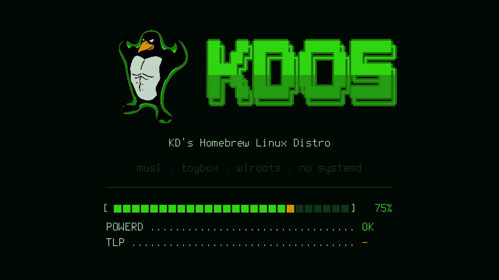
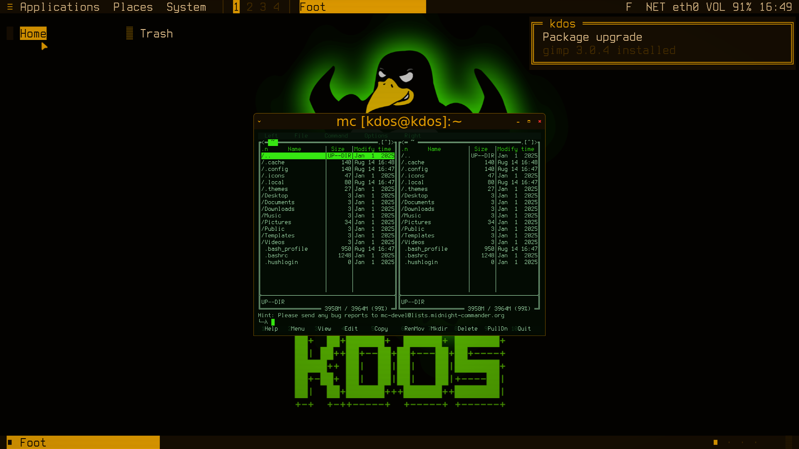
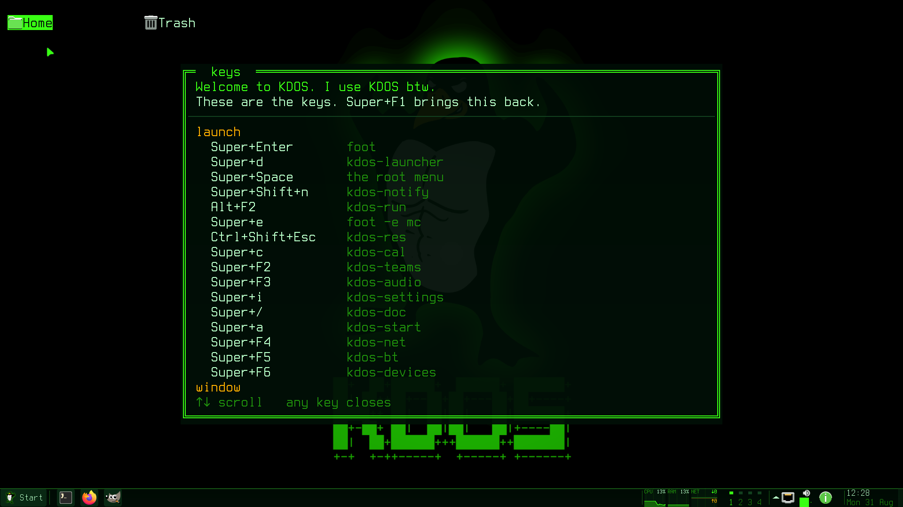

# Getting started

This chapter takes a newcomer from a clone of the KDOS repository to a running KDOS desktop. It
covers building the image, booting it in a virtual machine or from a USB stick, logging in, keeping
a live session's changes, and moving on to an installed system. It assumes a Linux machine with
Docker and some familiarity with a shell; nothing about KDOS itself is assumed. If you want to know
what KDOS is before you build it, read [Why KDOS](../01-philosophy/why-kdos.md) and
[How KDOS differs](../01-philosophy/how-kdos-differs.md) first. The installer has a chapter of its
own, [Installation](installation.md).

The chapter follows these steps in order:

1. Fetch the upstream sources and build an ISO image on your own machine.
2. Boot the image in a virtual machine to see that it works.
3. Write the image to a USB stick.
4. Boot the stick and log in.
5. Optionally, create a persistence store so that a live session keeps its changes.
6. Install to a disk with `kinstall`.
7. Try the first commands on the running desktop.

## Before you build

The project does not publish an image built from this tree. The releases page of
[github.com/kunaldawn/kdos](https://github.com/kunaldawn/kdos/releases) carries the source archive
(the releases named `sources-NNN`, described below) and one ISO from an earlier line of KDOS that
this book does not describe. The system this book describes is one you compile from the repository.
That follows from what KDOS is: a distribution built from source, where every program on the image
was compiled by the build you ran, apart from a short, named list of exceptions: firmware, four
compiler bootstrap seeds, compiled font files and data with no other source form (see
[What is not built from source](../01-philosophy/why-kdos.md#what-is-not-built-from-source)).
[How KDOS is built](../05-developer/how-kdos-is-built.md) follows the build from `git clone` to the
finished ISO, and [The build system](../05-developer/build-system.md) describes its orchestrator in
depth.

Plan for the cost before you start:

| | |
|---|---|
| Wall time, first build | Many hours; plan for most of a day. Every package is compiled, including GCC several times over and the kernel. The build container is limited to eight CPUs |
| Disk | About 8.9 GB (8.3 GiB) of upstream source archives, fetched by `make fetch`. The build tree under `build/` needs room of its own, and a complete set of phase snapshots about 84 GB more, of which the packaging phase alone is about 59 GB. Snapshots are optional |
| Network | Needed to clone, to run `make fetch`, and for the first `make build` on a machine, which builds its container image from Alpine Linux packages. The compile itself runs with networking switched off |
| Software on your machine | Docker, plus a few small tools listed in the next section. Every compiler runs inside a container |

Later builds are much shorter. The build runs in eight *phases*, stages that each run in order
(see [The build system](../05-developer/build-system.md#phases)); after each one it can save a
*snapshot* of the tree, so a later build can resume from that point. Most changes need only a
narrow rebuild of one port or one phase. [Developing](../05-developer/developing.md)
describes those targeted loops.

## What you need

| Need | Used by | Notes |
|---|---|---|
| A Linux machine with Docker | `make build` | `make build` runs `docker` directly, in privileged mode. The build image carries the whole toolchain |
| `git`, `curl`, `sha256sum` | Cloning, `make fetch` | Ordinary downloading happens on your machine |
| A C compiler (`$CC`, default `cc`) | `make fetch`, `make fetch-check` | Optional for `make fetch`, which compiles a small recipe reader on the host. Without a compiler, `make fetch` hands the whole fetch to a container of its own (Docker or Podman, whichever is on your `PATH`). `make fetch-check` has no container fallback |
| `fuser` (from psmisc) | `make build` | Guards the finished ISO against being rewritten while a virtual machine has it open; without `fuser` the guard is skipped |
| `qemu-system-x86_64`, OVMF firmware at `/usr/share/ovmf/OVMF.fd`, `/dev/kvm` | `make run`, `make rundisk` | Only to boot the result in a virtual machine |

The full list, with the tools that only development work needs, is in
[What a development machine needs](../05-developer/developing.md#what-a-development-machine-needs).

## Build an image

```sh
git clone https://github.com/kunaldawn/kdos.git kdos
cd kdos
make fetch
make build
```

`make fetch` is the only step that downloads source code. The first `make build` on a machine also
needs the network, to build its container image from Alpine Linux packages; after that, `make build`
reads nothing but what the fetch left in the port directories and runs offline.

### Fetching the sources

A clone carries the recipes, not the upstream source archives. Each recipe (also called a *port*: a
directory holding a declarative `kpkgbuild` file and a `build.sh`; 1,014 live under `ports/core/`
and 24 under `src/`; see the [glossary](../06-reference/glossary.md#port)) names its source files
with a `sha256 =` line, and `make fetch` downloads every such file that git does not carry.
Measured across the tree, that is 1,214 file names in 1,008 ports; a further 40 named files, such
as bash's upstream patches, are committed beside their recipes. Several ports share one archive, so
they are 1,192 distinct files and about 8.9 GB (8.3 GiB); the LLVM tarball alone serves eight
ports. [The ports catalogue](../06-reference/ports-catalogue.md) lists every port by phase and group.

For each file, `make fetch` takes the first copy it finds whose hash matches the recipe: the
download cache under `ports/.srccache/`, then the KDOS source archive (the `sources-NNN` releases),
then the upstream URL in the recipe. A verified file is entered in the cache and hard-linked into
each port directory that names it, so switching branches fetches nothing twice. The full lookup
order, the variables that change it and the container that regenerates a vendored dependency
bundle are described in
[Where sources come from](../05-developer/developing.md#where-sources-come-from).

`make fetch` is safe to re-run: a file already present and verified is not downloaded again.
`make fetch-check` lists, without using the network, every archived source that is missing or
corrupt, and exits 1 if it finds any. A build started without the fetch fails at the first port
whose archive is absent.

### Building

`make build` builds the container image `os-dev` from the repository's `Dockerfile` (Alpine Linux
with a compiler and build tools), then runs the build orchestrator, `kdosbuild`, inside it with
`--network none`. Only the first `make build` on a machine needs the network, to pull Alpine and
its packages; after that Docker reuses the image and the whole build runs offline.

When `make build` runs in a terminal, the orchestrator opens a *startup picker* before it does
anything. Choose *start fresh* and press `Enter` to run every phase; the picker also asks whether
to write phase snapshots, and `S` toggles that. `make build BUILD_ARGS=--fresh` skips the picker.
[The startup picker](../05-developer/build-system.md#the-startup-picker) describes both questions.

The result is one file:

```
build/iso-build/kdos.iso
```

`make build` refuses to start while that ISO is open in another program, for example a virtual
machine started by `make run`, because the last step rewrites it and a guest reading the old image
would see I/O errors. Stop the virtual machine first, or set `ALLOW_ISO_IN_USE=1` to override.

A few variables change what the build produces:

| Variable | Effect |
|---|---|
| `BUILD_ARGS="…"` | Flags for the orchestrator, such as `--fresh`, `--no-snapshot`, `--continue-from <phase>` or `--rebuild <port>`. See [The build system](../05-developer/build-system.md) |
| `KDOS_ISO_SOURCES=1` | Copies `src/` and `script/`, with an empty `ports/`, onto the ISO under `sources/`, together with a `SOURCES` stamp that `kdos rebuild` prints. The copy is not a complete tree, so a full rebuild still needs a checkout; see [KDOS can build KDOS](../01-philosophy/why-kdos.md#kdos-can-build-kdos) |
| `KDOS_PACK_KDOS=1` | Also packs the finished system as a base pack named `kdos`, written to `build/kdos-base/kdos.kpack` and carried on the medium under `packs/` |

The ISO carries no large graphical applications, and no build step puts any on it. It ships the
*catalogue*, which describes each application as a stack of container image layers built from
Debian packages, and the machine that wants an application builds it in a rootless Podman
container. See [Applications](applications.md) for using the catalogue, and
[Packs and boxes](../03-architecture/packs-and-boxes.md) for the format.

When a build fails, read the failing step's log under `build/logs/` and check
[Build troubleshooting](../05-developer/build-troubleshooting.md), which lists the recurring
failures by symptom.

## Try it in a virtual machine first

```sh
make run        # boot the ISO; creates build/kdos.qcow2 as a blank 20 GB disk if missing
make rundisk    # boot that disk instead, once you have installed to it
```

Both targets give the guest 4 GB of memory, one virtual CPU per host thread, UEFI firmware (OVMF),
an Intel HDA sound card when the host has an audio backend QEMU can use, and a user-mode network.
`make run` also attaches the ISO as a CD-ROM and a USB tablet, so the pointer follows the host's.
The guest's serial console is connected to the terminal you ran `make` from.

The targets pass `-enable-kvm -cpu host` to QEMU. The `Makefile` only warns when `/dev/kvm` is
missing, but QEMU cannot start with those options and no KVM, so treat `/dev/kvm` as required.

The screen comes up at 1920x1080. Set `KDOS_RES` to change it, for example
`make run KDOS_RES=2560x1440`.

`make run` attaches a plain `virtio-vga` adapter, on which the compositor falls back to software
rendering. The desktop works, but the *phosphor pass*, the compositor's CRT-style post-processing
shader, does not run: the compositor applies it only on its GLES2 renderer. `make run-hw` boots
the ISO, and `make rundisk-hw` the disk, through a containerised QEMU with virgl on your GPU, which
is the configuration where the shader is on. It needs Docker with the NVIDIA Container Toolkit and
`/dev/udmabuf`. See [The phosphor pass](theming.md#the-phosphor-pass) and
[Running the result](../05-developer/developing.md#running-the-result).

## Write the medium

The ISO is a hybrid image. Write it to a USB stick as a raw byte stream, replacing `/dev/sdX` with
your stick. Everything on that device is lost:

```sh
sudo dd if=build/iso-build/kdos.iso of=/dev/sdX bs=4M status=progress conv=fsync
```

The same image boots four ways: BIOS and UEFI, from an optical drive and from a stick. It carries
two El Torito boot records for optical drives, one for each firmware, and for a stick a partition
table with an EFI System Partition plus BIOS boot code in its first sector, so the `dd` above is the
whole job and there is no separate step to make the stick bootable.

Once you have one working stick, a running KDOS system can copy itself to another without a second
computer:

```sh
sudo kdos clone            # list the devices it may write to
sudo kdos clone /dev/sdb   # copy this boot medium onto /dev/sdb
```

`kdos clone` takes the image's length from the image itself rather than from the device, so a
small image on a large stick copies only the image. It refuses the medium it booted from and any
device that is mounted or named in `/etc/fstab`. When `f3probe` is installed it tests the target
for a counterfeit capacity first, and after the copy it verifies the target by reading it back with
the page cache dropped. `--yes` skips the confirmation, `--no-probe` and `--no-verify` skip the two
checks, and `--source <path>` clones an image file or another device instead of the boot medium.
See [Copying and rebuilding the medium](administration.md#copying-and-rebuilding-the-medium).

## Boot

KDOS boots on BIOS and UEFI alike through the [Limine](https://limine-bootloader.org/) bootloader,
so the menu looks the same either way. Select the stick in your firmware's boot menu and the KDOS
menu appears.

The menu counts down for ten seconds and then boots the first entry, so an ordinary boot needs no
keystroke. Press any key during the countdown to stop it; the menu then waits for you to choose:

| Entry | Boots |
|---|---|
| KDOS Live | The normal live session |
| KDOS Live (clean session) | The same, ignoring the persistence store for one boot (the kernel argument `nopersist`) |
| KDOS Live (verbose) | The same, with every kernel message on the console (`loglevel=7` in place of `quiet loglevel=3`) |
| Memory Test (memtest86+) | memtest86+ instead of the kernel. UEFI only: the entry is hidden on a BIOS boot, and absent from an image built without the memtest86+ port |

Every KDOS Live entry passes `console=tty0 console=ttyS0`, so kernel messages also reach a serial
line.

### Reading the splash

What you see during boot is the KDOS splash: a CRT power-on animation drawn directly to the
framebuffer, with a progress bar and the name of each stage as it starts. The initramfs, the small
early filesystem the kernel starts from, runs the first stages; the service scripts of the real
system run the rest. If a boot stops, the last stage named tells you where:

| Stage | If it stops here |
|---|---|
| `DEVICE MANAGER` | udev did not come up |
| `RAID` | Software RAID assembly. Shown only when `mdadm` is in the initramfs; finding no array is normal |
| `FILESYSTEM MODULES` | Loads the loop, ISO 9660, squashfs and overlay modules. This stage never stops the boot itself: a module it could not load shows up as a failure at `SYSTEM IMAGE` or `OVERLAY ROOT` |
| `BOOT SLOT` | An installed system reads its boot state from the EFI System Partition. It waits up to ten seconds for that partition, and when it cannot read the state it keeps the root named on the kernel command line, so this stage does not stop the boot |
| `VOLUME GROUPS` | An LVM volume group would not activate. Not fatal by itself; the root lookup says whether the root was in it |
| `UNLOCKING` | The encrypted root's passphrase was refused three times |
| `ROOT DEVICE` | An installed system's root partition did not appear within ten seconds |
| `BOOT MEDIA` | No device carrying the KDOS image appeared within ten seconds |
| `SYSTEM IMAGE` | The system image on the medium would not mount |
| `MOUNTING ROOT`, `OVERLAY ROOT` | The installed root filesystem, or the live overlay, would not mount |
| `SWITCHING ROOT` | The handover to the real root failed |
| `MOUNTING FILESYSTEMS` onward | The boot is in the service scripts, and the failing service names itself |



When the initramfs cannot continue, it leaves you at a shell rather than rebooting, so you can look
around. The progress bar stops one segment short of full until the splash is dismissed, so a boot
never shows 100% before it has finished. [Boot and init](../03-architecture/boot-and-init.md)
describes what happens at each stage.

## Log in

The image ships one human account:

| | |
|---|---|
| User name | `kdos` |
| Password | `kdos` |
| Groups | `wheel` (which grants `sudo`), plus `tty`, `dialout`, `audio`, `video`, `cdrom`, `render`, `input`, `kvm`, `users`, `seat` and `lpadmin` |

On the live image the root password is also `kdos`. The [installer](installation.md) asks for your
own user name and password, locks the root account by default, and never carries the live image's
root password over.

The consoles are laid out like this:

| Console | What it gives you |
|---|---|
| `tty1` | The desktop. On the live medium it logs in as `kdos` without asking; an installed system asks for a password unless it was installed with automatic login (see [Installation](installation.md)) |
| `tty2` | An ordinary login prompt: the recovery console |
| `ttyS0` | A root shell on the serial line, started when a key is pressed there. No password is asked |

At a text console, switch with `Alt+F1` and `Alt+F2`. From the desktop, `Ctrl+Alt+F2` reaches the
recovery console, and `Alt+F1` returns to the desktop.

### How the desktop starts

KDOS has no display manager and no graphical greeter. On `tty1`, `kdos-getty` loads the console
font and the sixteen console colours of the current *accent* (the colour scheme the whole session
is tinted with; see [Theming](theming.md)), then hands over to `kdos-login`, which starts
`agetty` and logs in the account named by `autologin` in `/etc/kdos/login.conf` without asking for
a password. The login shell's `~/.bash_profile` then starts the session with `kdos-desktop`, on
`tty1` and nowhere else. The session is not started with `exec`, so if it fails to come up you are
left at a shell on `tty1` rather than at a black screen, and the machine can still be repaired.
`tty2` is a plain login whatever `tty1` does.

To be asked for a password on `tty1` instead, comment out the `autologin` line in
`/etc/kdos/login.conf`:

```ini
# autologin = kdos
```

Every console login and every new terminal window opens with the KDOS banner, drawn one raster
line at a time. It appears once per terminal: a nested shell, or a shell inside a container, does
not repeat it. Any keypress skips the rest of the animation, and setting
`KDOS_NO_ANIM` prints it without one.

The text console uses the KDOS console font, `ter-kdos32n`, at 16x32 pixels. It has 512 glyphs,
which is why parts of the system restrict themselves to a small set of symbols when they draw on a
console; see [The design language](../03-architecture/design-language.md).

## Keep what you change

A live session's changes are held in RAM and are gone when the machine powers off. To keep them,
create a *persistence store*: an ext4 filesystem labelled `KDOS_PERSIST`, which the initramfs uses
as the writable layer of the live system instead of RAM.

```sh
sudo kdos persist create            # on the stick you booted from
sudo kdos persist create /dev/sdb   # on another device
kdos persist                        # does a store exist, and is this session using it?
```

`kdos persist create` adds one partition in the free space after the last partition on the device,
by default the stick you booted from. Nothing already on the device is moved or rewritten. It asks
you to type `yes` before it writes; `--yes` skips the question. It refuses to make a second store
when one already exists.

The store is found by its label rather than by a device name, so it can equally live on a second
stick or an internal disk, and it keeps working when USB devices come up in a different order.
`kdos persist create` makes it ext4. A store made by hand may use another Linux filesystem, but not
FAT, exFAT or NTFS: overlayfs cannot use them as its writable layer, and the initramfs refuses such
a store by name.

A new store is used from the *next* boot, not the one that created it; `kdos persist` reports
whether the running session is writing to it. If a change ever stops the desktop coming up, the
**KDOS Live (clean session)** menu entry ignores the store for one boot without deleting it.

## Install to disk

A live session is enough to try the desktop, and applications from the catalogue install there
too, but it keeps less of what they write. On a live session the home directory sits on the boot
overlay. The container engine's storage is pinned to `fuse-overlayfs`, which can stack its layers
on that overlay, so a catalogue install works; what it builds is written under `$HOME`, held in
memory and lost at power-off unless the session has a persistence store. A *box*, the rootless
container an application runs in (see [Packs and boxes](../03-architecture/packs-and-boxes.md)),
composed from an imported pack is worse off: the kernel will not stack its writable layer on the
overlay, so that layer is always a tmpfs, persistence store or not (see
[A live session cannot create a persistent box](../06-reference/known-gaps.md#a-live-session-cannot-create-a-persistent-box)).
An installed system keeps both. It also boots faster, and it can be set up for A/B
updates: two root partitions, where an update is written to the idle one and a boot that fails
returns to the one known to work (see
[A/B slot selection](../03-architecture/boot-and-init.md#ab-slot-selection)).

```sh
sudo kinstall
```

The installer partitions a disk, copies the system, writes the bootloader, creates your account and
offers groups of applications. The installer's import and network routes for applications install
them into the live session rather than onto the new disk, so the installed machine never sees them;
this is a known defect (see
[Applications imported or built during an install stay in the live session](../06-reference/known-gaps.md#applications-imported-or-built-during-an-install-stay-in-the-live-session)).
Only a recorded choice reaches the new disk. To get applications onto the installed machine,
install with no network and no exported set attached, so that the installer records the choice, or
install them from the store after the first login (see
[Installation, 8. Applications](installation.md#8-applications)). The installer is described in
full in [Installation](installation.md), and the program itself in
[kinstall](../04-programs/kinstall.md).

## First things to try

Open a terminal with `Super+Return` (the default terminal is `foot`) and run:

```sh
kdos help                # the system's commands, and where each kind of software lives
kdos doctor              # checks for the things that commonly break on this system
kdos status              # packages, containers and exported applications
kdos app list --all      # the application catalogue on your medium
kdos theme amber         # retint the entire session, live
```

`kdos theme amber` shows the desktop's colour system at work. The panel, the desktop icons, the
window frames, the wallpaper and the phosphor shader all change colour at once, with nothing
restarted. `kdos theme bone` restores the default, and `Super+Ctrl+Shift+Space` opens a picker that
previews each accent as you move over it. [Theming](theming.md) lists all eight accents.





The keybinding card above opens by itself on your first login. `Super+F1` opens it again at any
time; it is generated from the compositor's own key bindings, so it matches the bindings in force.

When the installer recorded your choice of applications, which it does when the machine has no
network and no exported set during the install, or when an import or a build fails, your first
session shows a notification saying they are ready to install rather than starting a long build
unannounced. Run
`kdos app install --pending` when you are ready, or open the application store, `kdos-store`, from
the Start menu (see [Applications](applications.md#the-store)).

## See also

- [Installation](installation.md): the installer, page by page
- [The desktop](desktop.md): the panel, menus, windows and keybindings
- [Applications](applications.md): the catalogue, boxes and installing applications
- [Administration](administration.md): services, networking, hardware and updates
- [How KDOS is built](../05-developer/how-kdos-is-built.md): what `make build` does, phase by phase
- [Developing](../05-developer/developing.md): build targets and the fast iteration loops
- [Boot and init](../03-architecture/boot-and-init.md): what each boot stage does

<!-- book-nav -->
---

*Part II — Using KDOS, chapter 5.* Previous: [4. Decisions](../01-philosophy/decisions.md) · [Contents](../README.md) · Next: [6. Installation](installation.md)
