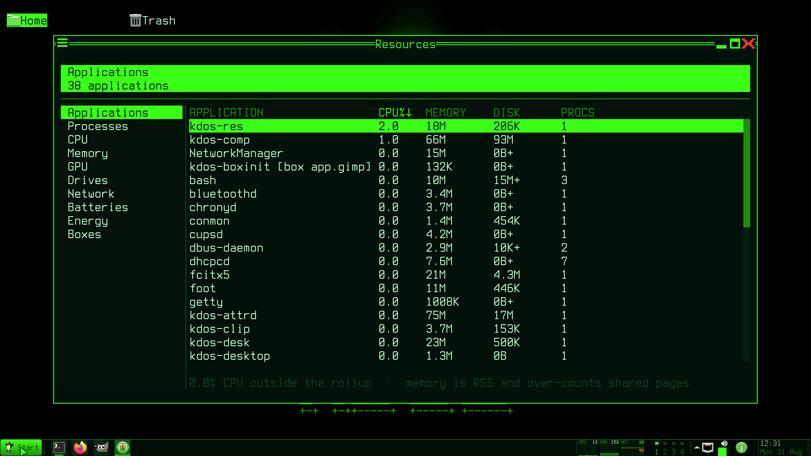
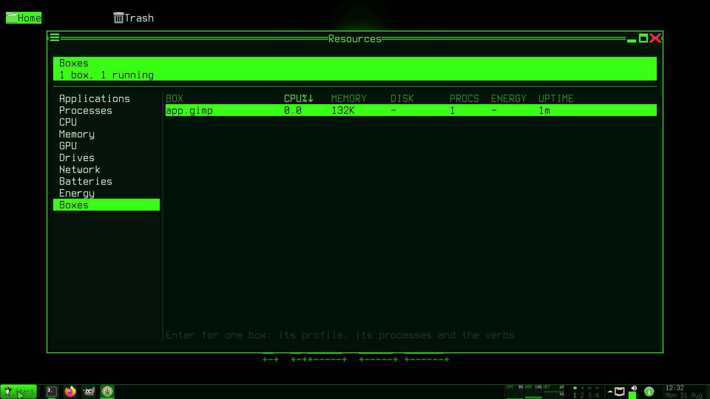

# kdos-res

The resource monitor: ten pages of readings, a detail page with the verbs on it, and a helper for
the two actions that need privilege. It exists **beside** the general-purpose monitors rather than
instead of them, because it can answer one question they cannot.

## What it is for

**Identity.** Every fat application on this system is its own container, so an ordinary process
table shows dozens of rows of internal process names and answers nobody's question. The conmon
walk turns a process id into `firefox-esr (appbox app.firefox-esr)`, and the Applications page is
that rollup.

This is the one desktop where that is cheap, because the boundary already exists and the container
supervisor already knows the name. Everywhere else it would need inventing.




## One renderer, three faces

The same page, the same layout and the same numbers on a console, in a window, and in a dump —
because there is only a grid of character cells, and the toolkit's backend decides who paints it.
Nothing above that line knows which.

**Which display server it reaches is `libkdisp`'s decision, not this program's.** It registers both
implementations — `kcon_impl` for a console session and `kwl_impl` for the compositor — and calls
`kdisp_init`, so the same binary is a window on the graphical desktop and a window on the console
desktop with no branch of its own. The console is offered first: a program started inside a console
session must not find a Wayland display left over from elsewhere and attach to that instead.

That is why nothing below says "under Wayland" where it means "when decorated": the question a
surface asks is whether its server draws chrome, not which server it is.

**It wears exactly one frame.** Undecorated — on a console, in a dump — it draws a box around the
whole surface with its title on the top edge. Under the compositor the **server-side decoration
is that box**, so the drawn one is suppressed and only its inset is kept. Two boxes nested one
inside the other is the tell that a program drew chrome the compositor had already drawn.

It is the first toplevel window in the tree; everything else on this desktop is a layer surface or
a lock surface. It asks for **104x26 cells**, which is at or above the threshold its own sidebar
degrades below — the generic toplevel default is under it, so a window naming no size would open
permanently in the narrow band with the sidebar collapsed and the footer hint clipped mid-word. It
is a default rather than a demand: the compositor's first configure wins on a screen too small.

## The pages

Ten, registered in one table. The identifiers in that table are the **only** spelling: the page
flag takes them, the configuration's sort keys use them, and the committed reference frames are
named after them.

| Page | Shows |
|---|---|
| `applications` | The rollup by box: one row per application, however many processes it is |
| `processes` | The process table |
| `cpu` | Per-core and aggregate processor time |
| `memory` | Memory and swap |
| `gpu` | Graphics utilisation or engine time — see below |
| `drives` | Block devices, capacity and throughput |
| `network` | Interfaces and their rates |
| `batteries` | Charge, rate and health |
| `energy` | The per-application energy share, asked of the daemon |
| `boxes` | Box, state, processes, CPU, memory, energy share, disk, uptime |




**The Boxes page needs no new subsystem** — the conmon walk already turns a process id into a box
name, and this is a rollup keyed on that. **The energy column is the energy daemon's answer, asked
for rather than recomputed**, and it renders as a dash when that daemon is not running — never a
zero, which is how a monitor reports a sensor that does not exist as a machine that is idle. **A
box that is described and not running is still a row**, for the same reason the box manager reads
the profiles as well as the container engine.

**The help output reads its page list from the registry**, never spelling it again. A hand-written
copy stopped short of the last page for a release: the page existed, the flag worked, and the only
way to find that out was to already know.

**The narrow sidebar carries three characters, not one.** A single initial made two different
pages the same control — worse than a truncation, which at least reads as incomplete. Three is the
shortest prefix keeping all ten distinct.

## The detail page

`Enter` on a process, an application, a drive or an interface opens a full-screen page for that
one subject: identity, its own processor and memory rings started **at the moment it was opened**,
thread count, open descriptors, elapsed time.

The rings start at open deliberately. A ring per process would be hundreds of them, and one
back-filled with zeroes would be inventing the past.

**The verbs live here and nowhere else.** End, Kill and Nice are on this page. A key that ended a
process from a *table* would be a key pressed while the cursor happens to be on a row, with
nothing on the screen saying which row that is.

## Acting on a process

`kdos-resctl` is the setuid helper, and its entire security argument is that there is nothing to
aim: three verbs, no paths, no options.

```
kdos-resctl dmi
kdos-resctl signal <pid> <TERM|KILL|STOP|CONT>
kdos-resctl renice <pid> <-20..19>
```

The details are in [the security model](../03-architecture/security-model.md). Two properties
belong here: it is **never on the sampling path**, because a setuid fork once a second would be an
attack surface with a schedule; and `kdos doctor` checks its setuid bit for the same reason it
checks the password checker's.

**One confirmation dialog, and it names the subject.** The toolkit's own modal belongs to a frame
protocol this program does not drive, so the dialog is this program's. Cancel is preselected — the
destructive button under the caret turns a reflex `Enter` into a kill — and the message says what
will happen:

> End all Firefox — 41 processes in appbox app.firefox-esr. Unsaved work in them is lost.

That count is the whole reason the Applications page's verbs are worth confirming: here, an
application is a container's worth of processes.

**A renice is not confirmed.** It is reversible, and a dialog on every nudge is what teaches people
to click through the one that matters.

**The desktop's own chrome is confirmed, not refused.** The memory daemon protects the compositor,
the panel, the desktop and the notification daemon because it acts on its own; a human aiming at a
wedged panel is entitled to end it, and the supervisor will bring it back — so the dialog names
what will happen rather than declining.

## Reading the numbers honestly

**No number is invented.** Every reader answers "unreadable" where the machine does not publish a
value, and the cell renders a plain `-`. A `0` default is how a monitor reports a missing sensor as
an idle machine.

The GPU page is where that bites hardest: only some drivers publish a utilisation percentage, so
every other driver gets **engine time, labelled as such**, and a driver with no statistics at all
gets **no column** rather than a column of zeroes.

**A counter that went backwards is a gap, never a spike**, and both halves of a mirrored pair skip
it together — one half advancing while the other did not would put received and sent a sample out
of step for the rest of the session.

**A rate is fed from the sampler, never from a page's per-frame preparation.** Preparation runs
once per *frame* and a frame is not an interval; the offscreen dump draws exactly once after two
samples, so a chart fed from preparation is empty in every reference frame and the arithmetic
behind it is never checked.

**Elapsed time may only be computed against system uptime.** A process's start time and the
uptime are both seconds since boot; pairing the start time with the sampler's monotonic stamp — a
different epoch, and under a fixture a different *machine* — underflows and draws the first digits
of an enormous number. A start later than the uptime renders a dash rather than wrapping.

## The charts

**A full-width chart cannot be a sprite tile.** The toolkit encodes a tile's sub-cell coordinate
in a few bits each way, so a tile is bounded to a modest number of cells — which is what the
panel's meters strip is sized around. A page-wide chart here is many times that, so the pixel path
is not merely unused, it is unreachable.

So the charts are drawn as cells: whole rows are the full block, and the top row of each column is
the ramp character for the remainder. The resolution is rows times the ramp's level count, and the
shape survives all three glyph tiers.

Two traps that shipped before this was understood: the toolkit's one-row sparkline handed a
ten-row band draws in the **first** row, on top of the label, leaving nine empty — which on a real
screen reads as a chart that is not working. And a tile guarded by a check for an existing slot can
never be created, because the slot only exists after the commit that guard is preventing.

## Configuration

`~/.config/kdos/res.conf`. Sort keys use the page identifiers from the registry, so there is one
spelling.

## Fixtures and goldens

```sh
kdos-res --fixture testing/fixtures/res --page boxes --dump
```

`--fixture` points every reader at a **recorded** system state instead of the live one — the same
seam the stutter attribution, the memory daemon and the privacy indicator use. It is what makes a
monitor's output deterministic enough to have committed reference frames at all.

Frames are committed for all ten pages plus the detail page, at **three widths**: a narrow one
that forces the sidebar to degrade, the classic terminal width, and a wide one.

**A reference frame that reads the host's filesystem is not a reference frame.** The detail page's
footer explains why a verb is unavailable, which meant stat-ing a helper binary — so the same
fixture rendered on two machines produced two different frames. Under a fixture that question is
not asked: a fixture is a *recorded* machine and the helper is a property of the running one, and
nothing is executed against a fixture anyway.

Rendering the Boxes page for the first time is what found both the elapsed-time underflow and the
sidebar collision described above. That is what the frame harness is for.

## The ways in

| | |
|---|---|
| The panel's meters strip | Left click |
| `Ctrl+Shift+Escape` | |
| The Start menu | |
| `kdos-res` | At a prompt |

## Known limits

The Drives and Network lists **do not scroll** — they are short, and their pointer handling is
select-and-open with no viewport — so the scrollbar and its drag exist on the two long tables only.

## See also

- [The design language](../03-architecture/design-language.md) — the pointer contract this follows
- [The daemons](daemons.md) — the energy daemon this asks, and the memory daemon it complements
- [The security model](../03-architecture/security-model.md) — the setuid helper in full
- [Testing](../05-developer/testing.md) — fixtures and reference frames
- [The kdos command](kdos-command.md) — the other readings, from a prompt
