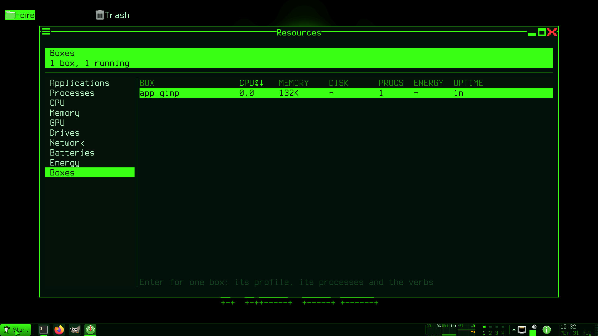

# kdos-res

`kdos-res` is the KDOS resource monitor, the program the desktop calls **Resources**. It shows what
is using the machine on eleven pages (applications, processes, processor, memory, graphics, drives,
network, batteries, energy, sensors and boxes), and it can end, stop or renice a process through a
small setuid helper, `kdos-resctl`. This chapter is for three readers: anyone who uses the monitor
day to day, administrators who want to know exactly what the helper may do, and contributors
changing the program. To use the monitor, press `Ctrl+Shift+Escape` and read [Pages](#pages) and
[Keys](#keys). Administrators want [Acting on a process](#acting-on-a-process). The later sections
explain how readings are taken and drawn, and end with the reference material: configuration,
options, fixtures and files. [The design language](../03-architecture/design-language.md)
describes the keys and the frame every KDOS surface shares, and is worth reading first. The word
*box* is used throughout for the per-application container every boxed program runs in; it is
defined in [Packs and boxes](../03-architecture/packs-and-boxes.md) and in the
[glossary](../06-reference/glossary.md).

## How it runs

`kdos-res` is one program that draws one grid of character cells, and three backends decide where
that grid goes:

| Backend | Used when |
|---|---|
| A window under the compositor | `$WAYLAND_DISPLAY` is set and non-empty, or `--gui` is given |
| Full screen in the terminal it was started from | No Wayland display (over ssh, on `tty2`), or `--tty` is given |
| An offscreen text dump on standard output | `--dump`, used by the test suite |

Every backend calls the same drawing function, so the layout cannot differ between the window, the
terminal and a committed reference frame. Which display server the window reaches is decided by
[libkdisp](../05-developer/c-libraries.md), the display library, not by `kdos-res` itself; the
program links the Wayland implementation and nothing else.

There is only ever one frame round the program. In the terminal and in a dump, `kdos-res` draws a
double-line box round the whole grid with **Resources** on its top edge. In a window the
compositor's title bar and border are that frame, so `kdos-res` draws none, and a window never
shows two nested frames. Below 12 columns or 8 rows no frame is drawn at all.

Inside the frame, top to bottom, are the header band (the page's name, an icon and a one-line
headline reading such as `5 applications` or `11G of 16G`), the sidebar and page body side by side,
and a one-row hint line naming the keys that work at that moment, for example
`F1 help  F10 pages | [/] page | Tab panes | Esc Close`.

In a window, five pages also put their one number at the right of the band, two rows high: the CPU
page its busy share, Memory the share in use, GPU the selected device's busy share (only where the
driver reports one), Batteries the first battery's charge and Sensors the hottest temperature. It
is [display text](../05-developer/writing-desktop-software.md#display-text), drawn on the pixel
layer in the chrome's own face (two rows of the 16×32 cell are the 32-pixel Terminus strike
doubled). The headline already says each of these in words, so the figure is drawn only where the
pixel layer is up, and only when it clears the page name and the headline; on a terminal and in a
dump the band is unchanged. The window hands its page to a flat backdrop (`kch_px_flat(KT_BG)` in
[libkchrome](../05-developer/c-libraries.md#libkchrome)), painted in the same `KT_BG` the cells
were, so everything else in the window looks as it did; the page is then opaque by declaration, and
a scrolled list still moves its pixels rather than repainting them.

The source is `src/desktop/kdos-res/`, and the recipe (`kpkgbuild` and `build.sh`) sits beside it.
The port is built in the [`05_desktop` phase](../05-developer/how-kdos-is-built.md#the-desktop-05_desktop)
and is listed in `script/05_desktop/packages.txt`; the same recipe builds `kdos-resctl`.
`kdos-res` ships beside `btop` rather than replacing it: `btop` is installed in phase 4 and stays
installed; a left click on the two-row bar's meters strip opens `btop`, and on a one-row bar the
CPU applet opens `kdos-res` (see [Opening it](#opening-it)). The ports catalogue lists
[`kdos-res`](../06-reference/ports-catalogue.md#the-resource-monitor) and
[`btop`](../06-reference/ports-catalogue.md#power-user-cli-base) in their groups.

## Opening it

| From | How |
|---|---|
| The panel | On a one-row bar, a left click on the CPU applet. A two-row bar has no CPU applet; a left click on its meters strip opens `btop` in a terminal instead, and a middle or right click opens `kdos stutter` or `kdos-energy` in a `kdos-status` popup |
| The keyboard | `Ctrl+Shift+Escape`, or `Super+Ctrl+T` (both bound in `rc.xml`) |
| The Start menu | **Resources**, or **Boxes**, which opens the Boxes page |
| `kdos-settings` | **Resources…** on the System page |
| A prompt | `kdos-res`, or `kdos-res --page boxes` |

In the Start menu, **Resources** is the application entry `/usr/share/applications/kdos-res.desktop`,
listed under its System category, and **Boxes** is a fixed row of the menu's system group. The routes
`system.monitor` and `system.boxes` in `/etc/kdos/menu.conf` are the names a search in the Start menu
or the palette, and `kdos menu summon`, resolve to `kdos-res` and `kdos-res --page boxes`; editing
them does not change what either row runs.

The window has the title `Resources` and the application id `kdos-res`. It asks the compositor to
float it at 104 by 26 cells: a monitor is looked at and dismissed rather than kept as one pane among
others. The width is at or above the 100 cells where the sidebar shows full page names. It is a
request, and on a screen too small for it the compositor's size wins.

## How it names applications

Every boxed application on KDOS runs in a container of its own, so an ordinary process list shows
rows of internal process names and no row for the application a person launched. `kdos-res` finds
each process's box by walking up its parent chain to the container monitor, `conmon`, whose
arguments carry the box's name (`-n <name>`). The walk is done by `libkproc`, the same library
`kdos-energyd`, `kdos-oomd` and `kdos stutter` use, so all four agree on which box a process is in.
The walk stops at `conmon`: a process whose chain reaches init without passing a `conmon` belongs to
no box.

The Processes page shows that name in a **BOX** column, the detail page shows it on an `appbox`
line, the Applications page rolls a whole box up into one row, and the Boxes page rolls it up per
box, with the box's profile (base and persistence) on its facts page. Identity comes from the
process tree, not from the compositor's list of windows, because the terminal backend has no
compositor and must name applications the same way the window does.


## Pages

Eleven pages, in sidebar order. The identifier is the one spelling of a page: `--page` takes it and
the committed reference frames are named after it.

| Page | Identifier | Shows |
|---|---|---|
| Applications | `applications` | One row per application, however many processes it has |
| Processes | `processes` | The process table, sortable and filterable |
| CPU | `cpu` | Processor utilisation and pressure, the processor's facts, and per-core charts |
| Memory | `memory` | Memory and swap use, memory pressure and a breakdown |
| GPU | `gpu` | Each graphics device, with utilisation or engine time |
| Drives | `drives` | Whole disks: size, type, busy time, temperature and model, with a throughput chart |
| Network | `network` | Interfaces: state, link speed, totals and hardware address, with a throughput chart |
| Batteries | `batteries` | Charge, health, cycles and draw for each battery, and the state of each mains supply |
| Energy | `energy` | `kdos-energyd`'s report of each application's share of energy |
| Sensors | `sensors` | Every temperature, fan, voltage and power reading the kernel publishes, grouped by chip |
| Boxes | `boxes` | Each box: processes, CPU, memory, writable size, energy share and uptime |

### Applications

The Applications page rolls processes up into applications: a process in a box is grouped under that
box; a process in no box is grouped by its command name (`comm`), so three `bash` processes are one
`bash` row. Kernel threads and init are not applications. Each row is named after its busiest
member, and a boxed row carries the box after it, as in `firefox-esr [box kdos-apps]`, so a
browser's many helper processes do not rename the row as they come and go. The `conmon` process is
outside its box and appears as a row of its own.

| Column | Meaning |
|---|---|
| **APPLICATION** | The row's name, with `[box NAME]` for a boxed application |
| **CPU%** | The members' processor use added up, as a percentage of one core |
| **MEMORY** | The members' resident memory (RSS) added up |
| **DISK** | Bytes read plus bytes written since each member started. A `+` means at least one member's counters were unreadable, so the sum is a lower bound. Shown at 60 columns and wider |
| **PROCS** | How many processes are in the row. Shown at 72 columns and wider |

The footer states the processor time spent outside the rollup and that RSS counts a shared page
once for every process that maps it. The table holds at most 128 applications; processes beyond that
count toward the time outside the rollup.

### Processes

The flat process table, with columns **PID**, **USER**, **CPU%**, **MEM**, **DISK**, **BOX** and
**NAME**. On a narrow page the least useful columns go first: **BOX** needs a page body 78 columns
wide and **DISK** 92. **DISK** is bytes read plus written since the process started; a process whose
counters the caller may not read shows `-`. **CPU%** reads `CPU%m` when the configuration asks for a
percentage of the whole machine.

Kernel threads are hidden by default and counted: the footer reads, for example,
`2 hidden kernel threads  .  sort: cpu`. The selection follows the process ID, not the row, so a
table re-sorted by processor use every second does not move the cursor onto somebody else's process.

`/` starts a filter, which matches the process name, the command line, the box or the user name as
a case-insensitive substring. The headline then reads `N shown, filtered by TEXT`.

### CPU

A utilisation chart for the whole machine, and under it the processor pressure from
`/proc/pressure/cpu`: the share of the last 10 and 60 seconds in which at least one task was waiting
for a processor. Busy and starved are different questions, and a machine can be either without the
other. A kernel with pressure stall information turned off gets `pressure  -  this kernel has PSI
off`.

Below that are the processor's facts: its model; the number of logical processors running, cores
and packages, counted from `topology/` rather than from `cpuinfo` blocks; the highest current
frequency of any running processor against the maximum; the processor temperature; the frequency
governor; and whether the machine is bare metal or which hypervisor it runs under.

Under **per core**, a machine with up to sixteen logical processors gets a small chart for each, in
four columns (two below 60 columns). A machine with more gets a heat strip with one column per
processor. An offline processor keeps its position and is drawn as a dim label with no chart, so
each chart's number matches the kernel's CPU number.

### Memory

A chart of memory in use and one of swap in use, each with a reading such as `11G of 16G`. Memory in
use is total minus `MemAvailable`, never total minus `MemFree`: Linux spends spare memory on cache,
and the second figure would report a healthy machine as full. A machine with no swap reads
`swap  none configured`. Under the charts is memory pressure (`some` and `full` over 10 seconds)
from `/proc/pressure/memory`, and a **breakdown** of available, free, cached, buffers, shared, dirty
and reclaimable memory, as far as the page has rows for them.

The last line reads `memory device details need kdos-resctl`. No page shows the per-slot memory
modules; see [Limitations](#limitations).

### GPU

One group per DRM device (a graphics device of the kernel's Direct Rendering Manager) under
`/sys/class/drm`; render nodes are skipped. A driver that publishes a utilisation percentage
(`amdgpu` does, through `gpu_busy_percent`) gets a `utilisation` line. Any other driver gets an
`engine time` line: the milliseconds of engine work in the last sampling interval, taken from the
DRM file descriptors of every process and summed. It is labelled `ms/s`, which is exact at the
default one-second interval; at any other interval the figure is per interval, not per second. The
line carries the note that the driver publishes no utilisation. Engine time is not converted into a
percentage, because an engine can be busy while the device as a whole is idle. Where the driver
publishes them, the page adds used and total memory, the clock, and the temperature and power.

For the proprietary NVIDIA driver, the page loads `libnvidia-ml.so.1` at run time if it is present
and reads what the kernel driver does not publish. KDOS does not ship that library, and without it
the page's last line reads `NVIDIA management library not present`. A machine with no DRM device
gets `No DRM device under /sys/class/drm.`

### Drives

Whole disks only; partitions are not listed. Loop, `ram`, `zram` and device-mapper devices are
virtual and hidden unless `virtual_drives = yes`, and the footer counts how many are hidden. The
columns are **DEVICE**, **SIZE**, **TYPE** (`SSD`, `HDD` or `-`), **BUSY**, **TEMP** and **MODEL**
(at 48 columns and wider).

**BUSY** is the share of the last interval in which the device's queue had work, from `io_ticks`
in `/proc/diskstats`. A disk at 100% busy with an unremarkable byte rate is a queue that is the
machine's bottleneck, and no other column says so. **TEMP** needs a driver that publishes one; for
SATA disks that is `drivetemp`, loaded by `/etc/modules-load.d/kdos-hwmon.conf`.

When the page has room, its bottom third is a chart of the selected disk's read and write rates.
Rates are computed in 512-byte units, which is the unit `diskstats` counts in, whatever the drive's
own sector size is. `Enter` opens a facts page with the size, media type, model, temperature and the
totals read and written.

### Network

Interfaces from `/sys/class/net`, with columns **INTERFACE**, **STATE**, **SPEED**, **RX**, **TX**
and **ADDRESS** (the hardware address, at 70 columns and wider). **RX** and **TX** are totals since
boot. **STATE** is the interface's administrative up or down flag, not its carrier. A link speed the
driver does not publish (every wireless driver, and any link that is down) shows `-` rather than
`0 Mb`. The loopback interface and any interface with no backing device (bridges, container
interfaces, tunnels) are virtual and hidden unless `virtual_net = yes`.

As on Drives, the bottom third charts the selected interface's receive and send rates. `Enter` opens
a facts page with the state and carrier, speed, MTU and driver, hardware address, and the packet,
error and drop counts in each direction. Wireless networks, connection profiles and VPNs belong to
NetworkManager, which `kdos-res` does not talk to; `n` opens [`kdos-net`](kdos-shell.md#kdos-net)
for them.

### Batteries

For each battery: the charge as a percentage with its state and energy in watt-hours; the health,
which is the full-charge energy as a share of the design energy (a measure of wear, and a different
fact from the charge); the cycle count; the present draw in watts; and the technology. The charge is
always shown; cycles, draw and technology are left out where the driver publishes none, and health
reads `-` with a note. After the batteries, each mains supply is listed as `connected` or `not
connected`. A machine with no battery gets `This machine has no battery.`

### Energy

The report of [`kdos-energyd`](daemons.md#kdos-energyd), printed as the daemon wrote it: each
application's share of the energy that could be attributed, with the daemon's own caveats. The
page asks the daemon's socket (`/run/kdos-energyd.sock`, or `$KDOS_ENERGYD_SOCKET` where set) with a
`report` request the first time the page is drawn, and again on `g` (see
[Limitations](#limitations)). It does not reformat the numbers, so it cannot restate them more
loosely than the daemon does, and it needs no JSON parser.

The daemon reads RAPL (Running Average Power Limit), the processor's energy counters, which the
kernel publishes under `/sys/class/powercap`; most virtual machines have none, and there the daemon
does not start. When the socket does not answer, the page says why: that the machine exposes no RAPL
energy domain when `/sys/class/powercap` does not exist, and that `kdos-energyd` is not running
otherwise. The RAPL counters are readable only by root, so the daemon's answer is the only one this
page can give.

### Sensors

Every reading from `hwmon` (the kernel's hardware-monitoring interface, under `/sys/class/hwmon`)
and the thermal zones, grouped under the chip that publishes it and named with the kernel's own
labels (for example `k10temp Tctl`), because a channel name such as `temp1` is unique only within
one chip. `kdos-res` does not use `libsensors`, so its names match what other
tools on the machine print from the same files.

Temperatures, fan speeds (rpm), voltages and power readings are shown as numbers. A temperature
whose chip publishes a critical point also gets a bar scaled to that point (on pages wider than 56
columns), drawn in the warning colour from 90% of it and the error colour at or above it; no other
threshold is invented. The headline names the hottest temperature, the number of temperature
readings and the number of fans. Board sensors on common desktop boards need the `nct6775` or
`it87` driver, which `/etc/modules-load.d/kdos-hwmon.conf` loads.

### Boxes



A rollup keyed on the box, over the same lookup the process table uses. The columns are **BOX**,
**CPU%**, **MEMORY**, **DISK**, **PROCS**, **ENERGY** and **UPTIME**; the last four appear from 47,
54, 62 and 71 columns respectively.

- **DISK** is the size of what the box has written: the writable layer of its overlay, under
  `~/.local/share/kdos/boxes/<name>`, walked to a depth of twelve. The shared packs underneath are
  not counted, because counting a shared base once per box would report it several times over.
- **ENERGY** is `kdos-energyd`'s share for the box, asked of the daemon rather than recomputed and
  cached for ten seconds, which is the daemon's own sampling period. It shows `-` when the daemon is
  not running, never `0`, which would report a missing reading as an idle box.
- **UPTIME** is the age of the box's oldest process, measured against the system uptime.

A box with a profile in `~/.config/kdos/boxes/<name>.conf` that is not running is still listed,
marked `(stopped)`, with `-` for its processor and memory. The headline counts boxes and how many are
running. `Enter` opens a facts page with the box's base, persistence, state, process count, memory,
writable size, energy share where known, and uptime.

### The sidebar and its three widths

The sidebar is drawn from the same page table as `--page` and the usage text, and it has three
widths, measured in cells:

| Window width | Sidebar |
|---|---|
| 100 cells or more | 18 cells, full page names |
| 60 to 99 cells | 6 cells, three-character prefixes (`App`, `Pro`, `CPU`, ...) |
| Under 60 cells | None; `F10` and `[` / `]` are the ways between pages |

The narrow form uses three characters rather than one initial, because a single letter would make
Batteries and Boxes the same control.

## Keys

`kdos-res` answers the keys every KDOS surface answers, described in
[the design language](../03-architecture/design-language.md#the-keys-every-surface-answers).

| Key | Does |
|---|---|
| `F1` | Opens this program's help page, `/usr/share/kdos/doc/res.txt`, in `kdos-doc` |
| `F10` | The page list, as a dialog over the page. `↑`/`↓` move through it, and `F10` or `Enter` closes it |
| `[`, `]` | Previous and next page, wrapping round |
| `Tab` | Moves focus between the sidebar and the page |
| `↑`, `↓` | The sidebar's pages or the page's rows, depending on focus |
| `Enter` | Opens the detail page for the selected row |
| `Esc` | Unwinds one level. See below |
| `q` | Leaves the program, from anywhere except a confirmation or the `F10` list |

Page keys:

| Page | Key | Does |
|---|---|---|
| Applications | `s` | Next sort column |
| Applications | `r` | Reverse the sort |
| Applications | `e` | End the selected application (every process in it), after a confirmation |
| Applications | `k` | Kill the selected application, after a confirmation |
| Processes | `s`, `r` | Next sort column; reverse the sort |
| Processes | `/` | Filter. Type, `Backspace` to erase, `Enter` to keep the filter, `Esc` to clear it while you are still typing |
| Boxes | `s`, `S` | Next sort column; reverse the sort |
| Drives, Network | `↑`, `↓` | Select a row |
| Drives, Network | `Enter` | Open the facts page for the selected drive or interface |
| Network | `n` | Open the network settings (`kdos-net`) |
| CPU, Memory | `←` | Read the utilisation or RAM chart one sample at a time: the first press marks the newest sample, each further press the one before. See [The charts](#the-charts) |
| CPU, Memory | `→` | Step the marked sample forward; past the newest, stop reading |
| Energy | `↑`, `↓` | Scroll |
| Energy | `g` | Ask `kdos-energyd` again |
| Detail | `←`, `→`, `Tab` | Move between the buttons |
| Detail | `↑`, `↓` | Scroll the facts of a drive, interface or box |
| Detail | `Enter` | Press the focused button |
| A confirmation | `←`, `→`, `Tab` | Move between the two buttons |
| A confirmation | `y`, or `Enter` on the action button | Confirm |
| A confirmation | `n`, `q`, `Esc`, or `Enter` on **Cancel** | Cancel |

The sort columns are: on Applications and Boxes, name, CPU, memory, disk and process count; on
Processes, CPU, memory, PID, name and disk. The sorted column is drawn in the accent colour with an
arrow for its direction, and the footer of the Processes page names it.

`Esc` takes exactly one step per press:

| What is up | What `Esc` does | What the hint line reads |
|---|---|---|
| A confirmation | Cancels it | `Esc Cancel` |
| A detail page | Back to the list it came from | `Esc Back` |
| The `F10` page list | Back to the page under it | `Esc Pages` |
| A chart read one sample at a time (`←`) | Stops reading it; the chart's reading is the value now again | `Esc Live` |
| Nothing | Leaves the program, unless the page uses `Esc` itself (see below) | `Esc Close` |

The one page that uses `Esc` itself is Processes, and only while a filter is being typed: there
`Esc` clears the filter and stays on the page. A filter kept with `Enter` is not cleared this way;
see [Limitations](#limitations).

While a confirmation is up it owns the keyboard, and neither `Esc` nor `q` leaves the program: a
question is waiting on its answer.

### The pointer

On the Applications, Processes, Boxes and Drives tables, moving over a row highlights it, a click
selects it, and a click on the row that is already selected opens its detail page. A click on a
column heading of the Applications, Processes or Boxes table sorts by that column, and a second
click reverses it. The wheel scrolls those three tables while the list is longer than
the window and moves the selection while it fits; on Drives and Network it moves the selection. The
Applications, Processes and Boxes tables have a scrollbar that can be dragged, and in a window a
scroll of those three glides to its new rows instead of jumping (see
[Motion](../03-architecture/design-language.md#motion)). On the CPU and Memory pages the pointer
resting on a chart reads the sample under it, as `←` does from the keyboard (see
[The charts](#the-charts)). A click in the sidebar
changes page, and on the detail page a click presses a button.

## The detail page

`Enter` on a process, an application, a box, a drive or a network interface opens a page for that
one subject. It takes the whole frame, sidebar included: it is about one subject, so a page list
beside it would be offering to leave without saying so. The header band names the subject; for a
process the headline reads, for example, `pid 950  kdos  appbox kdos-apps`.

For a process the page lists, under **identity**, the PID, parent PID and thread count; the user,
state and nice value; the elapsed time since it started and the number of open file descriptors; its
box, executable and command line where readable. Under **resources** come its resident memory and
swap, and the bytes it has read and written. Below those, under **since this page was opened**, are
a processor chart and a memory chart. An application's page names its box and shows the same two
charts, summed over the application's processes by the same grouping rule the Applications page
uses. A box, drive or interface page lists that subject's facts as described under [Pages](#pages).

The charts start when the page opens. Keeping history for every process would mean hundreds of
histories, most never looked at, and filling a chart with zeroes would invent a past the program did
not watch. If the process exits while its page is open, the page says `this process has exited`
rather than closing.

The bottom row carries five buttons: **End**, **Kill**, **Nice -**, **Nice +** and **Close**. The
first four work only on a process's page; on every other kind of detail page they are disabled, and
the Applications page's `e` and `k` act on the whole application instead. These buttons are the
only per-process actions in the program: a key that ended a process straight from a table would act
on whatever row the cursor happened to be on, with nothing on the screen saying which. On a
process's page, a button that cannot work is shown disabled with the reason on the same row, one
of:

- `pid 1 is not a task-manager target`
- `kdos-resctl is not installed`
- `kdos-resctl has lost its setuid bit`

Otherwise, including on every page that is not a process's, that space reads
`Esc  back to the list`. `q` on a detail page leaves the program.

## Acting on a process

**End** sends `SIGTERM`, **Kill** sends `SIGKILL`, and **Nice -** and **Nice +** lower or raise the
process's nice value by one, within -20 to 19.

On a process the caller owns, `kdos-res` tries the operation itself first: a signal with `kill(2)`,
and a renice to a value of 0 or more with `setpriority(2)`. Anything else goes through
`kdos-resctl`, the setuid helper: a process owned by another user, a signal or renice the kernel
refused with `EPERM` (or `EACCES`, for a renice) on the caller's own process, and any renice to a
negative value, which is privileged even on the caller's own process. The helper is executed through
an argument vector, never through a shell.

Its security argument is that there is nothing to aim: three commands, no paths and no options.
`dmi` reads the SMBIOS table, the firmware's inventory of the machine's hardware.

```text
kdos-resctl dmi                                   the SMBIOS table; its path is compiled in
kdos-resctl signal <pid> <TERM|KILL|STOP|CONT>
kdos-resctl renice <pid> <-20..19>
```

| Exit status | Meaning |
|---|---|
| 0 | Done |
| 1 | Refused: the caller is not authorised, the PID is 1 or lower, the nice value is out of range, or (for `dmi`) privilege could not be dropped or the SMBIOS table is empty |
| 2 | Usage error: no arguments, or any other argument vector from an authorised caller (an unauthorised caller gets 1) |
| 3 | The operation itself failed |

The caller must be in the `wheel` group (the administrators' group), judged by real user ID; root
always passes. It is the same gate as `kdos-powerd` and `kdos-energyd`. The group is fixed when the
helper is built and cannot be changed by an environment variable. A signal is sent through a process
handle (a pidfd) taken first, so a process ID reused in the meantime is not signalled; on a kernel
without pidfd support the helper falls back to `kill(2)`. `dmi` opens `/sys/firmware/dmi/tables/DMI`
as root, drops root, and then parses the table and prints one line per populated memory slot. The
full argument is in [the security model](../03-architecture/security-model.md#kdos-resctl).

The helper is never on the sampling path, so a setuid program is not started once per interval. It
is built from its own source file and linked against `libkbase` alone, so no font or display code
ever runs with its privilege. `kdos doctor` checks that
`/usr/bin/kdos-resctl` exists and is setuid root, because losing the bit is silent and the only
symptom is a monitor that cannot end anything the user does not own.

### Confirmations

End and Kill are confirmed. The dialog is drawn by this program, **Cancel** is preselected so a
reflex `Enter` does not kill anything, and the message names the subject and what will happen:

> End firefox-esr (pid 950) in appbox kdos-apps? Unsaved work in it is lost.

The Applications page's `e` and `k` act on every process of a whole application, and the count is
what makes them worth confirming, since an application here is a container's worth of processes. A
boxed application is named by its box:

> End all kdos-apps — 41 processes in appbox kdos-apps. Unsaved work in them is lost.

A group action skips any member whose buttons would be disabled on its own detail page.

A renice is not confirmed. It is reversible, and a dialog on every nudge teaches people to click
through the one that matters.

The desktop's own processes are confirmed like anything else rather than refused. `kdos-oomd`
protects the compositor, the panel and the other session processes because it acts on its own
initiative; a person ending a wedged panel is entitled to, and the compositor, which
[supervises the panel](../03-architecture/session.md#supervised-chrome), restarts it.

## Missing and discontinuous readings

No number is invented. Where the machine publishes no value, or the caller may not read it, the cell
shows `-`. A default of `0` is how a monitor reports a missing sensor as an idle machine, and a
column of confident zeroes is worse than an empty one, because somebody will act on it. The dash is
an ASCII hyphen rather than an em dash, because the console font and the reference frames use the
ASCII glyph tier.

Four further rules shape what you see:

- **A counter that went backwards is a gap, never a spike.** A 32-bit counter that wraps would
  otherwise produce an enormous rate. Both halves of a paired reading (read and written, or received
  and sent) skip that sample together, so they stay in step.
- **Rates come from the sampler, not from drawing.** A frame is not an interval, and the dump draws
  once after two samples, so a rate computed while drawing would be empty in every reference frame.
- **A page coming back into view reports no rate on its first tick.** The previous per-process
  sample may have been taken minutes earlier on another page, and a rate over that gap would be
  wrong; the second tick reports a correct one.
- **Ages are measured in seconds since boot on both sides.** A box's uptime is the system uptime
  minus the start time of its oldest process, and a start later than the uptime shows `-` rather
  than an underflowed number. A process's elapsed time on the detail page needs the boot time from
  `/proc/stat` and shows `-` without it.

## Sampling

The loop samples once per interval (1000 ms by default) and redraws on every event in between.
Keystrokes, pointer movement and resizes all wake the loop, so a loop that always waited a full
interval after each wake-up would sample unevenly and draw an uneven chart. It waits only for
whatever remains until the next sample.

Every sample reads the processor times, memory and the three pressure files. What else it reads is
decided by the page on screen, so the monitor does not become part of the load it measures:

| Page on screen | Per-process files read |
|---|---|
| Applications, Processes | Status, I/O counters, command line and box |
| GPU | Status, DRM file descriptors and box |
| Boxes | Status and box |
| Any other | None; the drive and interface counters are read only on their own pages |

An open detail page adds what it needs to whatever the page under it reads. Batteries, Sensors and
GPU read their devices each time they are drawn.

## The charts

A chart is drawn in one of two tiers, and both show the same stretch of history: one sample per
character column, the newest at the right, and a chart that is still filling grows from the right
edge rather than sliding its history sideways. Gridlines mark every ten seconds and move left with
the samples, so a flat chart still shows that the program is running. A sample too small to see is
drawn at the smallest height the tier has, so a trickle is not mistaken for silence.

- **Pixels, in a window.** Where the display has a pixel cell, a chart is an antialiased area
  chart drawn as a [pixel tile](../05-developer/writing-desktop-software.md#pixel-tiles) over its
  cells: a faint plate, a base line, the area at a third of the colour's weight and the trace at
  full weight over it, a line and a half wide. It is the same renderer as the
  [panel's meters](kdos-shell.md) (`kch_plot()` in `libkchrome`), so a chart looks the same on the
  bar and here. The vertical resolution is the chart's height in pixels, and a pair of series is
  mirrored about a midline.
- **Cells, everywhere else.** On a terminal, in `--dump` and in every golden frame, and whenever a
  tile is not up (no pixel cell, `icons = no`, no icon artwork, a full sprite table), a chart is
  drawn as character cells. Whole rows are the full block, and the top row of each column is the
  block-ramp character for the remainder, so the resolution is the chart's height times the ramp's
  levels (eight levels a row in a full font, fewer on the console font) and the shape survives all
  three glyph tiers of the [design language](../03-architecture/design-language.md). A pair is two
  bands stacked in a fixed order, because the ramp has no downward-growing twin.

**One sample, read off the chart.** On the CPU and Memory pages (the utilisation chart, the per-core
charts, and the RAM and swap charts), the pointer resting on a chart marks the sample under it, and
the chart's reading, top right, becomes that sample's age and value in the accent colour, as a
percentage on all four kinds (the RAM chart's usual `11G of 16G` included): `12s ago 34%`, or
`now 50%` for the newest. `←` does the same from the keyboard on the page's first chart
(utilisation, or RAM): the first press marks the newest sample, each further press the one before,
`→` steps forward and, past the newest, stops, and so does `Esc`. The marked sample is an absolute
sample, so it moves left with its column as new samples arrive, and the reading stops when it
scrolls out of the chart or its page is left. The pointer wins over the keyboard while it rests on
the chart. The value is the sample as recorded, not the smoothed height the chart draws. In pixels
the sample is marked by a line through the chart in `KT_MID`; in cells, its column is drawn
reversed. The reading is text in both tiers, so a terminal and a dump show it; a text dump carries
no attributes, so a golden of it shows the reading and not the marked column.

A chart moves one column per sample and holds still between samples. Scrolling it smoothly between
two samples would re-rasterise it every display frame instead of once a sample: measured on a loaded
host, one raster of a 1120×320 chart takes 0.7–1.1 ms and of a 2240×640 one (4K at scale 2)
2.8–4.5 ms, which at 60 frames a second is 45–70 ms and 170–270 ms of processor time a second for one
chart, before the frame is painted and committed.

Each history holds the last 256 samples. Percentage charts are pinned to 0–100; a memory chart on
the detail page scales to its own peak. The Drives and Network charts put two series on one shared
scale: read or received in the accent colour above, written or sent in the warning colour below.
Scaling the two separately would draw a quiet direction as tall as a busy one.

A chart's tile holds two canvases the size of the chart, which on a page-wide chart is megabytes:
by estimate, not measurement, about 20 MB for the CPU chart at scale 2 on a 4K output. A
chart that is not drawn in a frame, because its page is not on screen, gives its tile back once
that frame is presented and is drawn again from its history when the page returns. The tile's
content hash covers every sample it draws and the sample number, so it is rasterised once a sample
and not once a frame. A theme change drops every tile and retints the header's page icon, since each was drawn in the
old palette. A change of output scale rebuilds the page icon for the new cell and scale through
`kdisp_on_scale()`, and each tile is cut again the next time it is drawn. On a fractional scale the
scale stays 1 and the cell grows to the font's at the device size, so the charts are drawn in device
pixels.

### Adding a chart

Keep a `KprHist` (the 256-sample history type of `libkproc`) and push to it from the sampler on
every tick: `res_sample()` in `sample.c`, or `res_dev_sample()` in `p_dev.c` for a per-device
series. Never push from a page's `prepare()`, for the reason given under
[Missing and discontinuous readings](#missing-and-discontinuous-readings). Draw it with
`res_graph()`, or with `res_graph2()` for a read/write or receive/send pair on one scale. Both draw
the pixel tier where it is up and the cell tier otherwise, so there is nothing else to write. A
`res_graph()` handed a formatter (`res_fmt_pct` for a percentage) answers the pointer and a scrub
with that formatter's reading of one sample; handed NULL it answers neither. A page that wants the
keyboard scrub passes `←` and `→` to `res_graph_scrub()` with its chart's id from its key handler,
as `res_cpu_key()` and `res_mem_key()` do.

The first argument is the chart's id, and it names the chart's tile: it must be stable for that
chart and unique among the charts the program draws, and the program holds at most 24 tiles
(`TILE_MAX`). The ids in use are 1 to 3 (CPU and Memory), 100 to 115 (the per-core grid, which
stops at 16 cores), and 900, 901, 910 and 911 (the detail page, Drives and Network). Two limits
follow from the sweep. An outgoing page holds its tiles through the incoming page's first frame, so
any two pages together must fit in 24 tiles, or some of the new page's charts draw as cells for one
frame. And `graph.c` records at most 32 ids (`GRAPH_TILES`); an id past that is never swept and
keeps its canvases until the next theme change.

The toolkit's `ktui_sparkline()` draws one row, the first of whatever band it is given, so the cell
tier of a chart taller than one row is drawn by `kdos-res` itself, in `graph.c`.

## Configuration

`~/.config/kdos/res.conf`, or `$XDG_CONFIG_HOME/kdos/res.conf` where that is set. It is plain
`key = value` lines with `#` comments, the same shape as `panel.conf`. A missing file means the
defaults. An unknown key is reported by name on standard error rather than ignored. `kdos-settings`
edits every key on its Hardware page and signals the monitor, so a change there applies at once,
except `sort`, which each table reads the first time it is drawn and which takes effect at the next
start.

| Key | Values | Default | Does |
|---|---|---|---|
| `interval` | milliseconds | `1000` | Sampling period, clamped to 200–60000 |
| `units` | `1024`, `1000` | `1024` | `1024` gives binary sizes (`K`, `M`, `G`); `1000` gives `kB`, `MB`, `GB` |
| `temperature` | `c`, `f` | `c` | Temperature scale, everywhere a temperature is shown |
| `cpu_percent` | `core`, `machine` | `core` | Whether a Processes or detail-page percentage is of one core (eight busy threads read 800%) or of the running processors of the whole machine. The Applications and Boxes pages always use one core |
| `memory` | `rss`, `pss` | `rss` | Read and stored; no page consults it, and every memory figure is RSS (resident set size). PSS, proportional set size, would divide a shared page among the processes that map it |
| `kernel_threads` | boolean | `no` | Show kernel threads in the process table |
| `virtual_drives` | boolean | `no` | Show loop, `ram`, `zram` and device-mapper devices on Drives |
| `virtual_net` | boolean | `no` | Show loopback and interfaces with no backing device on Network |
| `icons` | boolean | `yes` | Draw the page's icon in the header band and the charts as pixels; `no` keeps the whole window character cells |
| `sort` | a column name | `cpu` | Initial sort column. Processes: `cpu`, `memory`, `pid`, `name`, `disk`. Applications and Boxes: `name`, `cpu`, `memory`, `disk`, `procs`. A name a page does not have leaves that page on its own default |
| `columns` | column list | empty | Read and stored; no page consults it |

`yes`, `1`, `true` and `on` are true for a boolean; anything else is false.

A short interval is floored rather than trusted: a monitor sampling every 10 ms becomes the load it
is measuring.

Example:

```ini
# ~/.config/kdos/res.conf
interval    = 2000
temperature = f
sort        = memory
```

`SIGHUP` re-reads this file and the accent; it is the signal `kdos theme` and `kdos-settings` send.
The handler only sets a flag, and the loop picks it up within one interval. A reload applies the
keys present in the file; a key removed from it keeps its current value until the program is
restarted, and an `interval` in the file replaces one given with `--interval`. To apply a hand edit,
signal the program by its exact name, because a pattern would also match the setuid helper, which
handles no signals and would be killed:

```sh
pkill -HUP -x kdos-res
```

The accent is the one word in `~/.cache/kdos/theme` (`$XDG_CACHE_HOME/kdos/theme` where set), naming
one of the colour schemes compiled into the program. See [Theming](../02-user-guide/theming.md).

## Synopsis

```text
kdos-res [--page ID] [--tty | --gui] [--fixture DIR] [--interval MS]
         [--detail PID] [--scrub N] [--font NAME]
         [--dump | --dump-cells] [--dump-size WxH] [--json]
         [--version] [--help]
```

## Options

| Option | Effect |
|---|---|
| `--page ID` | Open on a page. `ID` is one of the identifiers in [Pages](#pages); anything else prints `unknown page`, the usage text and the page list, and exits 2 |
| `--tty` | Draw in the terminal, whatever the environment says. With no terminal it exits 1 |
| `--gui` | Open a window, whatever the environment says. With no display server reachable it prints `no display server reachable — try --tty` and exits 1 |
| `--fixture DIR` | Read a recorded system state instead of the live one. See [Fixtures and reference frames](#fixtures-and-reference-frames) |
| `--interval MS` | Sampling period in milliseconds, overriding the configuration. A value below 200 is raised to 200; zero or a non-number is ignored. A `SIGHUP` re-reads `res.conf`, and an `interval` there then replaces this value |
| `--detail PID` | With `--dump`, draw the detail page for that process. A PID not in the sample draws the page named by `--page` |
| `--scrub N` | With `--dump`, press `←` N times on the page before drawing it, so a chart's sample reading has a golden. See [The charts](#the-charts) |
| `--font NAME` | The font for the window, as a fontconfig name |
| `--dump` | Sample twice, render once offscreen at the dump size and write the cells to standard output |
| `--dump-cells` | The same as `--dump` |
| `--dump-size WxH` | The offscreen grid. Default 80x24. A value that is not `WxH` exits 2 |
| `--json` | With `--dump`, sample and prepare the frame, then exit 0 without writing anything |
| `--version` | Print `kdos-res` and the port version, and exit 0 |
| `--help`, `-h` | Print the usage text and exit 0 |

An unrecognised option exits 2 with a usage line rather than being ignored, so a program that
starts `kdos-res` with a flag it does not have fails visibly. The usage text builds its page list
from the page table, so it always names every page.

## Fixtures and reference frames

```sh
kdos-res --fixture testing/fixtures/res --page boxes --dump
```

A **fixture** is a recorded system state (see the [glossary](../06-reference/glossary.md)).
`--fixture DIR` points every reader at `DIR/proc` and `DIR/sys` instead of the live ones, and uses
`DIR/passwd` for user names when it exists, so the same recording renders the same names on every
host. This is what makes the output deterministic enough to commit reference frames, called
**goldens**.

A dump samples twice before drawing, against the fixture's two snapshots, `DIR/` and `DIR/next/`,
one interval apart. Every rate is a difference between two readings, so sampling one snapshot twice
would draw a machine doing nothing and a golden that could never catch an arithmetic error. Under a
fixture the clock is the fixture's own: the second sample is stamped one configured interval after
the first, whatever the real time between them.

`testing/fixtures/res` is synthetic rather than copied from a real machine, and each of its details
is chosen to catch a specific mistake: a partition beside its disk, a loop device, a network counter
that wraps, a process blocked on disk, a daemon whose I/O counters are unreadable, a boxed browser
under `conmon`, a worn battery, and an `i915` device beside an `amdgpu` one. Its `README` lists each
one and what it catches.

Goldens are committed in `testing/goldens/` for all eleven pages plus the detail page (the fixture's
boxed `firefox-esr`, PID 950), at three sizes: 36 files named `res-<page>-<size>.txt`. A 37th,
`res-cpu-scrub-80x24.txt`, is the CPU page with `--scrub 1`: the utilisation chart's reading of its
newest sample, and the `Esc Live` hint.

| Size | Sidebar |
|---|---|
| 56x24 | None |
| 80x24 | Six cells of three-character prefixes |
| 132x43 | The full eighteen |

`testing/selftest.sh` renders them with `LC_ALL=C`, `TZ=UTC` and configuration and cache directories
that do not exist, so the defaults are what is rendered. Under a fixture, the detail page does not
ask whether `kdos-resctl` is installed: a fixture is a recorded machine, the helper belongs to the
running one, and the answer would make one fixture render differently on two hosts. Nothing is
executed against a fixture.

See [Testing](../05-developer/testing.md#goldens) for how the goldens are regenerated and compared.

## Files

| Path | What |
|---|---|
| `/usr/bin/kdos-res` | The monitor |
| `/usr/bin/kdos-resctl` | The helper, mode 4755, owned by root |
| `/usr/share/applications/kdos-res.desktop` | The **Resources** launcher |
| `/usr/share/kdos/doc/res.txt` | The help page `F1` opens |
| `~/.config/kdos/res.conf` | Configuration |
| `~/.cache/kdos/theme` | The accent, read at start and on `SIGHUP` |
| `~/.config/kdos/boxes/<name>.conf` | Box profiles, read by the Boxes page for stopped boxes, base and persistence |
| `~/.local/share/kdos/boxes/<name>` | Each box's writable layer, measured for the Boxes page's DISK column |
| `/run/kdos-energyd.sock` | The energy daemon's socket, asked by the Energy and Boxes pages |

## Limitations

- On the Network page the pointer does not select or open a row; use `↑`, `↓` and `Enter`.
- The Drives and Network lists have no scrollbar and hold at most sixteen devices each.
- A signal or renice that the kernel or the helper refuses (for example, when the caller is not in
  `wheel`) fails without any message on the screen.
- The sampler records when one sample takes longer than the interval, but no page displays it.
- A changed `sort` is not applied on `SIGHUP`; it takes effect when the program is next started.
- `memory` and `columns` in the configuration are accepted and have no effect.
- Per-slot memory module details are not shown. `kdos-resctl dmi` reads them from the SMBIOS table,
  but no page asks it.
- The Energy page asks the daemon once, the first time the page is drawn; a later visit shows the
  same report until `g` is pressed.
- `Esc` clears a Processes filter only while it is being typed. With a filter kept by `Enter`,
  `Esc` leaves the program with the filter still set; press `/` and then `Esc` to clear it.
- While a Processes filter is being typed, `q`, `[`, `]`, `Tab` and `F10` keep their global
  meaning, so a filter cannot contain those characters and typing `q` leaves the program.

## See also

- [The design language](../03-architecture/design-language.md) — the pointer contract, the keys
  every surface answers and the glyph tiers
- [The daemons](daemons.md) — the energy daemon this asks, and the memory daemon it complements
- [The security model](../03-architecture/security-model.md#kdos-resctl) — the setuid helper in full
- [Packs and boxes](../03-architecture/packs-and-boxes.md) — what a box is and where its layers live
- [Configuration](../06-reference/configuration.md) — `res.conf` beside every other configuration
  file
- [Testing](../05-developer/testing.md) — fixtures and reference frames
- [The kdos command](kdos-command.md) — `kdos doctor`, `kdos stutter` and the same readings from a
  prompt

<!-- book-nav -->
---

*Part IV — Programs, chapter 23.* Previous: [22. kdos-shell](kdos-shell.md) · [Contents](../README.md) · Next: [24. kdos-term](kdos-term.md)
