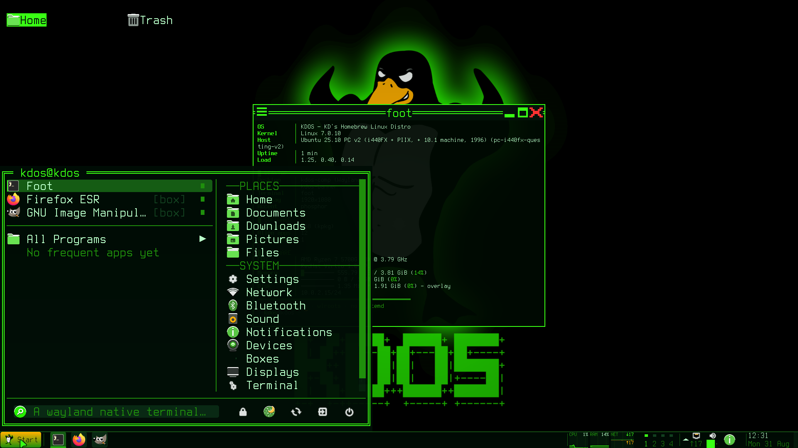
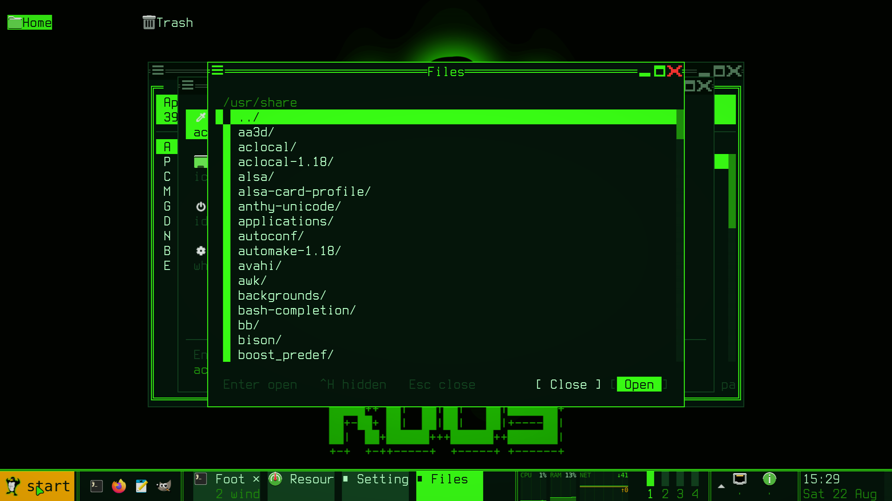
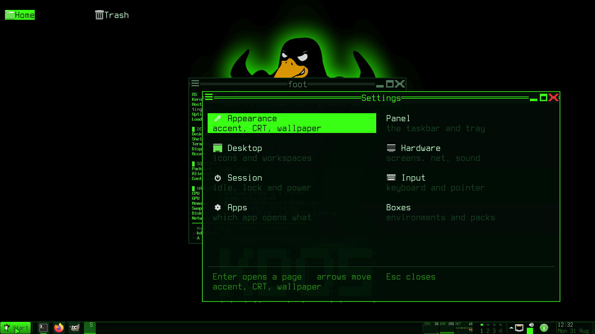
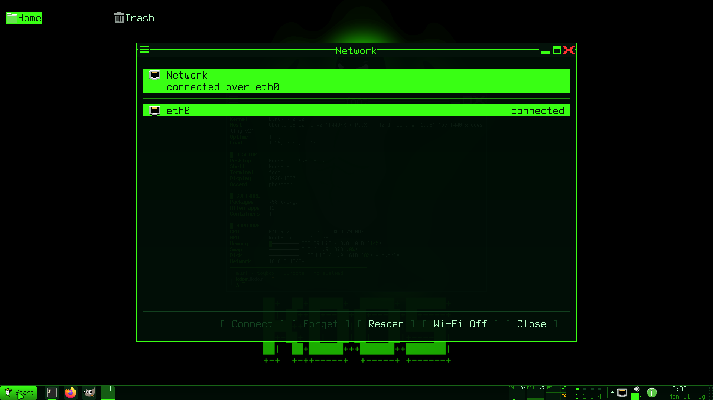

# kdos-shell

One binary providing twenty-nine commands, dispatched on the name it was invoked as: the panel,
and every surface that pops up from it or is reached by a key. This is the largest program in
KDOS and the one most of the desktop actually is.

Everything here follows [the design language](../03-architecture/design-language.md), and the
shared rules live there rather than being restated per surface.

## One binary, many names

The authoritative list is the name table in `main.c`. A name in that table with no matching entry
point is a **link error**, not a missing feature — the table and the implementation are one edit.
A name the build does not create a link for is a program nothing can reach, which is the other
half of the same mistake.

| Name | Is | Section |
|---|---|---|
| `kdos-shell` | The panel | [The panel](#the-panel) |
| `kdos-start` | The Start menu | [kdos-start](#kdos-start) |
| `kdos-launcher` | Full-screen application search | [kdos-launcher](#kdos-launcher) |
| `kdos-menu` | Root, System and window menus | [kdos-menu](#kdos-menu) |
| `kdos-desk` | The desktop and its icons | [kdos-desk](#kdos-desk) |
| `kdos-pick` | The file chooser and browser | [kdos-pick](#kdos-pick) |
| `kdos-notifyd` | The notification daemon | [Notifications](#notifications) |
| `kdos-notify` | The notification centre | [Notifications](#notifications) |
| `kdos-osd` | Volume and brightness | [kdos-osd](#kdos-osd) |
| `kdos-cal` | The calendar | [The small surfaces](#the-small-surfaces) |
| `kdos-settings` | Settings | [kdos-settings](#kdos-settings) |
| `kdos-net` | Networking | [The device managers](#the-device-managers) |
| `kdos-bt` | Bluetooth | [The device managers](#the-device-managers) |
| `kdos-audio` | Audio devices | [The device managers](#the-device-managers) |
| `kdos-devices` | Cameras, microphones, removable media | [The device managers](#the-device-managers) |
| `kdos-clip` | Clipboard history | [The small surfaces](#the-small-surfaces) |
| `kdos-status` | The overflow popup | [The overflow chevron](#the-overflow-chevron) |
| `kdos-tip` | Tooltips | [Tooltips](#tooltips) |
| `kdos-ime` | The input-method candidate window | [The candidate window](#the-candidate-window) |
| `kdos-teams` | The window list | [The small surfaces](#the-small-surfaces) |
| `kdos-display` | Screen configuration | [The small surfaces](#the-small-surfaces) |
| `kdos-keys` | The keybinding card | [The small surfaces](#the-small-surfaces) |
| `kdos-doc` | The documentation viewer | [The small surfaces](#the-small-surfaces) |
| `kdos-openwith` | Choose a handler | [The small surfaces](#the-small-surfaces) |
| `kdos-run` | The run box | [The small surfaces](#the-small-surfaces) |
| `kdos-prompt` | Yes/no, answering by exit status | [The small surfaces](#the-small-surfaces) |
| `kdos-slit` | The dockapp column | [The small surfaces](#the-small-surfaces) |
| `kdos-saver` | Attract mode between idle and lock | [The small surfaces](#the-small-surfaces) |
| `kdos-ascii` | A picture, as characters | [The small surfaces](#the-small-surfaces) |

## The panel

Two rows, on the bottom edge by default. The **second row is not padding**: it carries the
clock's date, a window button's own title under its application name, and the meters strip.

### Layout and degradation

The bar is laid out in **four passes**, and the order is the priority:

| Pass | Gives up |
|---|---|
| 0 | Nothing — the whole bar |
| 1 | The meters strip |
| 2 | Also the Start button's word, leaving its mark |
| 3 | Also the quick-launch row |

**No pass may drop a window button.** Before pass 1 is even reached, the window list degrades on
its own: full labels, then labels squeezed to their floor, then **icon mode** — three cells per
window, the picture centred over both rows with a state marker under it — and only after that an
overflow cell.

Icon mode before overflow is the right trade: a picture that identifies the window is worth more
than a word beside it, and dropping a window from view while the row still has room for a picture
of it is not.

**One floor, not two.** The right-hand wing reserves space against the window list's **icon**
floor, and the acceptance test measures against the same figure. Two statements of the same rule
is how a pass throws away the layout it was measured for.

### The Start button

Three states, one function drawing both the pixel tile and the character fallback — a control
whose two renderings disagree about its own state is worse than either.

- **Quiet at rest.** The accent belongs to hover, and the warning colour to the menu being open.
  At full strength it is the loudest object on screen, on the one control that is never the thing
  being looked at.
- **It carries the word**, because a button that is a picture the same size as the application
  icons beside it does not read as the way in.
- The tile lays out padding, mark, gap, word, padding — where padding and gap are **different**
  numbers — and the content is then **centred** in the tile, because a tile is a whole number of
  cells and the content is not. The rounding slack split between both ends is invisible; pushed to
  one end it is an asymmetry you can see.
- **Where the mark falls back to the literal word, the label is dropped**, since the brand printed
  beside itself says it twice.

### Quick launch

Pinned applications, from `~/.config/kdos/favorites`.

- **Hover is a fill behind the icon**, never a tint of the icon: tinting changes what the
  application looks like.
- **A launch pulses** the fill for about a second, and the panel shortens its own poll only while
  one is running.
- **Dragging reorders**, and the order is written back. The **button** is what is remembered
  across events, because plain and dragged motion are indistinguishable in the protocol; the
  launch therefore happens on **release**, since a launch on press fires before a drag can begin.
  Released off the row it does nothing.

### The window list

| Button | Does |
|---|---|
| Left | Toggles: minimises the window you are in, restores one you are not, opens the member list for a group |
| Middle | Opens a **new instance**, from the pinned entry's command or the window's own desktop entry |
| Right | The **window menu** |

Right opens the menu rather than minimising, because minimising is what left already does and the
right button is the one every other desktop reserves for these verbs. Closing is the menu's, not
the middle button's: middle is the button a hand hits by accident on a wheel, and on a row of
icon-mode squares what it closed would have had no name on it and no confirmation.

**A window button is a button.** An inactive chip is filled, so the row reads as controls rather
than as floating words; hover is a step brighter, and focused brighter still, so hover cannot be
misread as "this is the window you are in".

**The label is the desktop entry's name**, resolved once when the identifier arrives rather than
per frame: name, then title, then the raw identifier. An application identifier is chosen so it
cannot collide, so the reverse-DNS form is not what belongs where a human name goes. The entry is
found by its id first and then by the window-class field, which is what an X11 client under
Xwayland needs.

**The box appears in a label only when it disambiguates** — where the same application runs in two
boxes. A badge on every button on a machine where every application is boxed says nothing.

Applications can put a **count badge or a progress bar** on their button through the launcher-entry
interface, which `unity.c` implements.

### The meters strip

Fifteen cells of live graphs, drawn as a pixel tile on the second row. `meters =` in `panel.conf`
selects them and **the order is the order of importance**, because a narrow bar drops them from
the right.

| Meter | Source |
|---|---|
| `cpu` | Aggregate processor time |
| `ram` | **Available** memory, never total-minus-free — Linux spends every spare page on cache, and that arithmetic reports a healthy machine at 95% |
| `net` | Received and sent, mirrored about a midline on one shared scale |
| `disk` | Filesystem usage, sampled every ten seconds |
| `diskio` | Bytes read and written, **whole disks only** — the kernel lists partitions beside their disk and summing everything counts each byte twice |

Rules that make the charts readable rather than merely present:

- **They sample on their own clock, not on the draw loop.** The loop is woken by events, so
  re-sampling per frame divides by whatever interval happened to pass — and moving the mouse made
  the reading flash between extremes. It is not a rendering fault; the *number* was wrong.
- **The wait is shortened to whatever is left of the interval.** With a flat one-second wait, any
  event returned early, found the deadline not due, and then waited a full second again — so
  samples landed irregularly, and a chart draws one sample per pixel.
- **The interval is half a second**, not because it is more accurate but because a chart is a thing
  in motion. The label is a smoothed average; the chart plots the raw samples, because the point of
  a chart is the spikes.
- **A nice scale with hysteresis.** The axis snaps to a ladder of round numbers and grows as soon
  as a sample does not fit — a clipped chart is a lie — but shrinks only well below the current
  rung, because one threshold in each direction oscillates for a stream sitting on the boundary.
- **A filled area under a line, not a row of bars.** At one sample per pixel, bars are grass.
- **A flat band still shows time passing**: a faint gridline every ten seconds keyed to the
  absolute sample number, so it marches left with the samples. Without it an idle link renders a
  still image.
- **Every series is pushed on every tick**, carrying the last value forward when a reading is
  momentarily unavailable. A series that skips a tick is *shorter* than the one beside it and the
  two creep out of step for the rest of the session. A series with **no** sample at all is left
  empty rather than held at zero.
- **The trace spans the whole band from the first sample**, so the picture moves from the first
  sample onward rather than staying pinned to the right edge until the ring fills.

Clicking opens the resource monitor; middle opens the stutter attribution; right opens the energy
report. All three are real features of this system that nothing else pointed at.

### The status wing

Two rows, and **every applet uses both** — a readout with thirty-two pixels of nothing under it
looks unfinished beside a clock that uses both.

Two shapes, and the split is what each carries: **a number goes under its picture, a name goes
beside it.**

- The **compact** applet is three cells: an icon over a reading. Three, not two, so the icon is
  centred in the tile rather than in its left half — and so that a one-character value is not
  pushed under the icon's left edge.
- The **wide** applet is an icon with a headline and a detail line, for the two readouts carrying
  somebody's name: the media title, and the application holding the microphone.

**An applet tile is a fixed width whatever it says.** The wing is laid out right to left and
everything to its left starts where that walk stopped — so a readout going from three characters
to two would narrow the wing and slide every chart on the panel sideways.

The pager is little screens: one filled cell per workspace in its own state colour with the number
under it, and the second cell of the stride left as background. **Its hover is the width of what
was drawn**, not of the stride, or the highlight lights two cells under a square that is one.

**The window list stops at the wing.** The wing's left edge is whichever of its two rows reaches
further left, and the meters strip is handed the room the window list needs as its floor — so on a
narrow bar the strip degrades rather than the window list overwriting the charts.

### The overflow chevron

Widgets that only *sometimes* have something to say — the stutter chip, the restart mark, the
clipboard depth — appeared and vanished, changing the wing's width by several columns each time
and sliding every chart. So they live behind **one chevron of fixed width, drawn whether or not
anything is in it**. `overflow =` in `panel.conf` names them, using the same names `right =` uses.

The chevron is **two columns and no gap**, like the tray items beside it — a full applet tile would
be four, and four columns is the whole network chart on an eighty-column bar. It carries **no
count**: a digit is one cell wide in a two-cell box and would sit half a cell off. Colour says
whether anything is there and whether it wants attention; the tooltip names the first items; the
popup has the list.

It **returns one column short of its own left edge**, because the widget to its left draws a
separator at that column — returning otherwise puts the rule through the chevron's left cell and
the two-cell picture comes up as its own right half.

### The tray

A full StatusNotifierItem host: KDOS is the watcher and the host, because nothing else here is.
That matters more here than elsewhere, since **a boxed application that minimises to a tray which
does not exist has minimised to nowhere**.

An item is **one cell**: the first letter of its identifier, coloured by its status — dim for
passive, the text colour for active, the accent and reversed for needs-attention. The identifier
rather than the icon name, because a letter from a name a human chose beats a letter from a theme
lookup that will never happen on a character grid.

Left activates, middle secondary-activates, right opens the context menu.

Three rules, each a defect that was already there:

- **Nothing blocks the panel.** Property reads have a short ceiling and use one bulk call rather
  than several — several against a wedged application is over a second of dead panel — and every
  method call to an item is fire-and-forget.
- **Properties are never read from inside a bus callback.** A synchronous call there does not get
  its reply, because the bus library is already processing a message. Registration marks the item
  as needing properties and the next dispatch reads them.
- **The interface spelling is only recorded when the other one answered.** Two spellings are in
  use; flipping on the first failure sent every subsequent click to an interface the application
  did not implement — and a fire-and-forget click reports nothing, so it failed in total silence.

**When something else owns the watcher, the list is adopted** rather than contested — which is
what makes a dump taken beside a running panel show the same items rather than an empty tray.

**An item may resolve to a themed name first**, and exactly one class does: the input-method item
every session has publishes no usable icon name, so the identifier fallback found its own
full-colour artwork sitting between a phosphor network card and a phosphor speaker. Input-method
identifiers map to a keyboard icon before the application-artwork lookup runs. This is not a
licence to restyle other people's marks — it is the narrow case where the item is a *system*
function.

**Known gap: menus published over the menu protocol are not rendered.** An item that expects the
host to draw its menu will do nothing when clicked. Such an item is hidden by default through
`tray_hide =`, listed in the chevron's popup where the row can say what it is, and its tooltip
says why it cannot be clicked. One line of `panel.conf` brings it back.

Because items can be hidden, the drawn order is **recorded** and the click reads that, rather than
deriving an index from the pointer's column.

### The privacy indicator

Which application is using your microphone or camera, by name. Every phone platform answers this
and no other Linux desktop does — not for difficulty, but because it needs four owners and nobody
owns all four. KDOS owns all four.

**Two sources, because there are two ways to record:**

| | Found by | Why not the other way |
|---|---|---|
| Microphone | An audio-server capture stream, counted **only while running** | The process list says the audio server holds the device, which is the non-answer every other desktop gives |
| Camera | A process holding a descriptor on a video device | Almost nothing takes the camera through the portal, so the audio server would report nothing at all |

**A stream that exists is not a stream that is recording.** An application that opened the
microphone and went idle must not light the lamp. The camera is counted the other way round on
purpose: an open descriptor on a camera *is* use, there being no other reason to hold one.

The name is the application's own, then its node name, then the process name. One application is
named and the rest are counted, because the panel is one row and three truncated names say less
than one name and a number.

Drawn in the secondary colour, with the camera additionally reversed — the one thing on the panel
that is a warning rather than a fact.

**The tooltip names the box; the bar does not.** On a machine where every fat application is a
container, "firefox is recording" leaves out the half that says *which* firefox — and there can
legitimately be two.

**The microphone lamp is a control.** Clicking mutes. An indicator that names the application
recording you and cannot stop it is one people learn to ignore.

### The stutter chip

The compositor reports every late frame on a socket. The panel holds it open, counts the drops of
the last ten seconds, and shows a cell when there have been at least three; clicking opens the
attribution.

**The cell goes away when the desktop stops missing frames**, which is the honest shape — an
indicator that is always up says nothing.

The read is non-blocking with a reconnect no oftener than every ten seconds, because the frame loop
is what this must never slow. There is no structured-data parser in this binary: the count field is
scanned for literally, and the line it scans is written three files away in the same repository.

### Tooltips

Half the panel is pictures with no words. Hovering one thing for about three quarters of a second
raises `kdos-tip`, which says what it is and what its three buttons do.

It is **a separate process**, because the toolkit has one cell buffer per process — the rule every
popup here keeps. It takes **no input at all**, or it would eat the click aimed at the thing it
describes. The panel shortens its own poll to the dwell deadline, exactly as it does for the
meters and the launch pulse.

**A window button's tooltip carries a live picture of the window**, which is the only way to tell
three terminals apart.

**A click spends the dwell.** Killing the tip on motion clears the dwell because the pointer has
moved to something else; a *click* moves nothing, so without spending it the tooltip goes straight
back up over whatever the click just opened.

### Configuration and reload

`~/.config/kdos/panel.conf`:

| Key | Is |
|---|---|
| `right` | The notification-area widgets, in order |
| `overflow` | Which of them live behind the chevron |
| `meters` | Which meters, in order of importance |
| `task_labels` | `auto`, `yes` or `no` — always, never, or the ladder |
| `tray_hide` | Tray item identifiers to hide |
| `start_label` | Whether the Start button carries its word |
| `icons` | Whether pictures are drawn at all |

An unknown widget name is **reported**, not ignored.

The panel re-reads this on the same signal a theme change sends, so changes take effect on the bar
that is on screen. The loader **restores every default before parsing**, because it runs again on
that signal and a reload that only ever *added* would leave a widget hidden after the line hiding
it was deleted.

## kdos-start

The Start menu, and the front door.

The left column is what you **use**: pinned above the rule, most-frequently-launched below it —
which needed a **usage count**, kept in the state directory and written atomically.

**All Programs opens the category list in place.** A cascade needs a surface per level and buys
nothing on a grid.

**The way back is a row**, because Escape and the right button are not discoverable and a
pointer-only user is exactly the first-time user of a Start menu. It is the first row of the left
column, and it never closes the menu. A search gets the same row as "clear search".

**The field looks like a field**: placeholder text, a block caret, sunken, lighting under the
pointer, and going to the accent the moment it is active. A control that looks identical before
and after being clicked is one people click again to find out whether it worked. The clear mark is
drawn only while there is something to clear.

**With nothing typed, that row explains the selection** — every desktop entry carries a comment and
this menu was throwing it away.

**Search reaches the fixed rows too.** Every one carries synonyms, so typing `wifi` finds the
network manager; the hits are appended under a rule. A search over the application index alone
answered `wifi` with an empty list on a machine whose network tool is three rows up the same menu.

**Applications on the medium are listed** under their category with a medium icon, and under
`INSTALL FROM THE MEDIUM` in a search. A row is *open this*: the pack is installed if it is not,
and the application opens. Read from the medium's own index rather than over a socket, because the
search runs on every keystroke.

**`[box]` marks a boxed application**, because the first launch of one costs a container start and
that is something a person is entitled to know before clicking. The mark comes from the **shared
index**, so the Start menu and the launcher cannot disagree about it.

**Pinning is here**, at the right edge of a row. Before that the only writer was the *window* menu
— so an application had to be started before it could be pinned. The mark is checked before the
row's own action, or clicking it would launch the application and close the menu under the hand.

**Suspend and Restart are ordinary rows**, and the footer carries a row of power and session
buttons beside the search field — lock, restart, log out and shut down among them. Every power
verb is reachable with a pointer, without knowing a key or a right-click.

The category you were last in is preselected — it does not *open*, which costs nobody a keystroke
and saves one for somebody who lives in Graphics.

**Two rows change on the console desktop**, and both because a Wayland client's surface is pixels
and that desktop is a grid of characters. Terminal starts `kdos-term` — a cell surface, so it opens
as a window there — instead of `foot`, and a **Desktop** row appears that starts the full graphical
session on a terminal of its own. The Desktop row is not built at all under the compositor: you are
already in it.

The same rule runs one level down. **Launching a graphical application from the console asks the
session for a terminal**, which wraps it in `kdos-cage`; a `Terminal=true` entry becomes a
`kdos-term` window instead.

**Nothing here names a terminal emulator.** `sh_term()` answers with `kdos-term` when `$KDOS_CON` is
set and `foot` otherwise, and every place that opens one — the root menu's rows, Places, Open
Terminal Here, the manual-page link, the CPU tile, Open With, the run box's *In Terminal*, the
launcher, the desktop icons and the key card — asks it. Both emulators take `-e CMD` and `-D DIR`
with the same meaning, so naming the program is the whole of the difference. A call site that spells
`"foot"` instead is a row that does nothing on the console desktop, where there is no compositor for
a Wayland client to be under.

**A terminal running somebody else's program is given that program's name.** The compositor matches
a window to its desktop entry by app-id, so a `Terminal=true` entry started as a bare `foot -e btop`
is a taskbar row called foot, wearing foot's icon, however many are open. `sh_term_argv()` writes
the emulator, the identity and the `-e` together: `--app-id` for foot, `--title` for `kdos-term`,
taken from the first word of the entry's `Exec`. The two rows that open a terminal *as itself* —
the menu's Terminal, Open Terminal Here — pass no identity, because there the emulator is the
application.

## kdos-launcher

Full-screen search over the same application index. `Super+D`.

## kdos-menu

The root menu, the System menu, and the window menu.

`menu.xml` deliberately **lists no applications**: the compositor's built-in default is a
compositor's menu rather than a desktop's, and an application menu built at compositor startup
would be the one that went stale. Applications, Places and System are this program, reading the
same entries the launcher and the panel do.

The **window menu** carries Restore, Minimize, Maximize/Restore Down, Fullscreen and Close, plus
Minimize all and Close all for a group, over the window titles. It reads the window's own state, so
Maximize says *Restore Down* when the window is maximised rather than being a toggle whose
direction nobody can see.

**Move and Size are deliberately absent**: the protocol the panel uses has no request for either,
and a menu row that did nothing would be worse than the title-bar drag that is the move.

The menu is titled with the box qualification when there is one, so it says the same words the
taskbar button did.

## kdos-desk

The desktop, its icons, and its own context menu.

**It claims the whole surface.** Claiming only the cells its icons occupy let a click on bare
wallpaper reach the compositor's root menu — at the cost of the desktop having no menu of its own,
so creating a folder was reachable only by right-clicking an existing icon, and on a fresh login
the only icons are two pinned places.

So the desktop answers its own wallpaper: New Folder, New File, Open Terminal Here, Sort Icons,
Refresh, plus Applications, Change Wallpaper, Display Settings and Settings — everything the
compositor's root menu offered, because dropping the claim without replacing what it fed would
have been the regression. `Super+Space` still opens the compositor's own menu.

The context menu is drawn **into its own grid**, since this surface owns the screen and a popup
here is not a second surface. Its rows carry a **scope** — icon, wallpaper, or both — because two
menus would be two places for New Folder to drift.

`~/Desktop` is created if it is missing.

## kdos-pick

The file chooser, and — with a browse flag — the file **manager**.

This is the dialog **every boxed application reaches through the portal**, so it is the one surface
on the system that other people's software puts in front of you.

As a browser, opening a file hands it to the system's open resolution, and **the dialog stays up**:
a browser that closed after one file would be a chooser wearing the wrong name.

## Notifications

`kdos-notifyd` owns the bus name; `kdos-notify` is the centre. The daemon owns the list and the
front end draws it — the same split the clipboard uses.

**A notification that expired is not a notification that was read.** Every toast joins the history
on the way out, whatever took it out — expiry, a click, or the sending application closing it —
because the ones nobody saw are exactly the ones the centre exists to answer for. That lands harder
here than elsewhere: a boxed application's notification is often the only thing that says the work
it was doing has finished.

A ring of recent entries, and a short connection per request on a socket:

| Verb | Does |
|---|---|
| `count` | How many, and how many unseen |
| `list` | The history |
| `seen` | Clear the unseen count |
| `open` | Activate an entry |
| `clear` | Empty the history |
| `dnd` | Toggle do not disturb |

**Unseen is what the badge counts**, cleared by the centre being opened and by nothing else. A
count that cleared itself on a timer is a count nobody trusts.

**Do not disturb is only honest with a history behind it.** Silencing toasts without somewhere for
them to go would mean losing them; with the ring in place the notification is kept, the badge still
counts it, and the sending application cannot tell — the identifier is returned and the close
signal is still emitted, so nothing hangs waiting. **An urgent notification is shown anyway**: a do
not disturb that hid a battery-critical warning would be a switch nobody dares leave on.

**Hovering a toast holds its countdown.** A toast that disappears while it is being read has to be
read twice, and it cannot be. The remaining time is banked and restored on leave with a floor, so a
pointer merely crossing the corner never costs a notification. The border changes colour while it
is held, because a countdown that quietly stops is one nobody can tell has stopped — and **urgent
keeps its own colour**, since a warning that changed colour under the hand would be saying
something it does not mean.

The resume walks **every** held toast rather than one an index names, because the stack moves under
the pointer whenever a toast is dropped.

**A toast dismisses on click**, with the protocol's dismissed reason. The surface takes no
keyboard — a toast must never steal focus — so the pointer is the only way to make one go away
early.

## kdos-osd

Two surfaces sharing only the mixer helpers, because they are opposites.

The **bezel** is what the media keys raise: it takes no input at all, having once eaten every click
under it.

The **slider** is what clicking the volume applet opens: anchored, interactive, clickable along its
length — a control that can only be nudged in fixed steps is one people give up on — with mute as a
labelled button beside it.

**And it is dragged.** The button is remembered across events; the implicit grab means motion keeps
arriving after the pointer leaves the popup, so a hand that runs past the end of the bar lands at
the maximum rather than stopping wherever the surface did.

The level wears the same speaker icon the panel applet resolves, so the readout and the popup it
opens cannot show two different pictures of one number.

The mixer is **cached open** and re-read through the library's event call: a panel asks once a
second, and opening and loading the mixer per tick rebuilds it sixty times a minute.

## kdos-settings

**It opens on a grid of icons.** A sidebar of words is a fine way to move between pages once you
know what is on them and a poor way to find anything the first time. Escape steps **back to the
grid** rather than out of the program, so the unsaved-changes guard stays at the single exit.
A page flag still lands directly on a page, because an applet deep-linking into a page and then
making you pick it again would be a link that does half its job.

The tile icon names are checked against the **shipped icon set**, not taken from the naming
specification, and the blurbs are cut to what a tile holds at eighty columns.

**The Boxes page is the configuration half** of box management — the runtime half is `kdos-box` and
the monitor's Boxes page. Before it, every property of a box could only be set by knowing a
configuration file existed.

**It never writes a profile.** It reads them, and writes by **running** `kdos-box`, which is the
writer a person at a prompt reaches. That is what makes "a box created here is identical to one
created by hand with the same answers" true rather than approximately true, and it keeps the three
things `kdos-box` knows and this page must not re-derive: which keys the container engine can
enforce, which it cannot, and that a namespace change needs the box recreating.

Only the keys that **changed** are passed, because the writer rewrites the file from what it
loaded and passing everything would also rewrite the keys this page does not show.

**A box a launch created is always a row**, profile or not — an application pack gets a box at
first launch and nobody ever described it, so a page listing only profile files showed no boxes on
a machine with several running. Such a row reads *no profile yet* rather than showing defaults as
though somebody chose them.

The name is editable only while creating, since renaming is an operation with no verb. And the
network warning for a registry base is **a row, not a footnote**.

`kdos-settings` also writes `panel.conf`, which the panel re-reads on signal.

## The device managers

`kdos-net`, `kdos-bt` and `kdos-audio` share their chrome; **`kdos-devices` does not**, and looks
it beside the other three — it has its own sections and a hint row rather than a header band,
group headings and a button bar. That is stated rather than implied.

Everything these drive has worked on this system since before there was a desktop. What was missing
was a surface: the alternative was a network tool in a terminal.

Three things every control panel of the classic lineage has and these did not:

- **A header band** — accent-filled, two rows, an icon and a **subject line** saying what its
  subject is doing right now. "Am I connected" is the question the window is opened to answer, and
  it was somewhere in a list.
- **Group headings**, so eight rows read as two groups.
- **Real buttons**, labelled with verbs, clickable, each **enabled from the selection** — a Connect
  that fails when pressed teaches people to stop trusting the row it was on.

**Anchored means popup; centred means window.** Each is both things and the difference is which
one asked: from the panel it is the bar's own popup, sized like one and dismissed by a click
elsewhere; typed by name or opened from the Start menu it is the application, centred, full size
and staying up — because somebody who went looking for the network tool will look at something else
in the middle of using it, and a pairing confirmation must not vanish because the pointer went to
the device on the desk. One flag decides both.

Per-manager:

- **`kdos-net`** talks to the network service over the system bus. **The list does not reorder
  under the pointer**: signal strength moves on its own, so it is sorted once per refresh and the
  selection follows the network name rather than the row index. **Known limit:** there is no secret
  agent, so a passphrase is written into the connection at creation and the service cannot come back
  and ask for another — enterprise authentication and one-time-password VPNs need the full text
  tool.

  

- **`kdos-bt`** registers a pairing **agent**, without which a keyboard cannot be paired at all:
  the service asks the agent to confirm a passkey and refuses the pairing when nobody answers. The
  confirmation is a **deferred reply** — the handler retains the message and returns without
  replying — because a handler that sat in its own loop would stop answering the service.
- **`kdos-devices`** enumerates cameras by device call rather than through a library, finds who is
  holding one by walking the process table, and previews a grabbed frame through the shape-matching
  character renderer. **Opening a camera to preview it is using it**, so the privacy lamp lights for
  this program too and the descriptor is closed with the frame. It also fronts removable media.

## The small surfaces

| Name | Notes |
|---|---|
| `kdos-cal` | The calendar. It grew the two arrows and a Today button every calendar has had for decades — it had the wheel and no sign that it did anything |
| `kdos-clip` | Clipboard history. The daemon owns the list; this draws it |
| `kdos-teams` | The window list, and what the panel's overflow cell opens — previously that cell stepped the row by one per click, so reaching the third hidden window took three clicks and three reflows |
| `kdos-display` | Screens. It grew a button bar, because a pointer could select a screen and then not switch it off or apply anything |
| `kdos-keys` | The keybinding card. **It reads whichever desktop it is opened on**: `rc.xml` under the compositor, and `kdos-con --keys` on the console, which prints the chord table after the `keys.conf` overlay. One reader and one writer — a second copy of the table is a copy that goes stale, and a card that is confidently wrong is worse than no card. **The card owns only the wording and the grouping**, in `con_section()`; an action it has no row for is dropped, so a chord added to the session and not here works and appears nowhere a person would look for it. `selftest.sh` fails the build on that |
| `kdos-doc` | The documentation viewer |
| `kdos-openwith` | Choose a handler, and optionally always use it |
| `kdos-run` | The run box. It takes a click to place its caret, and grew a button bar because its one feature beyond a prompt was a **modifier** that nothing announced |
| `kdos-prompt` | Yes or no, answering by **exit status** — which is what the compositor reads |
| `kdos-status` | The overflow popup; see below |
| `kdos-slit` | The dockapp column. Off by default: a slit nobody configured is a column of marks |
| `kdos-saver` | Attract mode, between idle and lock |
| `kdos-ascii` | A picture, as characters |

**`kdos-status` has a second half worth knowing about.** The hidden-widget list is published **by
the panel** into a file, rather than re-derived — re-deriving "three restarts" in the popup would
be a second implementation of the same reading, asking the system again at the moment somebody
clicked. Its other half is a **live pane**: it runs the stutter, restarts or energy report onto a
pipe and drains it without blocking, so the two most KDOS-specific tools on the machine are read in
a scrollable popup instead of in a terminal that covers the desktop and scrolls a fresh paragraph
per dropped frame. Long lines are soft-wrapped **on the way in**, because a stutter report is a
hundred columns wide and the half that gets clipped is the half naming the process.

## Popups and anchoring

**A menu opens under the word that was clicked.** Layer-shell surfaces have no coordinates, so "at
x" is an anchor plus a margin in pixels, which the panel passes. Without it every menu opened in the
**centre** of the screen and read as a dialog.

**Which anchor depends on the bar's own edge**, because a popup belonging to a bar on the other edge
has to grow the other way.

**A popup's margin is measured from the output, and the exclusive zone decides that.** A layer
surface with a zone of zero is arranged inside the *usable* area, which already has the panel's
zone taken out of it — and the panel passes its own height as the margin, so the two applied one
after the other and every popup floated exactly one bar height above the bar it belonged to. A zone
of **minus one** means "do not move me out of anyone's exclusive zone", so the anchor is the output
edge and the margin is the only offset — which is the arithmetic the caller already did. It is set
only when a margin was actually given: a centred dialog, a notification with its default corner
margin, and the volume bezel are all asking to be *placed*.

**A keyboard overlay that loses focus closes itself**, gated on having seen focus first — the
compositor decides when an on-demand layer surface gets the keyboard, and a focus loss before any
gain would close the surface during its own appearance. There is no "unfocused menu" state worth
having.

**The panel lights the word the pointer is over.** Whether a menu is open is never known here — the
menu is a separate process and does not report back — so hover is what the bar actually knows, and
it is what makes three words read as three buttons.

## Dumping a surface

Every front end can render one frame with no display at all.

| Flag | Produces |
|---|---|
| `--dump` | The cell buffer as plain text |
| `--dump-cells` | One line per painted cell: row, column, character, colours, attributes |
| `KDOS_DUMP_SIZE=WxH` | Render at that size |

`--dump` proves the **layout**; `--dump-cells` is what makes a **colour** regression visible as
well as a geometric one. Reference frames for both are committed and compared by the test suite.

Dumping at a size that forces degradation is how the Start menu's columns were caught running
through their own footer — invisible for as long as neither column was long enough to reach it, and
invisible to the compiler, to the committed frames and to a running session.

## See also

- [The desktop](../02-user-guide/desktop.md) — using all of this
- [The design language](../03-architecture/design-language.md) — the rules every surface follows
- [Writing desktop software](../05-developer/writing-desktop-software.md) — adding a surface
- [kdos-comp](kdos-comp.md) — what supervises it, and the sockets it reads
- [Configuration](../06-reference/configuration.md) — `panel.conf` and the rest

## The candidate window

`kdos-ime` is the twenty-ninth name, and it exists because the candidate window was **the one thing
on this desktop that was not cells**: an input engine draws its own with its own renderer, which on
a character grid is a rounded antialiased panel sitting on top of a text-mode desktop.

It speaks **kimpanel**, the generic D-Bus panel protocol of the input-method framework and the same
mechanism KDE's plasmoid and the GNOME extension use. So this is not an input method and knows
nothing about any language: the engine decides what the candidates are and this draws them, with
`libkchrome` furniture and `libkcolor` slots through `libkdisp` — one surface on the Wayland desktop
and one on the console.

**Both halves of the protocol, because it is two.** The preedit, the auxiliary string and the show
and enable flags arrive as *signals* on `org.kde.kimpanel.inputmethod`; the candidate list arrives
as a *method call*, `org.kde.impanel2.SetLookupTable`, on the panel's own object. A panel that only
listened would show a preedit with nothing under it. The signal match names no path — fcitx5 5.1
exports `/kimpanel` and older panels documented `/kimpanel/inputmethod` — and only the methods this
can actually answer are declared, because the engine reads the introspection to decide what to send.

**Starting it IS selecting it.** fcitx5's kimpanel module has a UI priority above its own classic
interface and becomes available the moment `org.kde.impanel` has an owner, so the session bring-up
starting `kdos-ime` is the whole of the configuration. Nothing is written to a config file.

**There can be only one, and the protocol cannot hand the name back.** A second `kdos-ime` therefore
refuses to start and names the program that owns it, rather than taking the name and leaving
whatever was drawing the candidates believing it is still the panel.

**On the console the window is drawn and the engine is not running.** fcitx5 speaks
`input-method-v2` to a compositor and there is none on that path, which is why
[known-gaps](../06-reference/known-gaps.md) still records no input method there.
